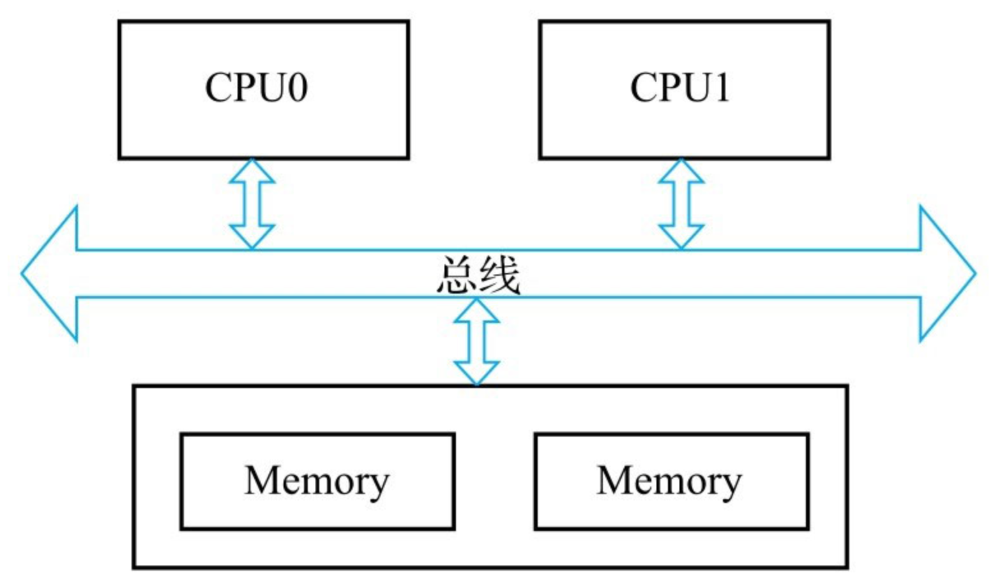
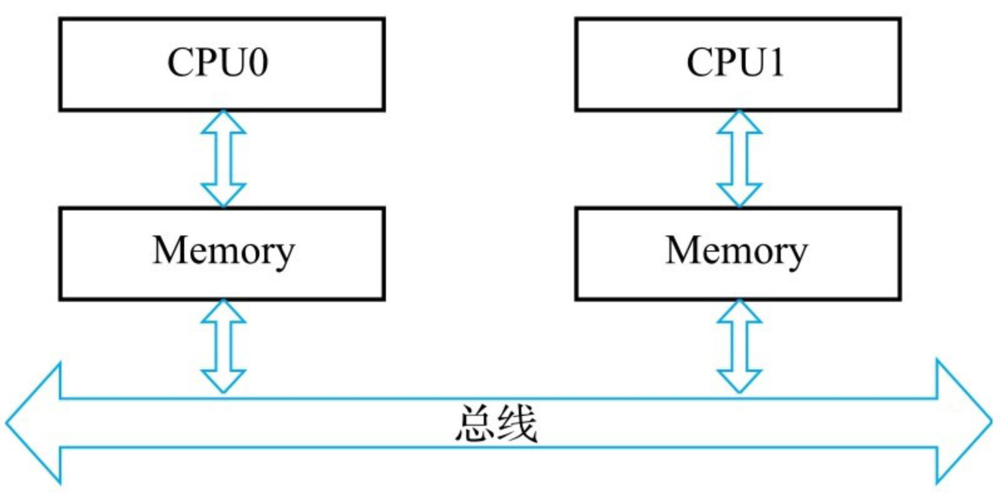
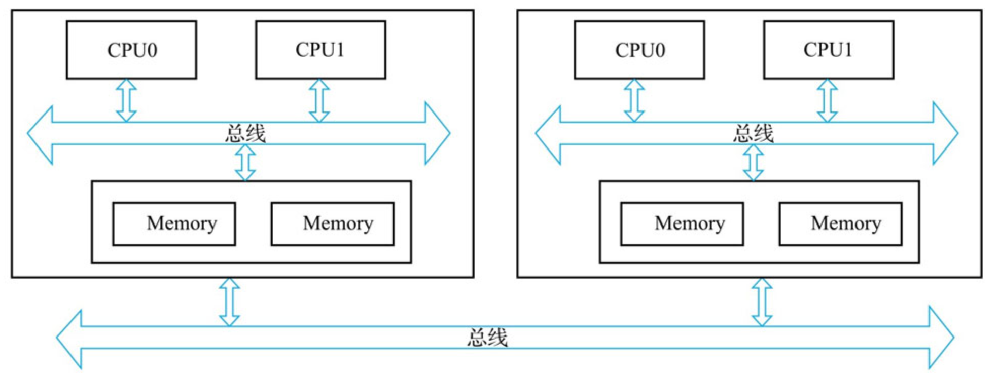

#UMA(Uniform Memory Access)
在过去，对于X86架构的计算机，内存控制器还没有整合进CPU，所有对内存的访问都需要通过北桥芯片来完成。X86系统中的所有内存都可以通过CPU进行同等访问。
任何CPU访问任何内存的速度是一致的，不必考虑不同内存地址之间的差异，这称为“统一内存访问”
在UMA中，各处理器与内存单元通过互联总线进行连接，各个CPU之间没有主从关系。互相竞争总线

#NUMA(Non-Uniform Memory Access)
```asp
之后的X86平台经历了一场从“拼频率”到“拼核心数”的转变，越来越多的核心被尽可能地塞进了同一块芯片上，各个核心对于内存带宽的争抢访问成为瓶颈，
所以人们希望能够把CPU和内存集成在一个单元上（称为Socket），这就是非统一内存访问（Non-Uniform Memory Access, NUMA)。
很明显，在NUMA下，CPU访问本地存储器的速度比访问非本地存储器快一些
```

随着系统的演化，可以把多个CPU集成在一个节点（node）上，例如在图2-8中，一个节点上集成了两个处理器，它们优先访问本地的内存

