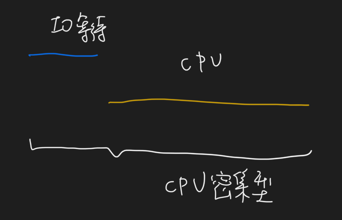
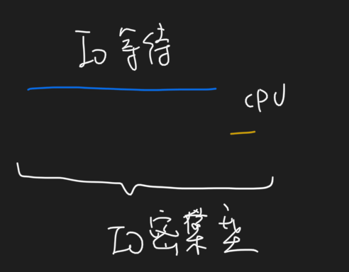

##cpu密集和io密集问题
1.cpu密集型是指程序基本都是cpu读写内存指令吗?
2.io密集是指程序很多内存读写磁盘操作吗?
3.这样说来程序不操作磁盘就是cpu密集型？
4.io密集型，io都是写入内核缓存了，内核缓存再刷入磁盘，好像和应用进程没关系?还是说读写磁盘都是同步操作？
##cpu密集型特点
cpu使用时间/总时间  很高，就是cpu密集型

指令计算
##io密集型
io使用时间/总时间 很高，就是io密集型

web请求，mysql执行
