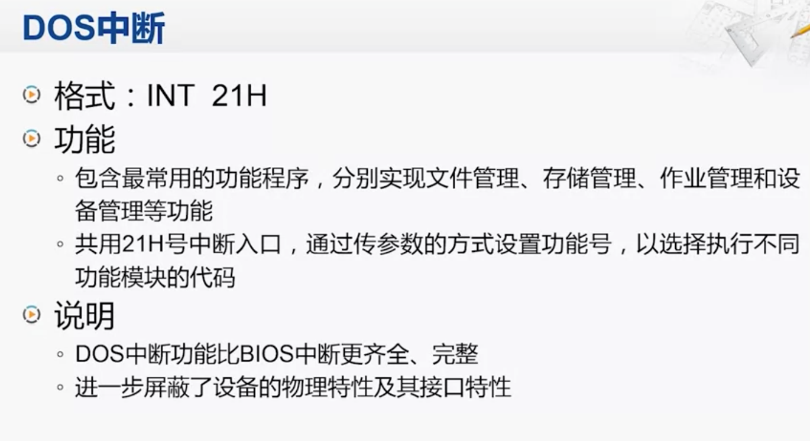

##临界知识
中断/异常,产生特定信号跳转内存特定地址,特定内存地址是对应中断/异常处理程序的入口地址
中断向量表地址寄存器IDTR
中断/异常模型
  
中断/异常形式


中断寄存器cs+ip(段寄存器+偏移寄存器)  
cpu寻找中断向量执行中断程序流程
中断指令 int n
##硬中断
###中断系统对象


中断设备/接口,中断控制器,cpu,中断向量表,
###中断控制器&中断控制器中的寄存器

[](https://baike.baidu.com/item/8259A%E4%B8%AD%E6%96%AD%E6%8E%A7%E5%88%B6%E5%99%A8/3572337?fr=aladdin)


```asp
当一个中断请求从IR0到IR7中的某根线到达IMR时，IMR首先判断此IR是否被屏蔽，如果被屏蔽，则此中断请求被丢弃；否则，则将其放入IRR中。
在此中断请求不能进行下一步处理之前，它一直被放在IRR中。一旦发现处理中断的时机已到，Priority Resolver将从所有被放置于IRR中的中断中
挑选出一个优先级最高的中断，将其传递给CPU去处理。IR号越低的中断优先级别越高，比如IR0的优先级别是最高的。
8259A通过发送一个INTR(Interrupt Request）信号给CPU，通知CPU有一个中断到达。CPU收到这个信号后，会暂停执行下一条指令，然后发送一个
INTA(Interrupt Acknowledge）信号给8259A。8259A收到这个信号之后，马上将ISR中对应此中断请求的Bit设置，同时IRR中相应的bit会被reset。
比如，如果当前的中断请求是IR3的话，那么ISR中的bit-3就会被设置，IRR中IR3对应的bit就会被reset。这表示此中断请求正在被CPU处理，而不是正在等待CPU处理。
随后，CPU会再次发送一个INTA信号给8259A，要求它告诉CPU此中断请求的中断向量是什么，这是一个从0到255的一个数。8259A根据被设置的起始向量号
（起始向量号通过中断控制字ICW2被初始化）加上中断请求号计算出中断向量号，并将其放置在Data Bus上。比如被初始化的起始向量号为8，当前的中断请求为IR3，则计算出的中断向量为8+3=11。
CPU从Data Bus上得到这个中断向量之后，就去IDT中找到相应的中断服务程序ISR，并调用它。
```


###可屏蔽中断
###非屏蔽中断
###中断控制器
###IRQ引脚
###cpu内部中断控制器
###中断请求流程

###中断嵌套

##内部中断/软中断/异常


###除0中断

###溢出中断

###单步中断

###断点中断


##中断向量/中断向量表/中断服务程序


###cs寄存器/ip寄存器

在Intel X86中可以支持256中向量中断，为了使处理器能使别每种中断源，给它们进行了编号----->叫做中断向量
```asp
CPU的中断系统可以处理256种中断。每种中断都有对应的中断服务程序。中断服务程序的入口地址称为中断向量。256种中断向量存储在内存中构成一张表，称为中断向量表。
每个中断向量都包括两部分：段基址和偏移地址。因此，存放1个中断向量需要4个内存单元，256种中断向量共需要1K个内存单元。
中断向量表位于内存起始地址00000～003FFH的存储区内。从地址00000H开始，每4个单元存放一个中断向量，其中低地址的两个单元存放中断向量的偏移地址，  
高地址的两个单元存放中断向量的段基址。256种中断向量按中断向量码从0到255的顺序依次存入中断向量表中。
```

###中断向量地址


###中断执行流程


###中断向量表


##中断指令INT n

###调用BIOS功能


###调用DOS功能

##内部外部中断优先级

