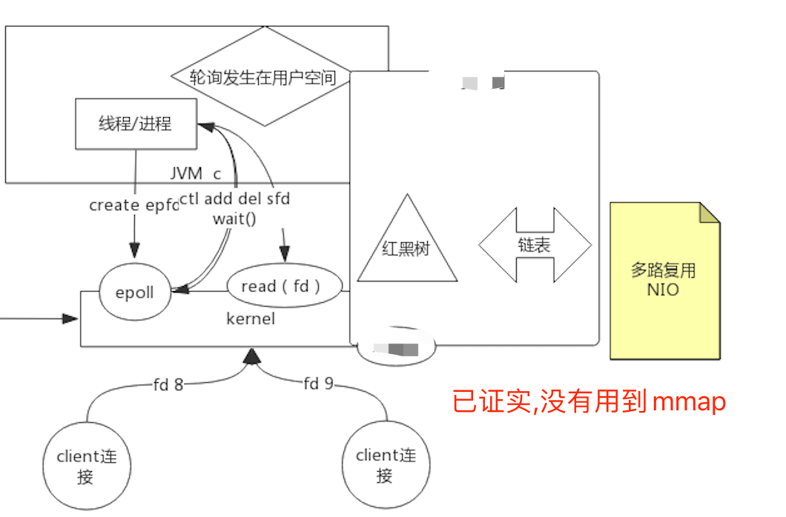

##临界知识
一次系统调用批量发送fd状态
类型拆分,只批量发送活跃的fd
JVM线程资源很大,1M
线程太多,cpu需要大量上下文切换,导致work cpu时间减少很多,维持tcp连接数减少线程数量
##accept阻塞
每个连接对应一个线程,使用线程数较多,需要大量上下文切换,jvm 线程资源

##accept非阻塞 
每个连接对应一次系统调用,连接较多时,需要大量系统调用,导致大量上下文切换

##select
所有连接对应一次系统调用,连接较多时，返回的事件较多,把没有事件达到的也返回了,用户态每次需要进行大量无用遍历

##poll
##epoll
只返回触发的事件,加快增删改查效率(红黑树),减少返回事件数,只返回有响应的事件

###对象
eventpoll结构体（fd）
###数据结构
红黑树,管理所有的eventpoll,时间复杂度O(logN)
双向链表,事件发生时事件对应的epitem结点加入rdlist中
[](https://www.cnblogs.com/zhilong233/p/13410719.html)
```asp
epoll_create(256)                       = 19
epoll_ctl(19, EPOLL_CTL_ADD, 17, {EPOLLIN, {u32=17, u64=140131897966609}}) = 0
epoll_ctl(19, EPOLL_CTL_ADD, 16, {EPOLLIN, {u32=16, u64=140131897966608}}) = 0
epoll_wait(19,  <unfinished ...>)       = ?           
```
[](SocketMultiplexingSingleThreadv2)
