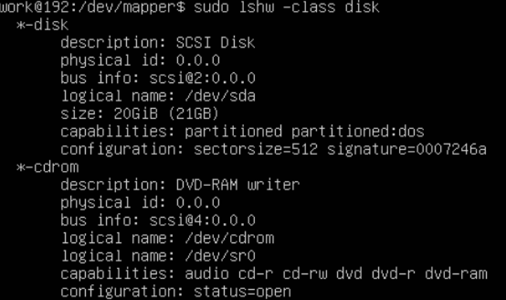
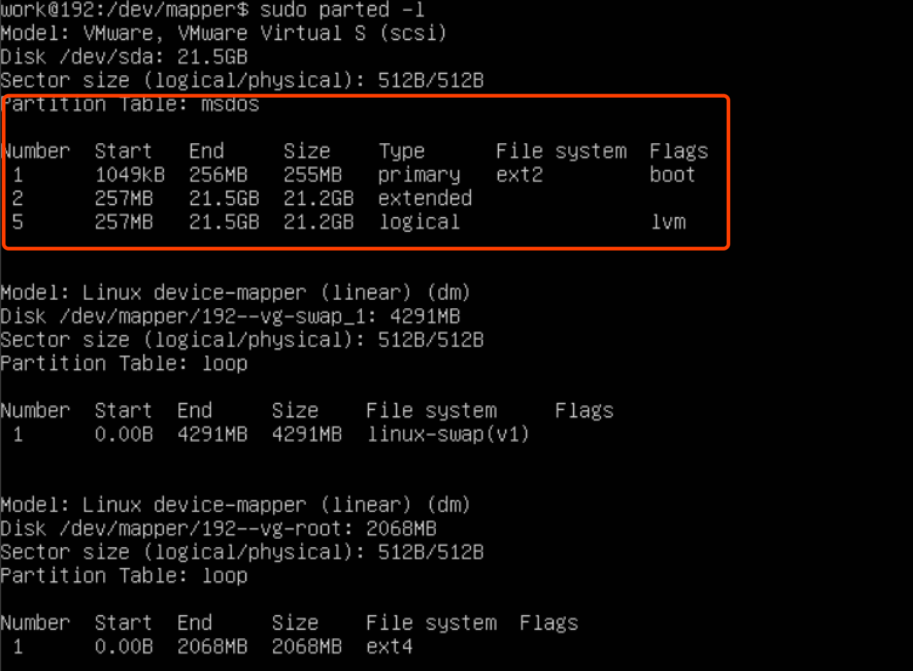
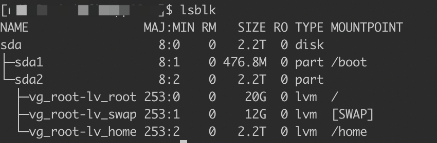
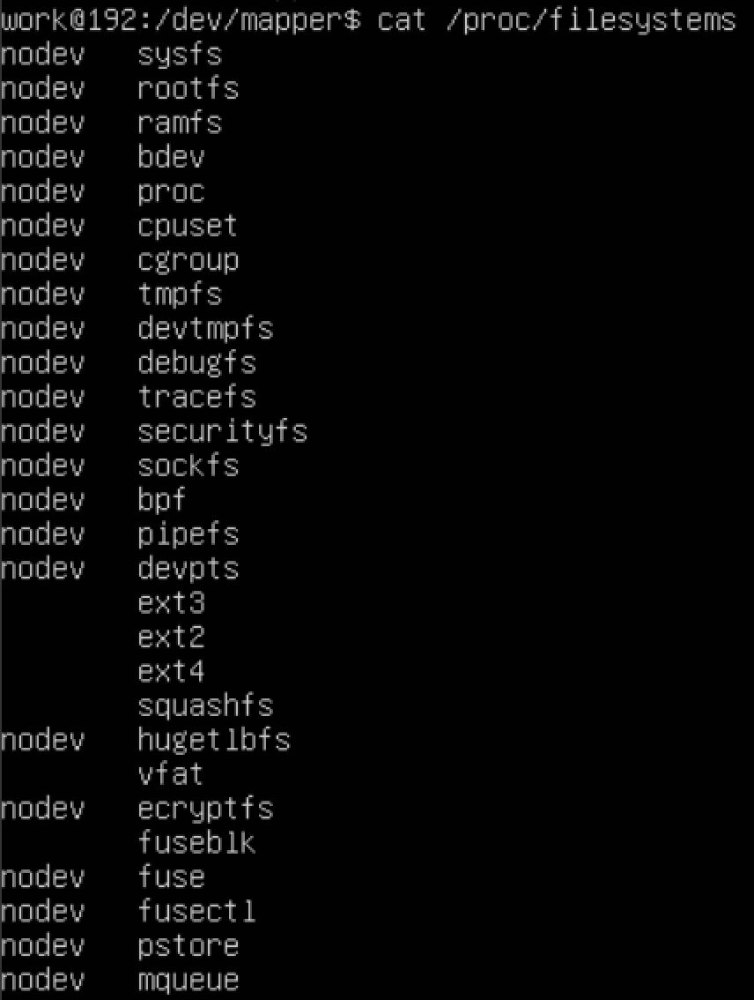
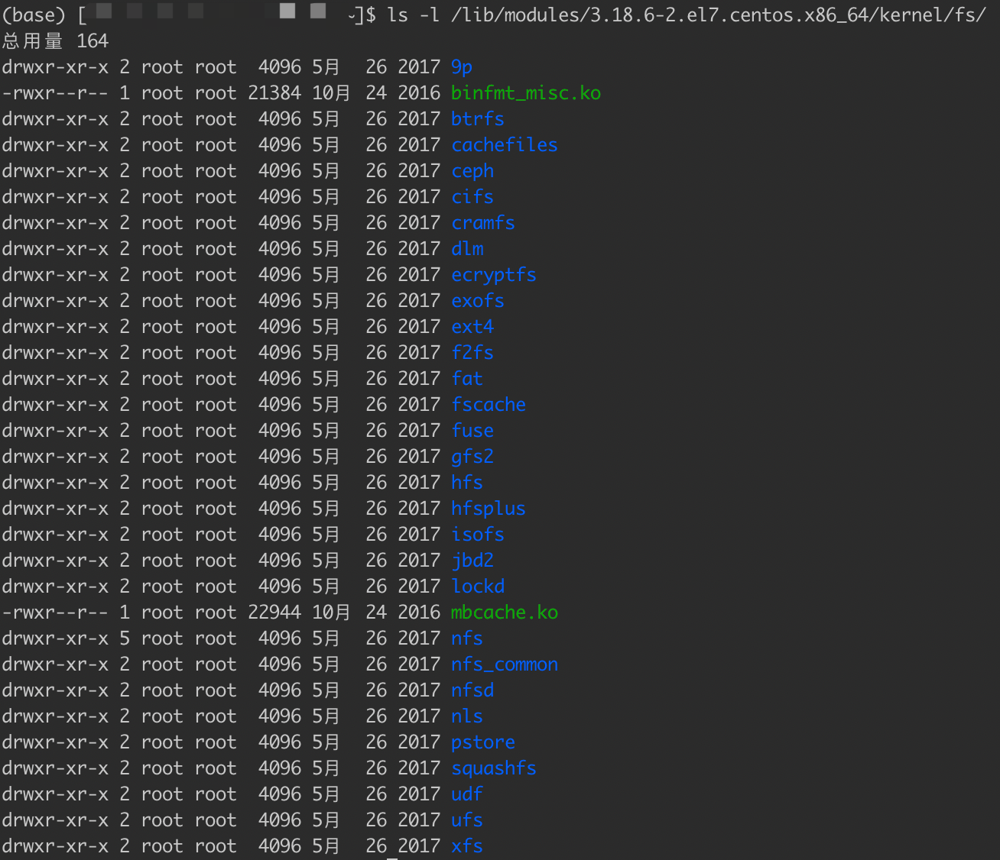
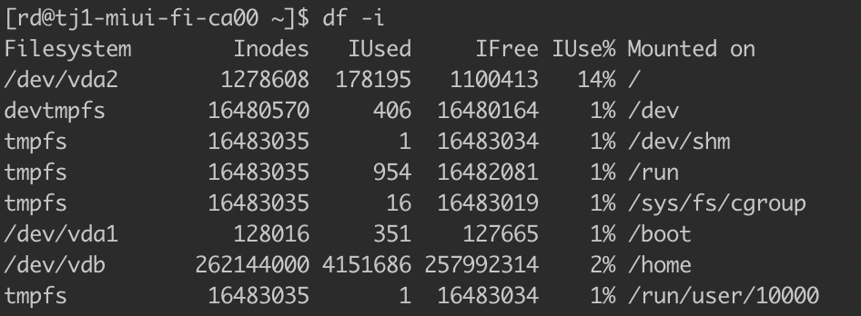
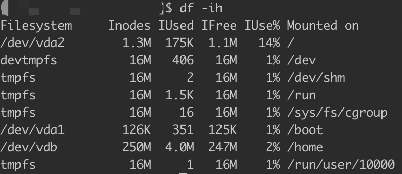
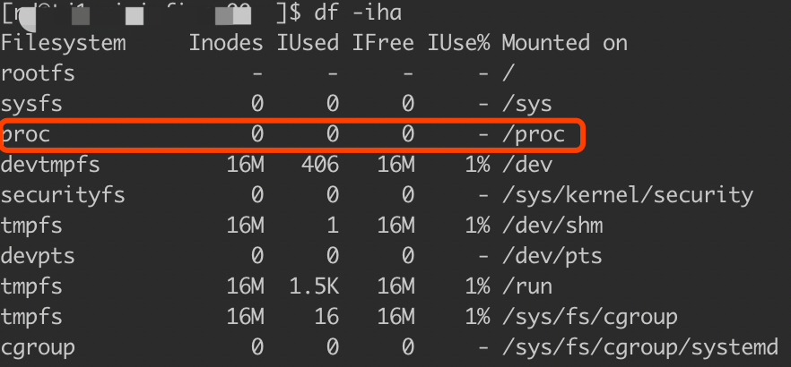
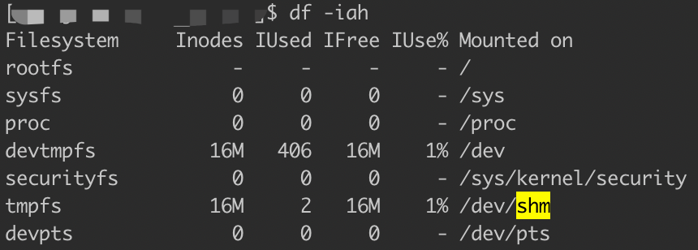
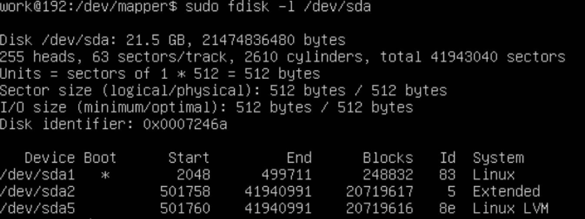

##临界知识
/proc目录有所有运行时系统信息:包括设备,中断,鼠标键盘,
##查看块设备
lsblk
lshw -class disk

##查看分区
parted -l

##文件系统命令
###查看载入内存的文件系统
cat /proc/filesystems

###查看系统支持的文件系统
ls -l /lib/modules/3.18.6-2.el7.centos.x86_64/kernel/fs/

###查看superblock
dumpe2fs

查看系统中的文件系统:df  -ia

查看文件系统的inode总数&占用数情况:df -i  

查看文件系统的使用率:df -ih  

###内存文件/proc

/proc 的东西都是 Linux 系统所需要载入的系统数据，而且是挂载 在“内存当中”的， 所以当然没有占任何的磁盘空间
###虚拟磁盘空间
/dev/shm/ 目录，其实是利用内存虚拟出来的磁盘空间  
tmpfs是最好的基于RAM的文件系统
通过内存仿真出来的磁盘，因此你在这个目录下面创建任何数据文件时，存取速度是 非常快速的!

###swap
free
swapon -s
##目录
###查看当前目录磁盘占用
du -sm -h  /home/work/log/*
###查看目录的文件系统
df -hT /home
##文件硬连接/符号连接
ln [-sf] 来源文件 目标文件
 
##查看配额
repquota -v /home

##挂载
mount

##磁盘阵列
##lvm
查看lvm  
fdisk -l /dev/sda

###PV操作/Physical Volume, PV, 实体卷轴(磁盘虚拟化)
pvdisplay
###VG阶段(查看虚拟磁盘)
vgdisplay
###LV阶段(查看虚拟磁盘的分区)
lvdisplay

##列出pci设备(符合pci标准的io设备)

lspci -tv,列出所有PCI设备
lsusb -tv,列出所有USB设备
lsmod,列出加载的内核模块
cat /proc/bus/pci/devices
cat /proc/softirqs
cat /proc/swaps
cat /proc/filesystems
cat /proc/diskstats
