##临界知识
1.磁盘越来越大,文件系统需要适应
2.不同场景使用不同文件系统
3.数据一致性保证
##linux文件系统ext架构
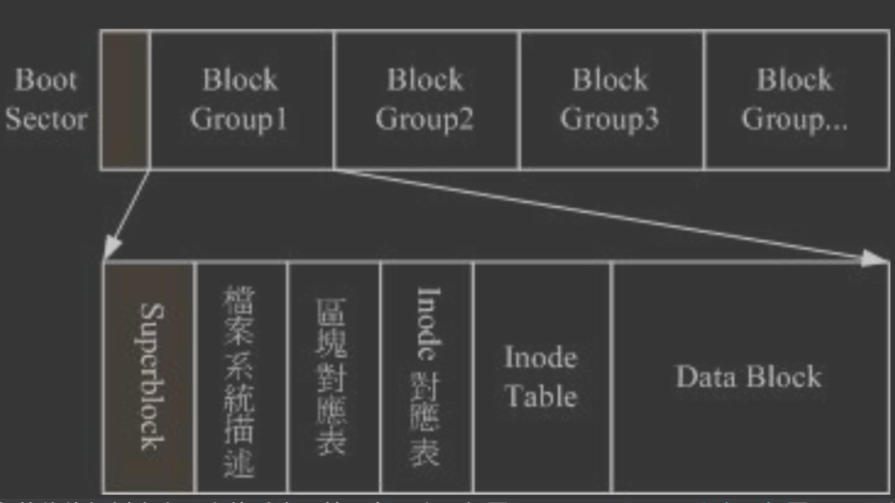
linux文件系统ext基于inode索引
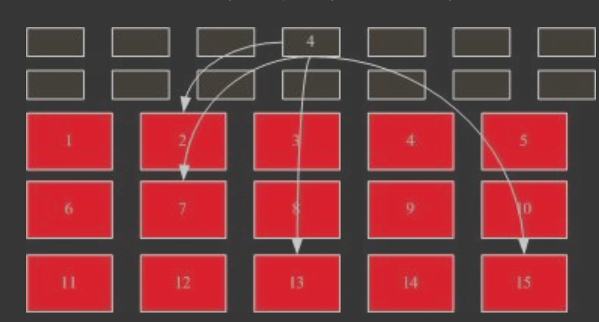
FAT文件(U盘)系统基于链表

##superblock
记录此 filesystem 的整体信息，包括inode/block的总量、使用量、剩余量， 以及文件系统的格式与相关信息等
  

查看命令:dumpe2fs

##inode
一个文件对应一个inode

命令 ls -li

##inode表(inode bitmap)
这个其实与 block bitmap 是类似的功能，只是 block bitmap 记录的是使用与未使用的 block
号码， 至于 inode bitmap 则是记录使用与未使用的 inode 号码啰!
##data block
实际记录文件的内容，若文件太大时，会占用多个 block 
4k

##block表(block bitmap (区块对照表))
每个inode记录文件的权限与相关属性，一个文件占用一个inode，同时记录此文件的数据所在的 block 号码;
文件系统一开始就将 inode 与 block 规划好了，除非重新格式化 (或者利用 resize2fs 等指令变更文件系统大小)，否则 inode 与 block 固定后就不再变动


##inode table

###block大小权衡
既然大的 block 可能会产生较严重的磁盘容量浪费，那么我们是否就将 block 大小订为 1K 即可? 这也不妥，因为如果 block 较小的话，那么大型文件将会占用数量更多的 block ，  
 而 inode 也要记录更多的 block 号码，此时将可能导致文件系统不良的读写性能
###block多级索引
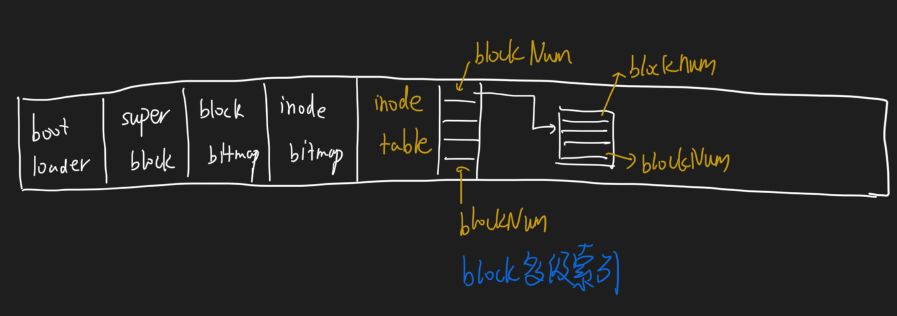
系统内部打开文件的步骤：
①系统找到这个文件名对应的inode号码
②通过inode号码,获取inode信息
③根据inode信息,找到文件数据所在的block,读出数据

inode一般为128字节或256字节
每个inode中都记录着文件所在的block号,每条记录着block号的信息占用4字节。
inode中关于block号的记录一共包含12个直接,1个间接,1个双间接和1个三间接
12个直接连接：共占用48字节磁盘空间,包含着12个直接指向block号的信息，若此文件系统默认的block大小为4kb,则仅仅可以指向12*4=48kb大小的文件内容,然而我们的文件若较大时,则需要使用到更多的block,肯定要多于12个block,进而有间接,双间接和三间接

间接：inode中所记录这4字节的内容,所指向一个block,这个block中存放的不是真的文件内容,而是真实文件所存放位置的block号信息,若每个block大小为4kb,那么可以存放1024个block号信息1个间接可以存放的文件大小为1024*4=4096kb

双间接：在间接的基础上在进行间接,若默认的block仍然为4kb,那么1个双间接可以存放文件内容的大小为1024*1024*4=4096MB

三间接：在双间接的基础上再进行间接,若默认的block仍然为4kb,那么1个双间接可以存放文件内容的大小为1024*1024*1024*4=4096GB也就是说在一个block大小默认为4KB的文件系统中,一个文件最大存储可达48kb+4096kb+4096MB+4096GB=4100GB

##block group
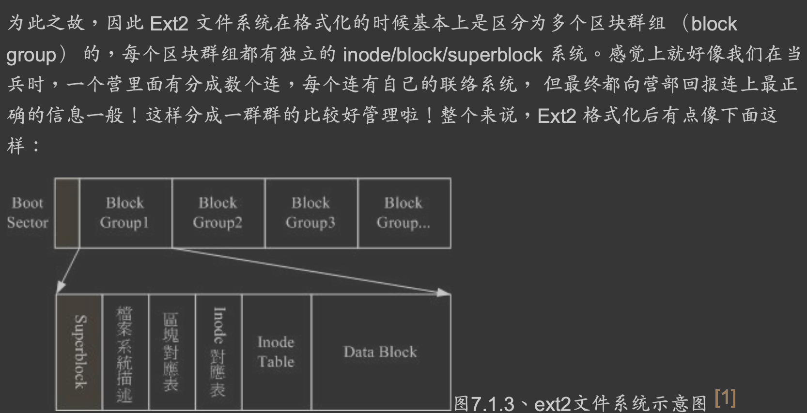
在整体的规划当中，文件系统最前面有一个开机扇区(boot sector)，这个开机扇区可以安 装开机管理程序
```asp
此外，每个 block group 都可能含有 superblock 喔!但是我们也说一个文件系统应该仅有一 个 superblock 而已，那是怎么回事啊? 
事实上除了第一个 block group 内会含有 superblock 之外，后续的 block group 不一定含有 superblock ，
 而若含有 superblock 则该 superblock 主要是做为第一个 block group 内 superblock 的备份咯，这样可以进行 superblock 的救援 呢!
```
##目录与inode、block

当我们在 Linux 下的文件系统创建一个目录时，文件系统会分配一个 inode 与至少一块 block 给该目录。  
其中，inode 记录该目录的相关权限与属性，并可记录分配到的那块 block 号码;   
而 block 则是记录在这个目录下的文件名与该文件名占用的 inode 号码数据。也就是说目录所 占用的 block 内容在记录如下的信息:
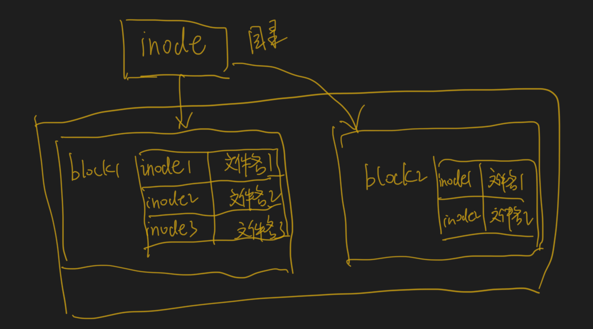
###目录大小
命令:ls -li
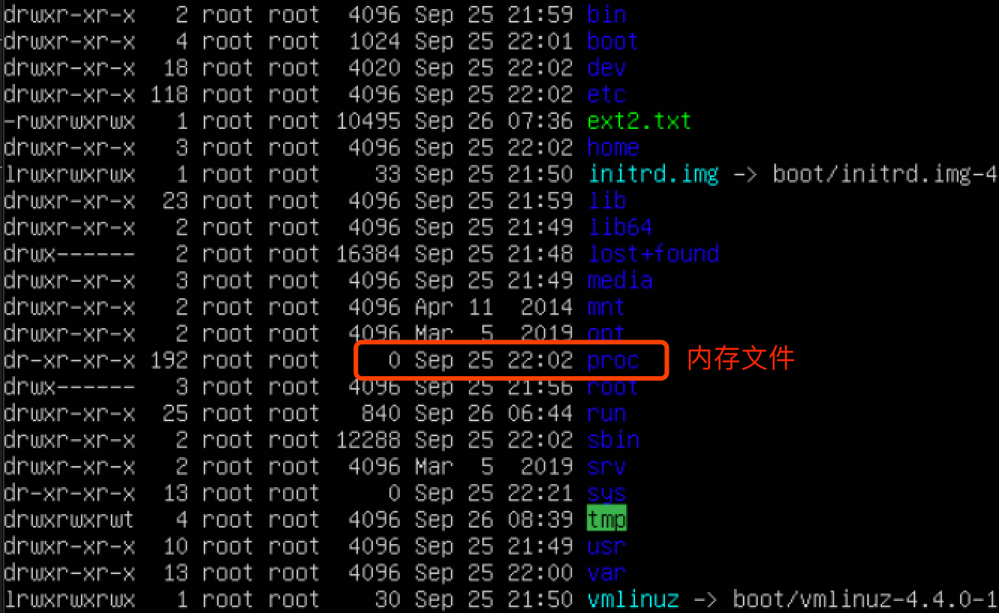
上面的结果我们知道目录并不只会占用一个 block 而已，也就是说: 在目录下面的文 件数如果太多而导致一个 block 无法容纳的下所有的文件名与   
inode 对照表时，Linux 会给予 该目录多一个 block 来继续记录相关的数据;
###文件名与block
 inode 本身并不记录文件名，文件名的记录 是在目录的 block 当中
##文件与inode、block
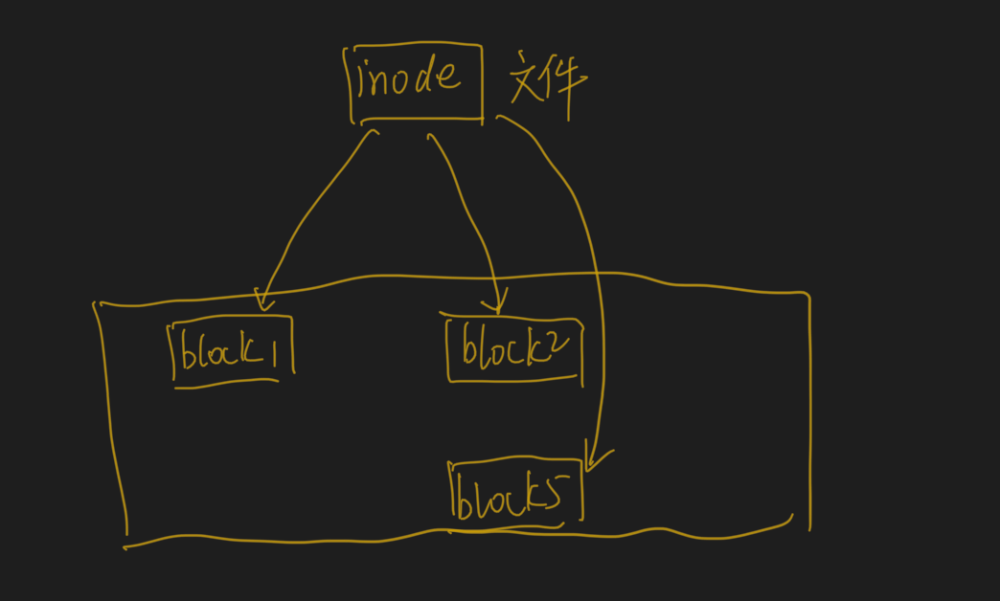
当我们在 Linux 下的 ext2 创建一个一般文件时， ext2 会分配一个 inode 与相对于该文件大小 的 block 数量给该文件。例如:假设我的一个 block 为 4 KBytes ，  
而我要创建一个 100 KBytes 的文件，那么 linux 将分配一个 inode 与 25 个 block 来储存该文件! 但同时请注意， 由于 inode 仅有 12 个直接指向，因此还要多一个 block 来作为区块号码的记录喔
##目录与文件
###目录树读取流程
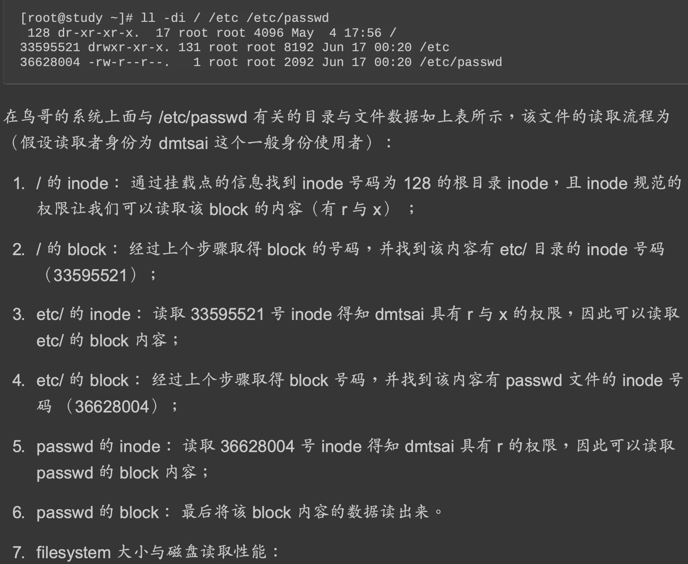

###文件新建流程
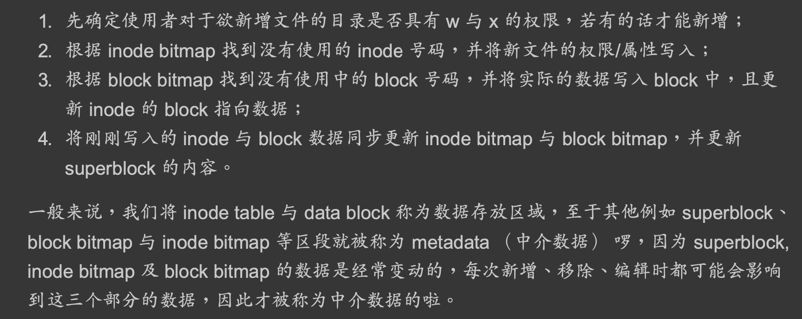

##格式化
如果文件真的太过离散，确实还是会发生读取效率低落的问题。 因 为磁头还是得要在整个文件系统中来来去去的频繁读取! 果真如此，  
那么可以将整个 filesystme 内的数据全部复制出来，将该 filesystem 重新格式化， 再将数据给他复制回去即 可解决这个问题。
将superblock, inode表,block表初始化,block data区没有改变但无法通过inode表索引到

##硬连接
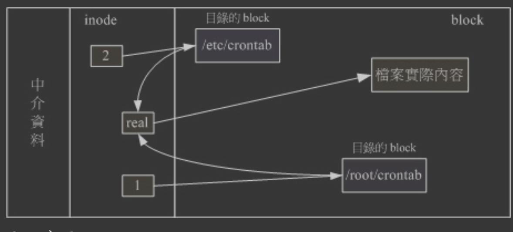
  
不能跨 Filesystem; 不能 link 目录
###/. 和 /..的含义
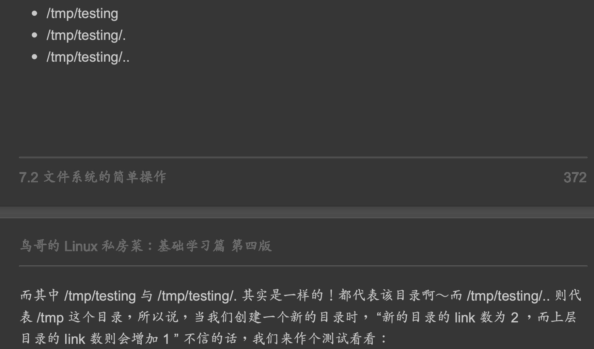 
##符号连接

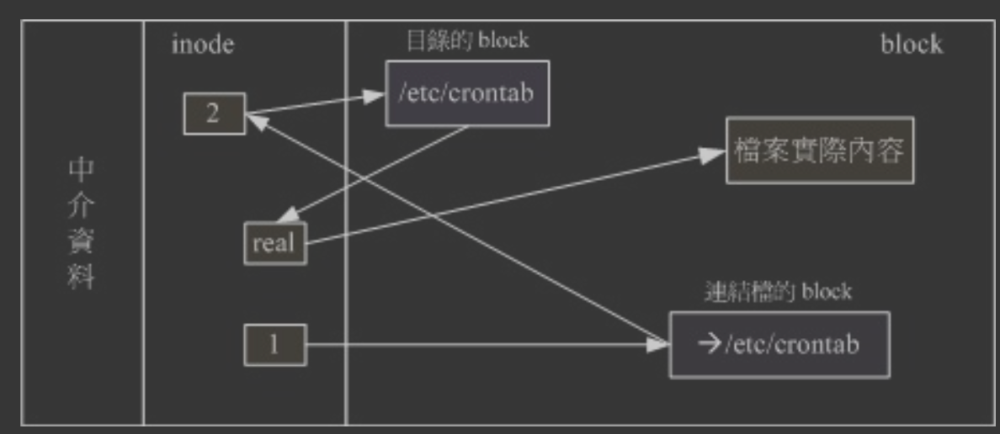

##文件系统类型
###windows 98 文件系统 FAT/U盘文件系统

windows 2000 NTFS 文件系统,
###Linux 文件系统 Ext2   

###centos xfs
磁盘容量越来越大，连传统的 MBR 都已 经被 GPT 所取代  
你的 TB 以上等级的传统 ext 家族文件 系统在格式化的时候，光是系统要预先分配 inode 与 block 就消耗你好多好多的人类时间
##VFS虚拟文件系统
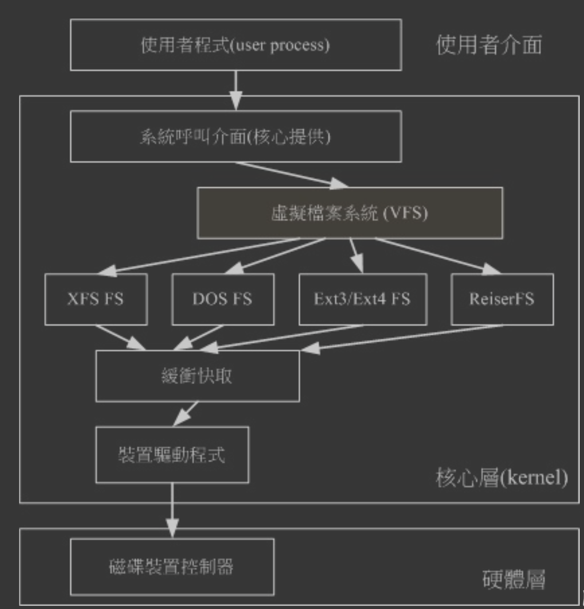

##日志系统Journaling filesystem
###数据不一致
所以写入的数据仅有 inode table 及 data block 而已， 最后一个同步更新中介数据的步骤并没有做完，  
此时就会发生 metadata 的内容与实际数据存 放区产生不一致 (Inconsistent) 的情况了
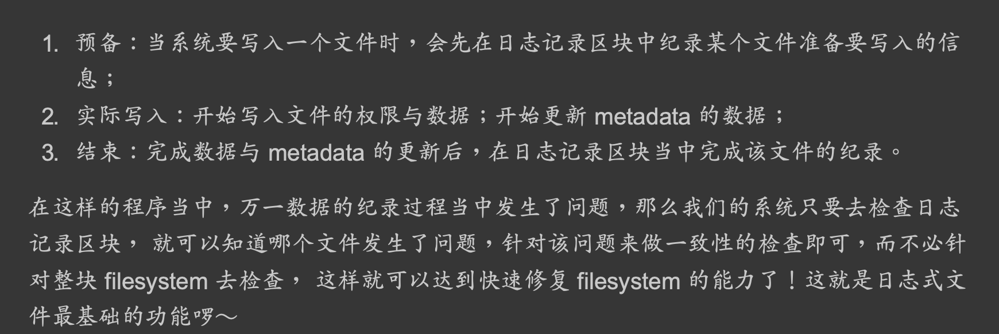

