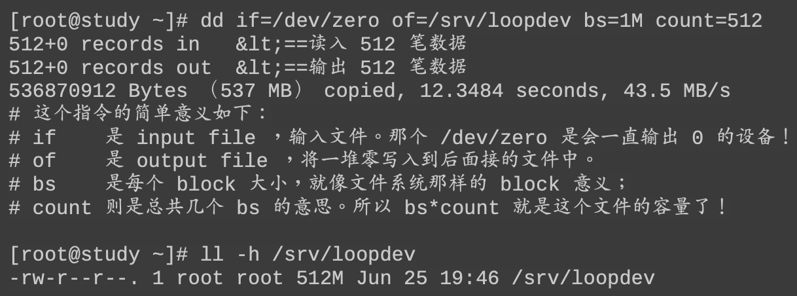
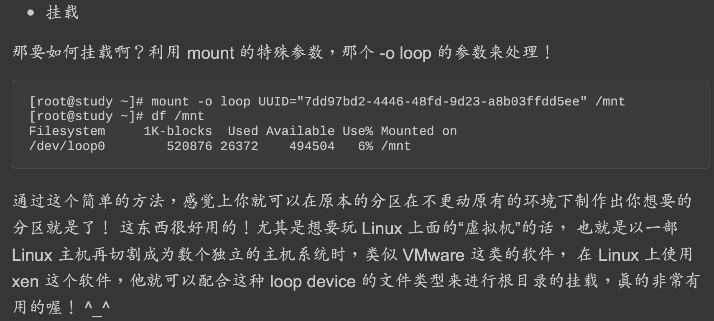

##挂载&挂载点
所谓的“挂载”就是利用一个目录当成进入点，将磁盘分区的数据放置在该目录下
也就是说，进入该目录就可以读取该分区的意思

上图中假设我的硬盘分为两个分区，partition 1是挂载到根目录，至于partition 2则是挂载 到/home这个目录。   
这也就是说，当我的数据放置在/home内的各次目录时，数据是放置到 partition 2的，如果不是放在/home下面的目录， 那么数据就会被放置到partition 1了
挂载信息:

###有目录的文件挂载到另一个有目录的文件?
##分区

##文件系统
##目录树挂载
##设备挂载
###临界知识
硬件设备文件名 , 软件设备文件名  

几乎所有的硬件设备文件都在/dev这个目录 内， 所以你会看到/dev/sda, /dev/sr0等等的文件

###实体磁盘设备文件
/dev/sd[a-p][1-128]

###虚拟磁盘文件
/dev/vd[a-d][1-128]
###LVM逻辑卷文件

###文件挂载为文件系统
制作出一个大文件，然后将这个文件 格式化后挂载
创建大型文件  

大型文件的格式化  

挂载  

