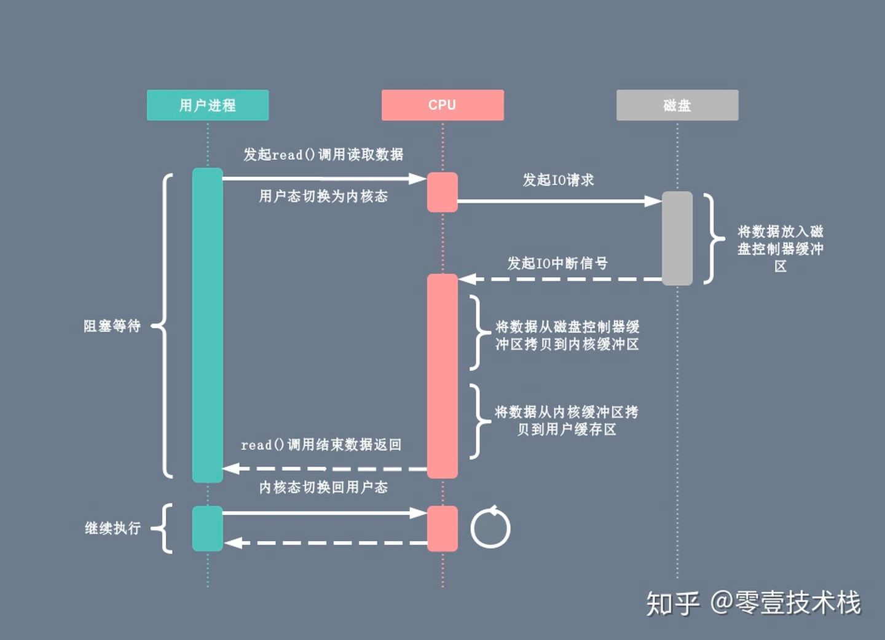
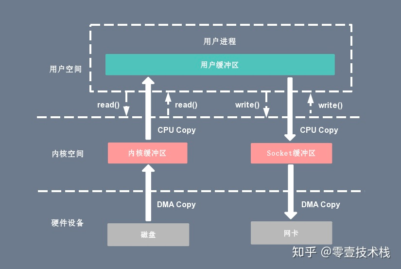
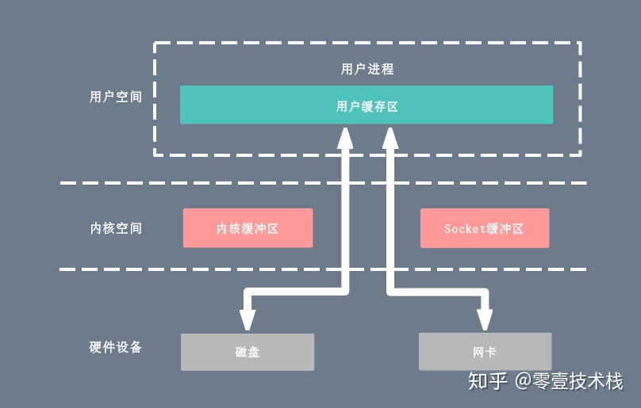
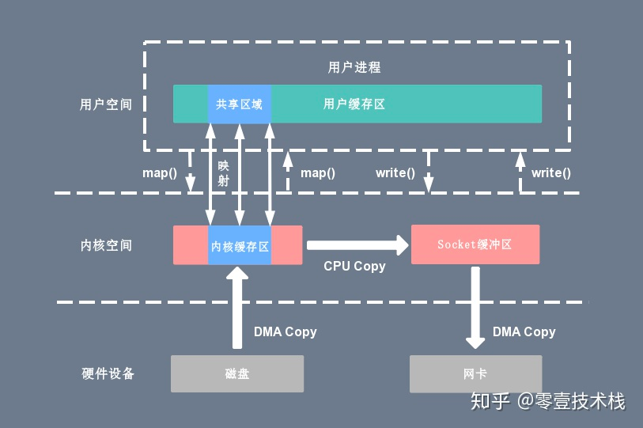
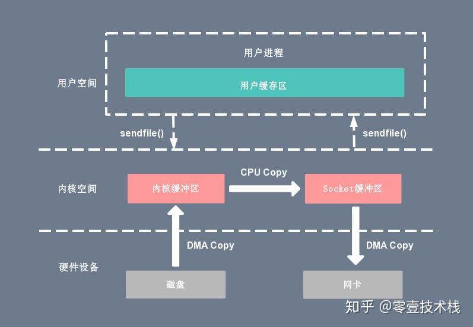
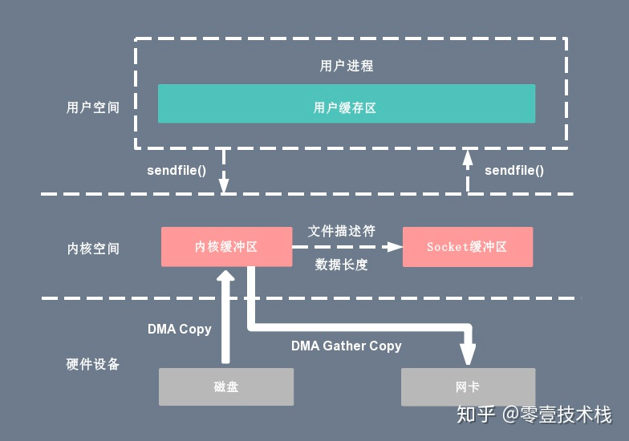
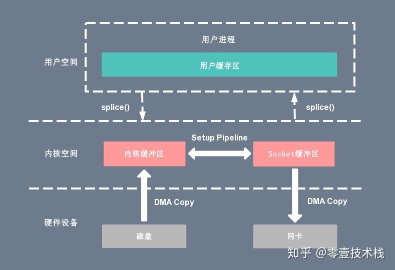

#临界知识
[](https://zhuanlan.zhihu.com/p/83398714)

#磁盘io关联概念
##物理内存和虚拟内存

虚拟内存为每个进程提供了一个一致的、私有的地址空间，它让每个进程产生了一种自己在独享主存的错觉
###进程虚拟内存页表
逻辑地址空间分为若干页,由页表管理
```asp
当进程执行一个程序时，需要先从先内存中读取该进程的指令，然后执行，获取指令时用到的就是虚拟地址。
这个虚拟地址是程序链接时确定的（内核加载并初始化进程时会调整动态库的地址范围）。
为了获取到实际的数据，CPU 需要将虚拟地址转换成物理地址，CPU 转换地址时需要用到进程的页表（Page Table），
而页表（Page Table）里面的数据由操作系统维护。

其中页表（Page Table）可以简单的理解为单个内存映射（Memory Mapping）的链表（当然实际结构很复杂），
里面的每个内存映射（Memory Mapping）都将一块虚拟地址映射到一个特定的地址空间（物理内存或者磁盘存储空间）。
每个进程拥有自己的页表（Page Table），和其它进程的页表（Page Table）没有关系。
```
###物理内存页表
物理内存空间分为若干页框（也叫作块
##进程的用户空间和进程内核空间

```asp
进程私有的虚拟内存：每个进程都有单独的内核栈、页表、task 结构以及 mem_map 结构等。
进程共享的虚拟内存：属于所有进程共享的内存区域，包括物理存储器、内核数据和内核代码区域。
```

##cpu io中断技术

##DMA io技术


##内存区域映射技术

#磁盘io过程


##2次cpu拷贝
CPU拷贝：由 CPU 直接处理数据的传送，数据拷贝时会一直占用 CPU 的资源
CPU将数据从内核内存拷贝到用户进程
##2 次 DMA 拷贝
由 CPU 向DMA磁盘控制器下达指令，让 DMA 控制器来处理数据的传送，数据传送完毕再把信息反馈给 CPU，从而减轻了 CPU 资源的占有率
DMA将数据从磁盘拷贝到内核内存
##4次上下文切换
当用户程序向内核发起系统调用时，CPU 将用户进程从用户态切换到内核态；当系统调用返回时，CPU 将用户进程从内核态切换回用户态。
##传统读
```asp
1次CPU拷贝
1次DMA拷贝
2次上下文切换
```
##传统写
```asp
1次CPU拷贝
1次DMA拷贝
2次上下文切换
```
#零拷贝技术
##用户态直接 I/O
```asp
应用程序可以直接访问硬件存储，操作系统内核只是辅助数据传输。这种方式依旧存在用户空间和内核空间的上下文切换，硬件上的数据直接拷贝至了用户空间，
不经过内核空间。因此，直接 I/O 不存在内核空间缓冲区和用户空间缓冲区之间的数据拷贝
```

##减少数据拷贝次数
```asp
在数据传输过程中，避免数据在用户空间缓冲区和系统内核空间缓冲区之间的CPU拷贝，以及数据在系统内核空间内的CPU拷贝，这也是当前主流零拷贝技术的实现思路
```
###mmap + write
减少了 CPU 拷贝的次数

###sendfile
不仅减少了 CPU 拷贝的次数，还减少了上下文切换的次数

```asp
整个拷贝过程会发生 2 次上下文切换，1 次 CPU 拷贝和 2 次 DMA 拷贝
```
###sendfile + DMA gather copy
```asp
为 DMA 拷贝引入了 gather 操作。它将内核空间（kernel space）的读缓冲区（read buffer）中对应的数据描述信息（内存地址、地址偏移量）记录
到相应的网络缓冲区（ socket buffer）中，由 DMA 根据内存地址、地址偏移量将数据批量地从读缓冲区（read buffer）拷贝到网卡设备中，
这样就省去了内核空间中仅剩的 1 次 CPU 拷贝操作
```

基于 sendfile + DMA gather copy 系统调用的零拷贝方式，整个拷贝过程会发生 2 次上下文切换、0 次 CPU 拷贝以及 2 次 DMA 拷贝
sendfile + DMA gather copy 拷贝方式同样存在用户程序不能对数据进行修改的问题，而且本身需要硬件的支持，它只适用于将数据从文件拷贝到 socket 套接字上的传输过程
###splice

##写时复制技术
```asp
写时复制指的是当多个进程共享同一块数据时，如果其中一个进程需要对这份数据进行修改，那么将其拷贝到自己的进程地址空间中，
如果只是数据读取操作则不需要进行拷贝操作。
```
#java零拷贝
##MappedByteBuffer(内存映射mmap)
内部使用DirectByteBuffer
##FileChannel sendfile
#netty零拷贝
内核态拷贝优化
```
Netty 通过 DefaultFileRegion 类对 java.nio.channels.FileChannel 的 tranferTo() 方法进行包装，在文件传输时可以将文件缓冲区的数据直接发送到目的通道（Channel）
```
应用用户态拷贝优化
```asp
ByteBuf 可以通过 wrap 操作把字节数组、ByteBuf、ByteBuffer 包装成一个 ByteBuf 对象, 进而避免了拷贝操作
ByteBuf 支持 slice 操作, 因此可以将 ByteBuf 分解为多个共享同一个存储区域的 ByteBuf，避免了内存的拷贝
Netty 提供了 CompositeByteBuf 类，它可以将多个 ByteBuf 合并为一个逻辑上的 ByteBuf，避免了各个 ByteBuf 之间的拷贝
```

#案例
##rocketMQ VS kafka
```asp
RocketMQ 选择了 mmap + write 这种零拷贝方式，适用于业务级消息这种小块文件的数据持久化和传输
而 Kafka 采用的是 sendfile 这种零拷贝方式，适用于系统日志消息这种高吞吐量的大块文件的数据持久化和传输。但是值得注意的一点是，
Kafka 的索引文件使用的是 mmap + write 方式，数据文件使用的是 sendfile 方式
```

