##临界知识
物理硬件-虚拟(软件)硬件
磁盘容量不断增大-文件系统更迭
分区容量动态扩容(磁盘/分区虚拟化)-lvm
不同用户磁盘容量管理-quota
数据安全性策略-磁盘阵列
访问效率优化-文件系统
数据版本管理-lvm快照
##虚拟磁盘
##tmpfs
tmpfs=(Real Memory)+(swap)
tmpfs使用的是VM，因此它比硬盘的速度肯定要快
##虚拟内存
##swap
Swap是硬盘存储,通过硬盘虚拟出来的内存空间
##quota磁盘配额
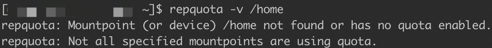
###上下文需求
对不同用户/用户组/目录的磁盘容量进行隔离管理
###方案
quota
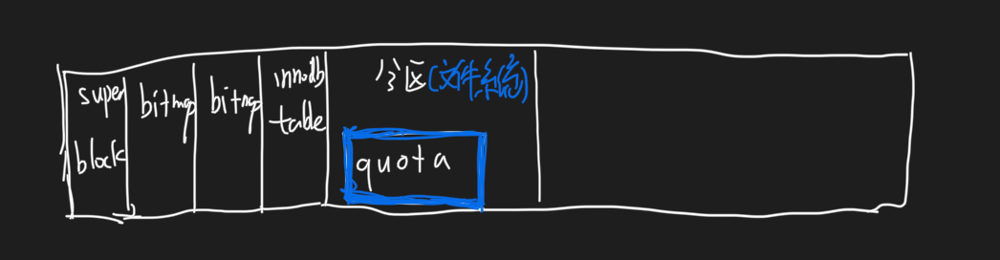
###输出
查看配额
repquota -v /home
##磁盘阵列
###临界知识
通过一个技术(软件或硬件)，将多个较小的磁盘整合成为一个 较大的磁盘设备
###需求
```asp
1. 数据安全与可靠性:指的并非网络信息安全，而是当硬件(指磁盘)损毁时，数据是否 还能够安全的救援或使用之意;
2. 读写性能:例如RAID0可以加强读写性能，让你的系统I/O部分得以改善; 
3. 容量:可以让多颗磁盘组合起来，故单一文件系统可以有相当大的容量。
```
###方案
####临界知识
容量扩充,访问(读写)效率,数据可用性评估
####RAID-0 (等量模式,
每个磁盘会 交错的存放数据， 因此当你的数据要写入 RAID 时，数据会被等量的放置在各个磁盘上面
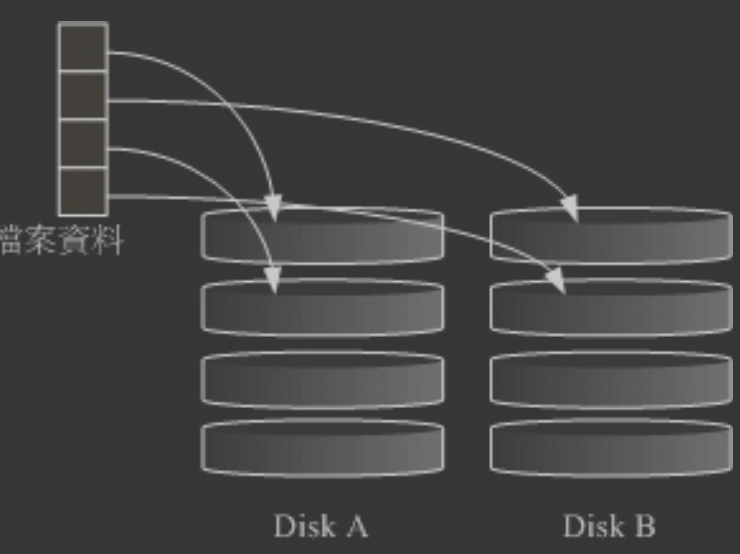
访问效率增强
数据可用性下降
####RAID-1 (映射模式, mirror):完整备份
让同一份数据，完 整的保存在两颗磁盘上头
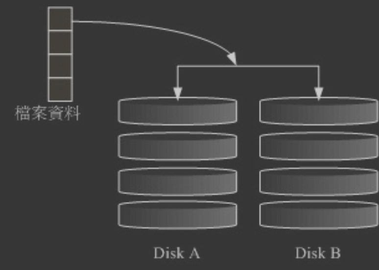
写效率下降,读不变
数据可用性增强
####RAID 0+1
RAID-0 的性能佳但是数据不安全，RAID-1 的数据安全但是性能不佳，那么能不能将这两者 整合起来设置 RAID 
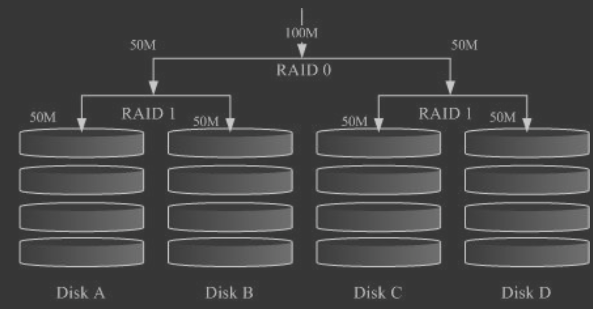
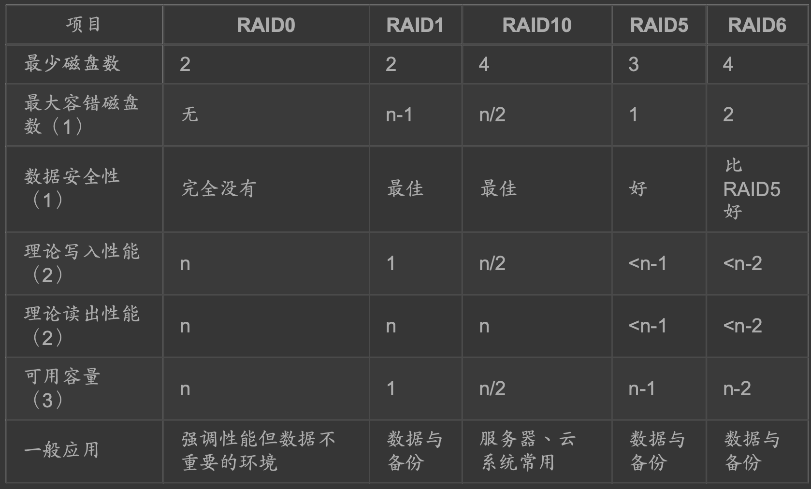
###软件磁盘阵列
硬件磁盘阵列在 Linux 下面看起来就是一颗实际的大磁盘，因此硬 件磁盘阵列的设备文件名为 /dev/sd[a-p] ，因为使用到 SCSI 的模块之故。至于软件磁盘阵列 则是系统仿真的，  
因此使用的设备文件名是系统的设备文件， 文件名为 /dev/md0, /dev/md1...，两者的设备文件名并不相

##LVM逻辑卷轴管理
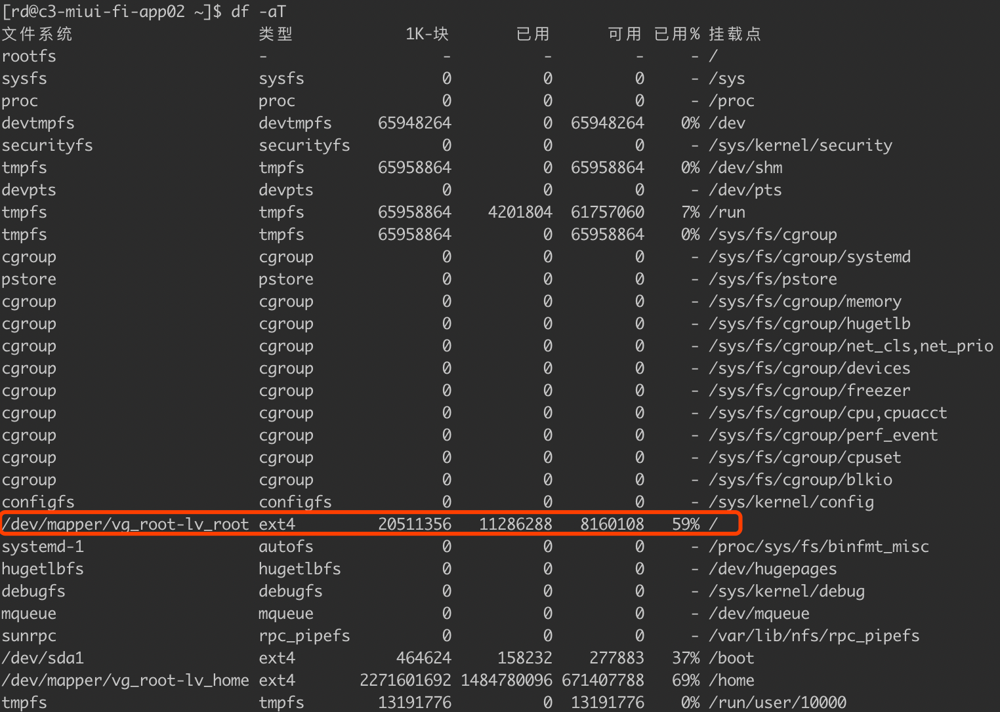
###临界知识
分区容量动态扩容
PV(Physical Volume, PV, 实体卷轴)    
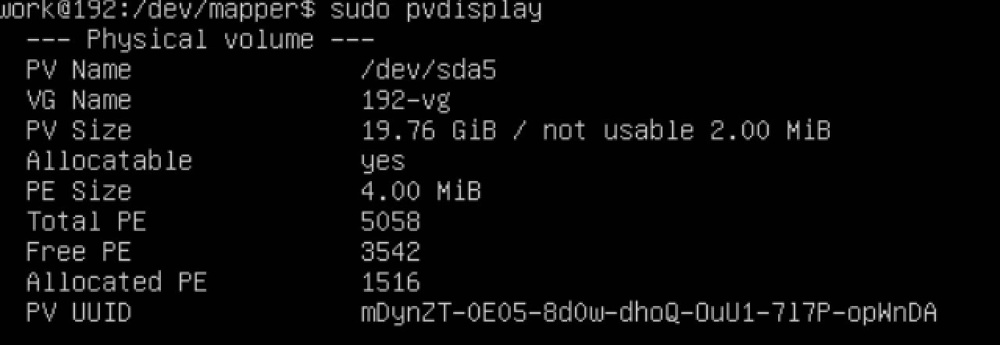  
VG(Volume Group,  卷轴群组)  
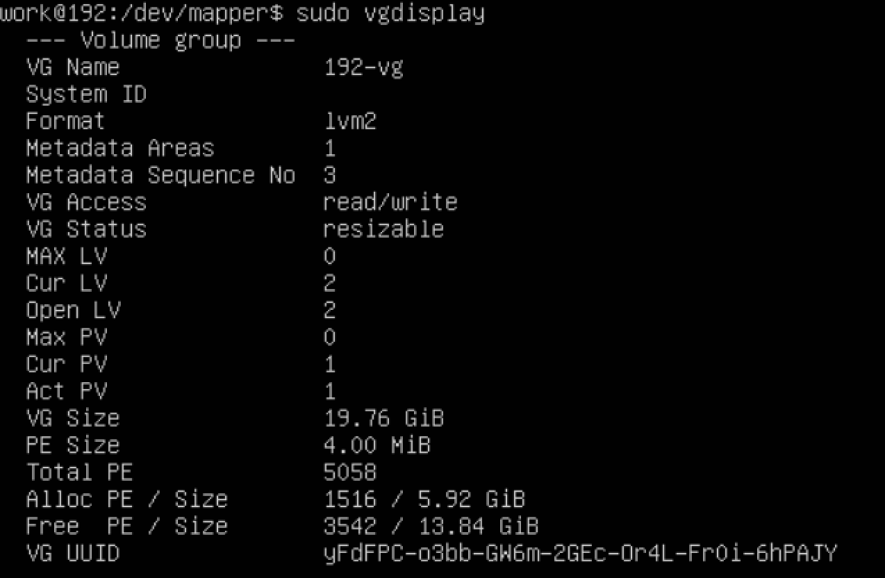  
LV,(Logical Volume, LV, 逻辑卷轴)  
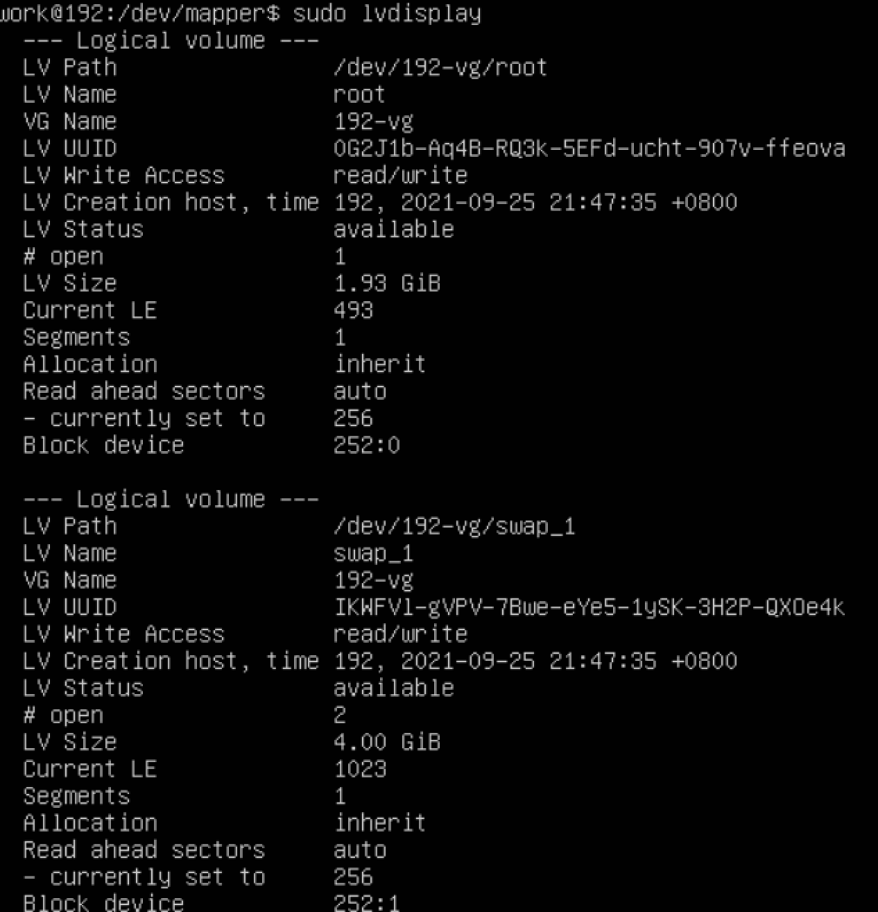
PE(Physical Extent, PE, 实体范围区块)

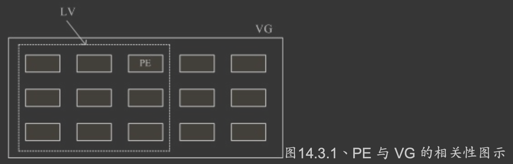
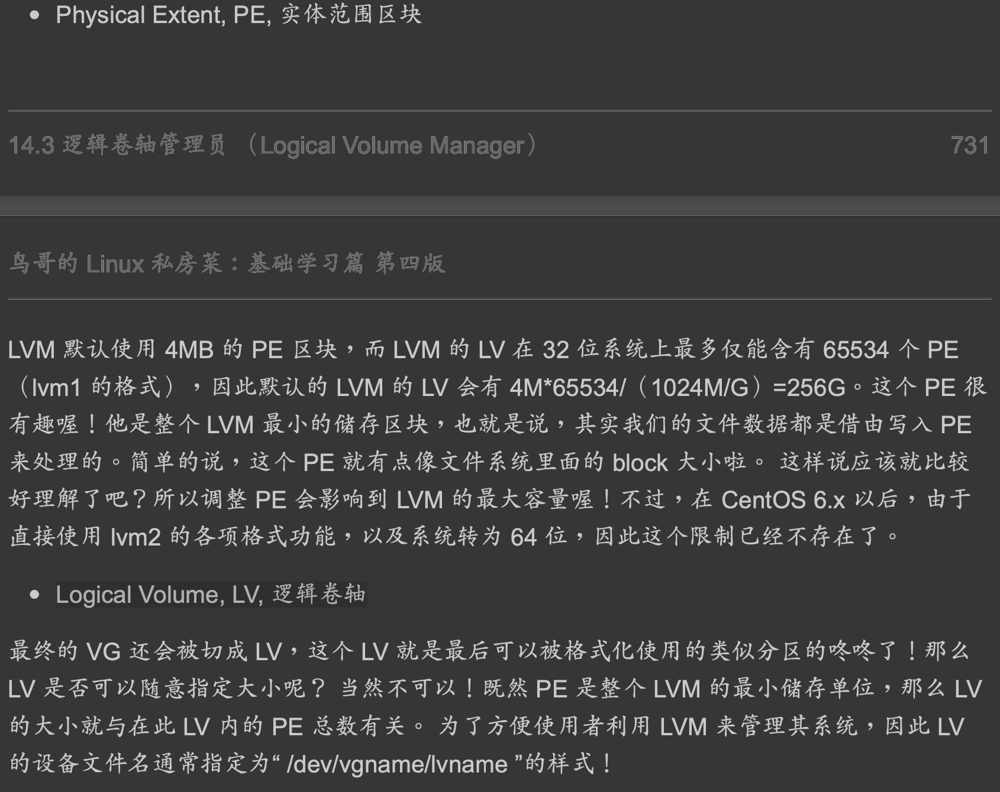
###需求上下文
可以弹性的调整 filesystem 的容量,LVM 最主要的用处是在实现一个可以弹性调整容量的文件系统上
###方案

###输出
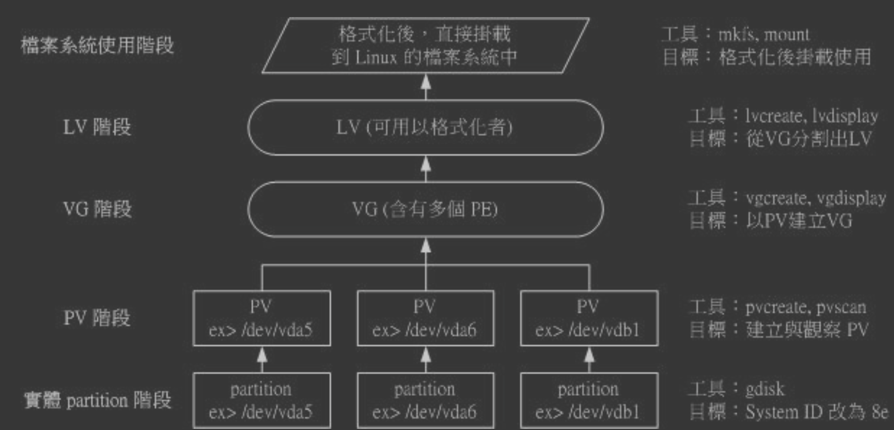
查看lvm

##磁盘快照
###临界知识
快照就是将当时的系统 信息记录下来，就好像照相记录一般! 未来若有任何数据更动了，则原始数据会被搬移到快 照区，没有被更动的区域则由快照区与文件系统共享
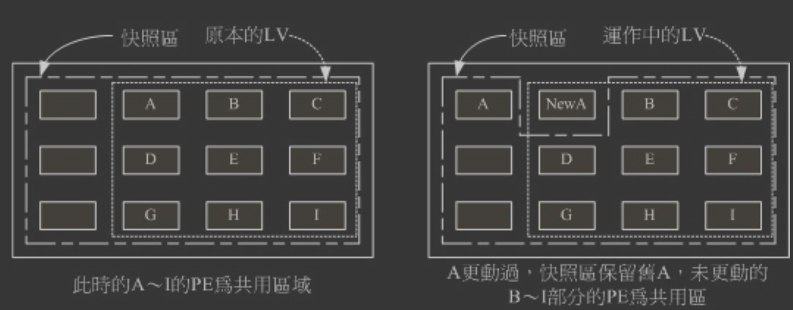
###需求上下文
磁盘数据版本管理
###方案
###输出
