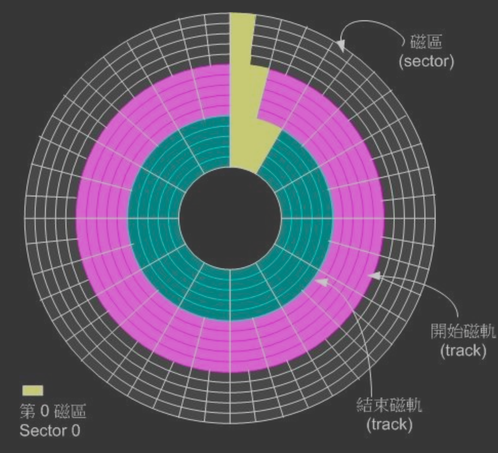
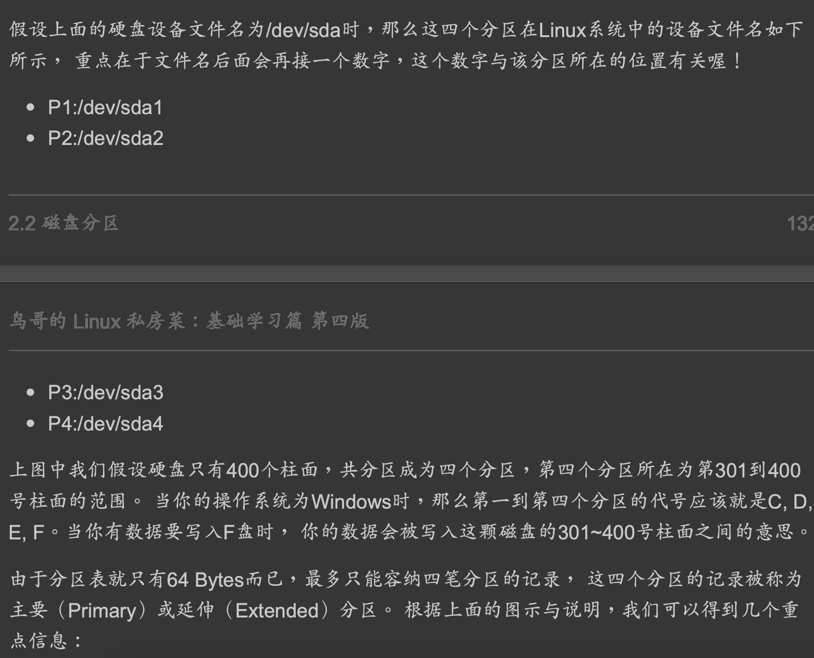
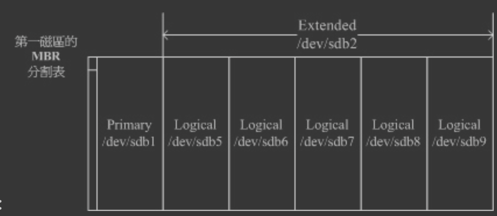
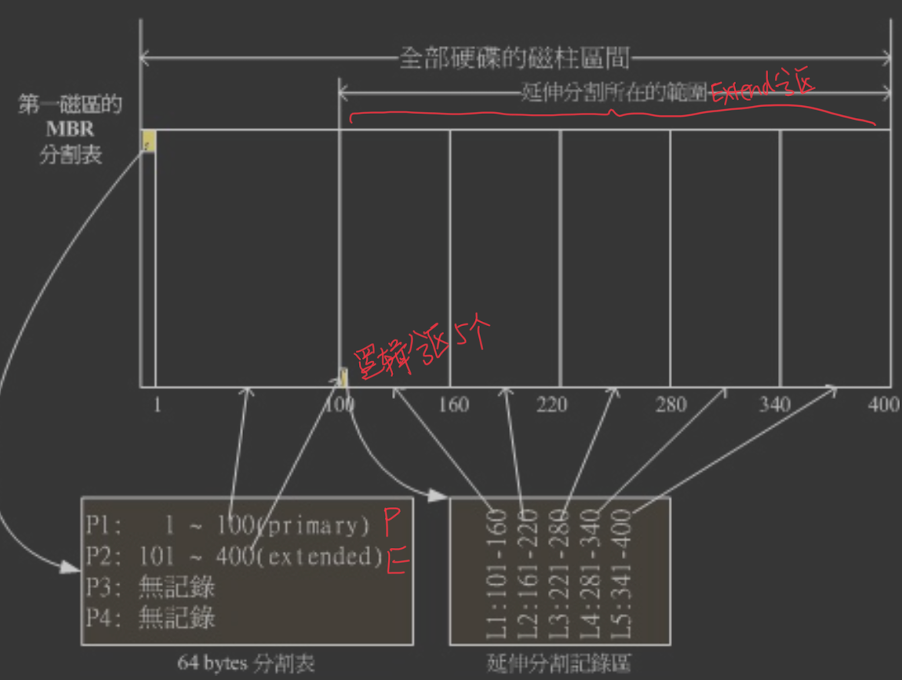
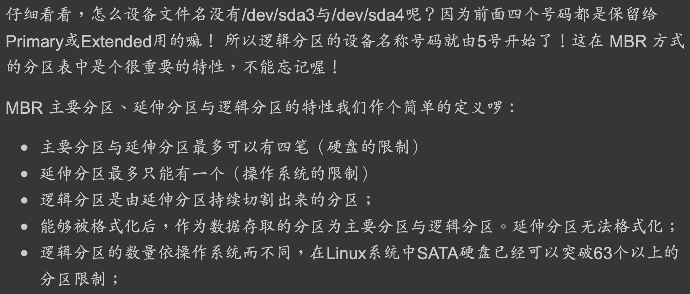

##磁盘接口
SATA与SAS
##磁盘类型
磁盘,硬盘
##磁盘设备挂载
##磁盘柱面

每一个同心圆是一个柱面，每一个柱面仅属于某一个分区
##磁盘分区格式
###MBR主引导扇区
早期磁盘第一个扇区里面含有的重要信息我们称为MBR (Master Boot Record) 格式
这个扇区通常是 512Bytes 的大 小 (旧的磁盘扇区都是 512Bytes 喔!)，所以说，第一个扇区 512Bytes 会有这两个数据:
主要开机记录区(Master Boot Record, MBR):可以安装开机管理程序的地方，有446 Bytes
分区表(partition table):记录整颗硬盘分区的状态，有64 Bytes


###GPT
甚至有些大 于 2TB 以上的磁盘分区已经让某些操作系统无法存取。因此后来又多了一个新的磁盘分区格 式，称为 GPT (GUID partition table)
##磁盘分区
###磁盘分区表


###磁盘主要分区&磁盘扩展分区
最多一个扩展分区
PPP+E,
PP+E,
P+E


###逻辑分区(逻辑卷)
查看逻辑卷lvdisplay




##开机流程_计算机电源启动读取磁盘B分区_BIOS和MBR主引导扇区关系和硬盘/磁盘关系


###BIOS引导程序&MBR引导程序&boot loader引导程序
BIOS引导程序位于ROM
MBR引导程序位于硬盘第一个扇区
boot loader引导程序位于分区前几个扇区
###MBR
MBR不属于任何一个操作系统，不随操作系统的不同而不同，即使不同，MBR也不会夹带操作系统的性质，具有公共引导的特性  
它先于所有的操作系统被调入内存并发挥作用，然后才将控制权交给活动主分区内的操作系统
```asp
主引导代码实现下列功能：
　　1．扫描分区表查找活动分区；
　　2．寻找活动分区的起始扇区；
　　3．将活动分区的引导扇区读到内存；
　　4．执行引导扇区的运行代码。
```

###DBR
分区引导扇区DBR
每个分区都有引导扇区，但只有被设为活动分区的DBR才会被MBR装入内存运行。
```asp
DBR主要由下列几个部分组成：
　        　1．跳转指令，占用3个字节的跳转指令将跳转至引导代码。
        　　2．厂商标识和DOS版本号，该部分总共占用8个字节。
　        　3．BPB（BIOS Parameter Block， BIOS 参数块）。
        　　4．操作系统引导程序。
        　　5．结束标志字，结束标志占用2个字节，其值为AA55
```
其内容将随格式化所用的操作系统版本及硬盘的逻辑盘参数的变化而变化。
[](https://sites.google.com/site/fenghuangsite/dian-nao/ruan-jian/ying-pan-zhu-yin-dao-shan-qu-fen-qu-biao-he-fen-qu-yin-dao-shan-qu-mbr-dpt-dbr-bpb-xiang-jie)
##文件系统
###windows 98 文件系统 FAT/U盘文件系统

windows 2000 NTFS 文件系统,
###Linux 文件系统 Ext2   


##格式化
为什么需要进行“格式化”呢?这是因为每种操作系统所设置的文件属性/权限并不相 同，  
 为了存放这些文件所需的数据，因此就需要将分区进行格式化，以成为操作系统能够利 用的“文件系统格式(filesystem)
windows 98 文件系统是 FAT,
windows 2000 NTFS 文件系统,
Linux 文件系统则为 Ext2 

##磁盘重组
需要磁盘重组的原因就是文件写入的 block 太过于离散了， 此时文件读取的性能将会变的很差所致。 这个时候可以通过磁盘重组将同一个文件所属的 blocks 汇整在一起，  
这样数据的读取会比较容易啊! 想当然尔，FAT 的文件系统需要三不五 时的磁盘重组一下，那么 Ext2 是否需要磁盘重整呢  
由于 Ext2 是索引式文件系统，基本上不太需要常常进行磁盘重组的。但是如果文件系统使用 太久，  
 常常删除/编辑/新增文件时，那么还是可能会造成文件数据太过于离散的问题，此时或 许会需要进行重整一下的。
##LVM
一个分区格式化为多个文件系统
##软件磁盘阵列(software raid
将多个分区合成一个文件系统(LVM, RAID)
