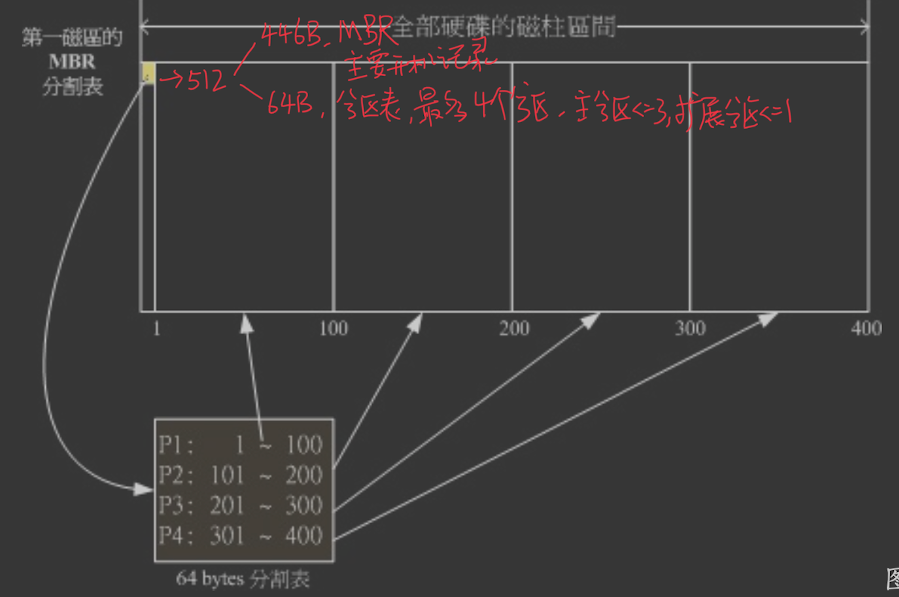
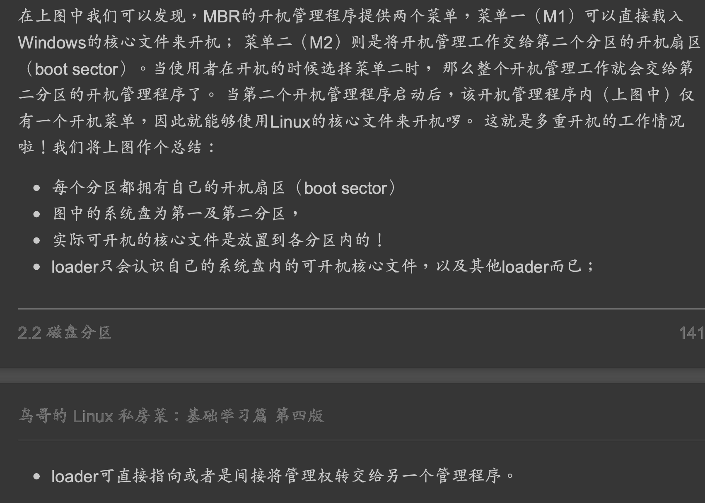

##磁盘接口
SATA与SAS
##磁盘类型
磁盘,硬盘
##磁盘设备挂载
##磁盘柱面

每一个同心圆是一个柱面，每一个柱面仅属于某一个分区
##磁盘分区格式
###MBR
早期磁盘第一个扇区里面含有的重要信息我们称为MBR (Master Boot Record) 格式
这个扇区通常是 512Bytes 的大 小 (旧的磁盘扇区都是 512Bytes 喔!)，所以说，第一个扇区 512Bytes 会有这两个数据:
主要开机记录区(Master Boot Record, MBR):可以安装开机管理程序的地方，有446 Bytes
分区表(partition table):记录整颗硬盘分区的状态，有64 Bytes

###GPT
甚至有些大 于 2TB 以上的磁盘分区已经让某些操作系统无法存取。因此后来又多了一个新的磁盘分区格 式，称为 GPT (GUID partition table)
##磁盘分区
###磁盘分区表

###磁盘主要分区&磁盘扩展分区
最多一个扩展分区
PPP+E,
PP+E,
P+E

###逻辑分区(逻辑卷)
查看逻辑卷lvdisplay

##开机流程_计算机电源启动读取磁盘B分区_BIOS和MBR关系和硬盘/磁盘关系

