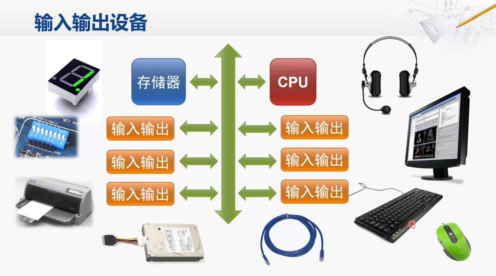
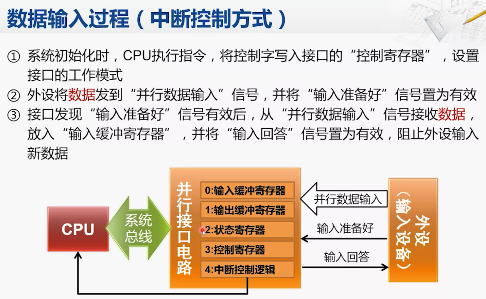
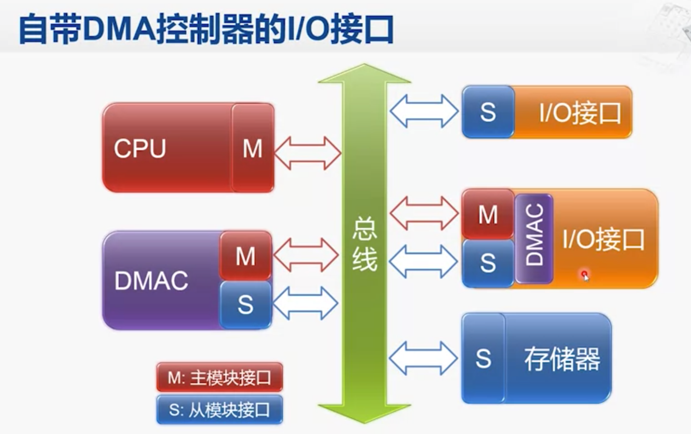
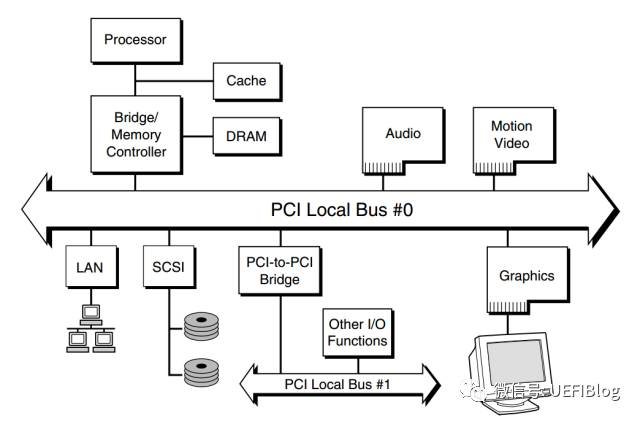

##临界知识
系统总线-事件总线
[](https://time.geekbang.org/column/article/111952)
[](https://www.coursera.org/lecture/jisuanji-zucheng/901-shu-ru-shu-chu-jie-kou-de-ji-ben-gong-neng-EU9VB)

接口-适配器
两种交互方式:轮训,中断
##总线体系

人的大脑和其他的器官、四肢，大部分靠脊髓相连。PCI/PCIe 总线 ，就相当于x86架构机器的脊髓。
其他内部总线、外部总线，都是挂在系统总线上的。USB、SATA、1394，统统是 PCI/PCIe 总线的下级

##本地总线/后端总线/高速缓存总线
##前端总线/处理器总线/内存总线/系统总线

##io总线/外部总线

诸如USB SATA IDE 1394 串口 以太网，这些暴露给普通用户插的，就是外部总线。
前面提到过，他们都是PCI/PCIe 总线 的下级
例如在PCI/PCIe 总线上，USB控制器是pci设备。在USB总线上，USB控制器又是头头，U盘是设备。  
 U盘里的数据想去cpu，得经由 usb总线 -->pci总线-->前端总线-->CPU
##功能类型
###数据线
###地址线
内存的某个位置，还是某一个 I/O 设备
###控制线
##总线裁决
总线不能同时给多个设备提供通信功能。我们的总线是很多个设备公用的，  
那多个设备都想要用总线，我们就需要有一个机制，去决定这种情况下，到底把总线给哪一个设备用

##输入输出设备


###接口


SATA 硬盘，上面的整个绿色电路板和黄色的齿状部分就是接口电路
黄色齿状的就是和主板对接的接口，绿色的电路板就是控制电路
接口可能在io设备中,也可能在主板中

并行接口（Parallel Interface）、串行接口（Serial Interface）、USB 接口，都是计算机主板上内置的各个接口。我们的实际硬件设备，比如，  
使用并口的打印机、使用串口的老式鼠标或者使用 USB 接口的 U 盘，都要插入到这些接口上，才能和 CPU 工作以及通信的。

接口本身就是一块电路板。CPU 其实不是和实际的硬件设备打交道，而是和这个接口电路板打交道。我们平时说的，  
设备里面有三类寄存器，其实都在这个设备的接口电路上，而不在实际的设备上，它们分别是状态寄存器（Status Register）、 命令寄存器（Command Register）以及数据寄存器（Data Register）

###接口在主板上
你平时听说的并行接口（Parallel Interface）、串行接口（Serial Interface）、USB 接口，都是计算机主板上内置的各个接口。我们的实际硬件设备，比如，使用并口的打印机、  
使用串口的老式鼠标或者使用 USB 接口的 U 盘，都要插入到这些接口上，才能和 CPU 工作以及通信的。
####接口寄存器
####控制电路
####数据缓冲区
###io设备
我们的硬件设备并不是直接接入到总线上和 CPU 通信的，而是通过接口，用接口连接到总线上，再通过总线和 CPU 通信。
###io通信流程

[](https://time.geekbang.org/column/article/113361)

##I/O端口、接口、设备控制器


###接口芯片
I/O接口芯片
I/O 接口的作用是什么？
缓冲
驱动
模式转换
向CPU提供I/O设备的状态信息和进行命令译码。对传送数据提供缓冲，以消除计算机与外设在“定时”或数据处理速度上的差异
###I/O端口

是指接口电路中的一些寄存器，这些寄存器分别用来存放数据信息、控制信息和状态信息。
一个 IO 接口，细分起来，还可分成几个端口。
如：状态端口、数据端口、命令端口等
执行一条指令时,cpu使用地址总线选择端口,数据总线将cpu寄存器数据传输给io接口中的设备端口
###端口映射

几乎每一种外设都是通过读写设备上的寄存器来进行的。外设寄存器也称为“I/O端口”，通常包括：控制寄存器、状态寄存器和数据寄存器三大类，而且一个外设的寄存器通常被连续地编址。  
CPU对外设IO端口物理地址的编址方式有两种：一种是I/O映射方式（I/O－mapped），另一种是内存映射方式（Memory－mapped）。而具体采用哪一种则取决于CPU的体系结构

###端口内存映射（Memory-Mapped I/O，简称 MMIO）
统一的i/o指令  
外设I/O端口的物理地址就被映射到CPU的单一物理地址空间中，而成为内存的一部分。此时，CPU可以象访问一个内存单元那样访问外设I/O端口，而不需要设立专门的外设I/O指令。  
这就是所谓的“内存映射方式”（Memory－mapped）。

```asp
为了让已经足够复杂的 CPU 尽可能简单，计算机会把 I/O 设备的各个寄存器，以及 I/O 设备内部的内存地址，都映射到主内存地址空间里来。主内存的地址空间里，
会给不同的 I/O 设备预留一段一段的内存地址。CPU 想要和这些 I/O 设备通信的时候呢，就往这些地址发送数据。这些地址信息，
就是通过上一讲的地址线来发送的，而对应的数据信息呢，自然就是通过数据线来发送的了。而我们的 I/O 设备呢，就会监控地址线，并且在 CPU 往自己地址发送数据的时候，
把对应的数据线里面传输过来的数据，接入到对应的设备里面的寄存器和内存里面来。CPU 无论是向 I/O 设备发送命令、查询状态还是传输数据，都可以通过这样的方式。
这种方式呢，叫作内存映射IO（Memory-Mapped I/O，简称 MMIO）。
```

###端口I/O映射（Port-Mapped I/O，简称 PMIO）
需要额外的io指令  


每个io接口对应一个地址区间(地址高位),一个端口对应一个io接口中的寄存器(地址低位)
为外设专门实现了一个单独地地址空间，称为“I/O地址空间”或者“I/O端口空间”。这是一个与CPU地RAM物理地址空间不同的地址空间，所有外设的I/O端口均在这一空间中进行编址。  
CPU通过设立专门的I/O指令（如X86的IN和OUT指令）来访问这一空间中的地址单元（也即I/O端口）。这就是所谓的“I/O映射方式”（I/O－mapped）。与RAM物理地址空间相比，  
I/O地址空间通常都比较小，如x86 CPU的I/O空间就只有64KB（0－0xffff）。这是“I/O映射方式”的一个主要缺点

```asp
无论是 PMIO 还是 MMIO，CPU 都会传送一条二进制的数据，给到 I/O 设备的对应地址。设备自己本身的接口电路，再去解码这个数据。  
解码之后的数据呢，就会变成设备支持的一条指令，再去通过控制电路去操作实际的硬件设备。对于 CPU 来说，  
它并不需要关心设备本身能够支持哪些操作。它要做的，只是在总线上传输一条条数据就好了。
```
##io三种控制方式

###程序控制方式(直接执行,嵌入式设备)


###程序查询传送方式(轮训)


###中断控制方式(中断)
####中断程序指令
输入  

  
输出  
输出中断是因为cpu不确定输出缓冲是否为空,需要设备来通知


缺点  


###DMA直接存储访问
中断访问时,如果cpu io时接收数据过多,会占用过多cpu



##中断类型
###硬中断

####可屏蔽中断
####非屏蔽中断
###软中断
##PCI 设备
[](https://zhuanlan.zhihu.com/p/26172972)

符合 PCI 总线标准的设备就被称为 PCI 设备，PCI 总线架构中可以包含多个 PCI 设备。图中的 Audio、LAN 都是一个 PCI 设备。  
PCI 设备同时也分为主设备和目标设备两种，主设备是一次访问操作的发起者，而目标设备则是被访问者

