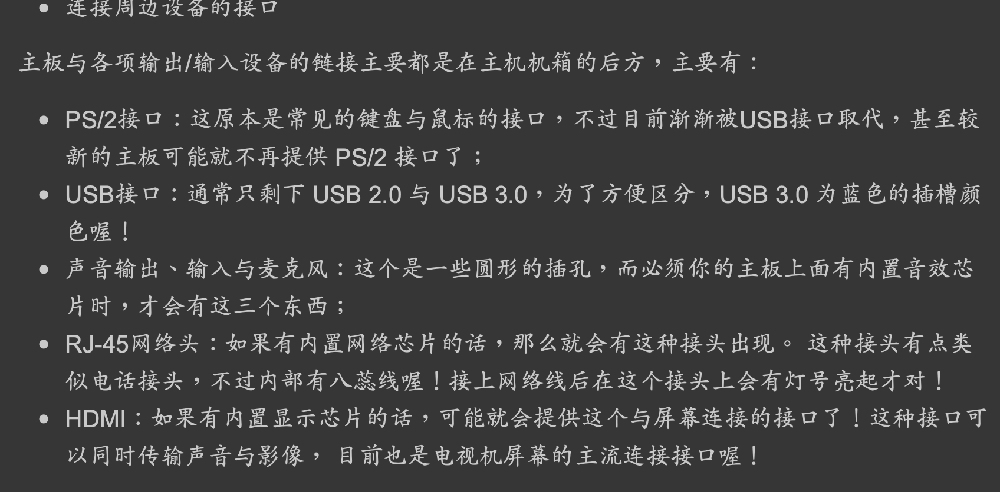
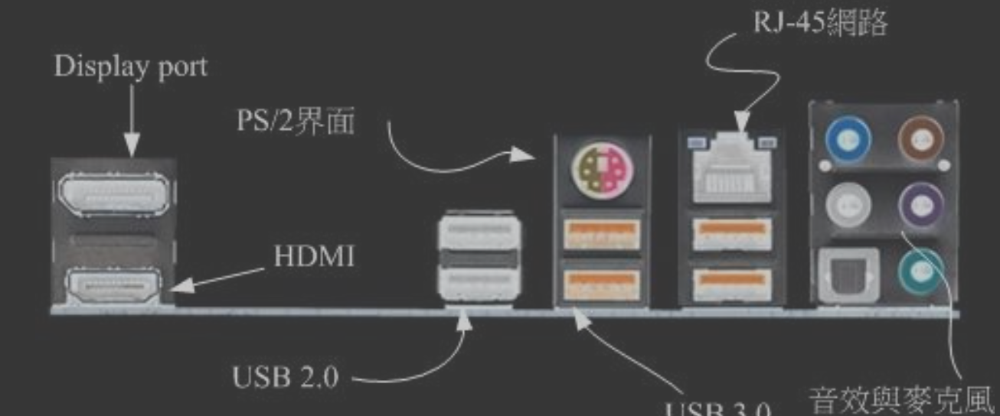
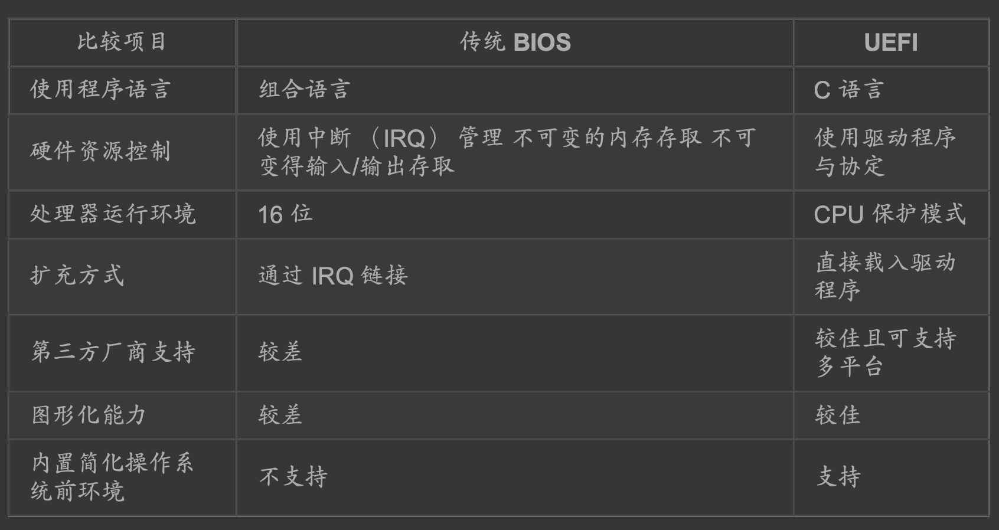

##存储器
###ROM
CMOS
###RAM
cpu,内存(DRAM)
###硬盘
接口类型,磁盘接口有两种， 分别是SATA与SAS
##CMOS
CMOS主要的 功能为记录主板上面的重要参数， 包括系统时间、CPU电压与频率、各项设备的I/O位址与 IRQ等，由于这些数据的记录要花费电力，因此主板上面才有电池。  
BIOS为写入到主板上某 一块 flash 或 EEPROM 的程序，他可以在开机的时候执行，以载入CMOS当中的参数， 并尝 试调用储存设备中的开机程序，进一步进入操作系统当中。  
BIOS程序也可以修改CMOS中的 数据， 每种主板调用BIOS设置程序的按键都不同，一般台式机常见的是使用[del]按键进入 BIOS设置画面。
##CPU
##内存
频率/带宽
##显卡
##网卡
##设备接口类型

##固件
写入ROM的软件,例如BIOS,BIOS位于ROM中
磁盘容量100GB增大2TB:
BIOS->UEFI:UEFI (Unified Extensible Firmware Interface)是BIOS的升级版
MBR->GPT:MBR(主要开机记录区(Master Boot Record, MBR)),GPT(GUID partition table, GPT 磁盘分区表)

##设备I/O地址与IRQ中断
设备I/O地址:CPU与设备通信
IRQ中断线路:设备与CPU通信
##io总线
