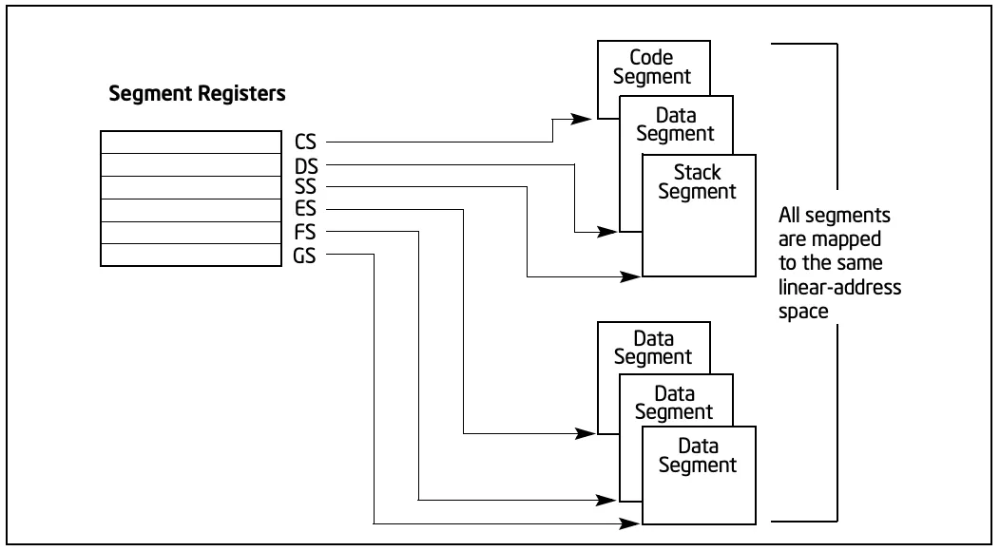
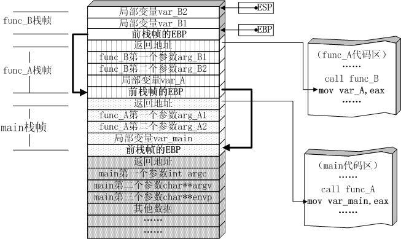
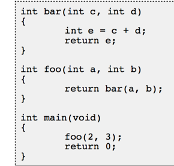
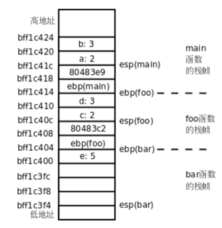
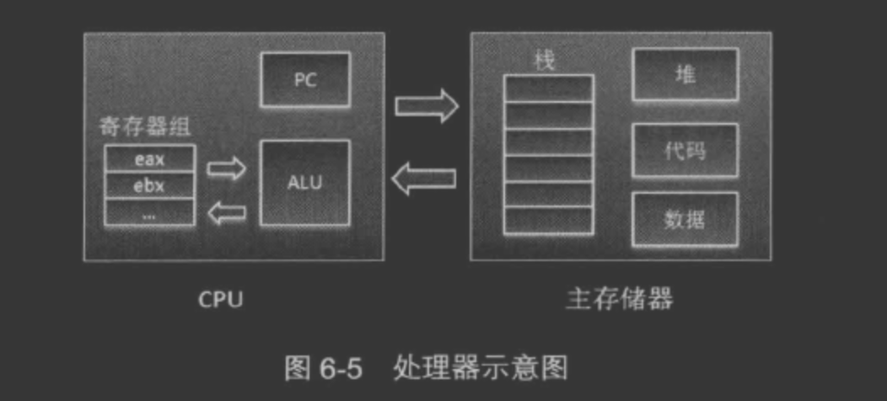

##寄存器
###做什么
存储数据
指针

###
[](https://www.cnblogs.com/xuanyuan/p/13850548.html)
[](https://blog.csdn.net/kwame211/article/details/77773621)
指令寄存器(IR):用来保存当前正在执行的一条指令
指令包括操作码和地址码两个字段，为了执行指令，必须对操作码进行测试，识别出所要求的操作，指令译码器（Instruction Decoder，ID）就是完成这项工作的。指令译码器对指令寄存器的操作码部分进行译码，以产生指令所要求操作的控制电位，并将其送到微操作控制线路上，在时序部件定时信号的作用下，产生具体的操作控制信号。

指令寄存器中操作码字段的输出就是指令译码器的输入。操作码一经译码，即可向操作控制器发出具体操作的特定信号。

程序计数器（PC）
地址寄存器（AR）
数据寄存器（DR）
累加寄存器（AC）
程序状态字寄存器（PSW）:

###通用寄存器:这些寄存器CPU没有特殊的用途，交给应用程序“随意”使用

esp: 栈顶指针，指向栈的顶部地址
```
eax: 通常用来执行加法，函数调用的返回值一般也放在这里面
ebx: 数据存取
ecx: 通常用来作为计数器，比如for循环
edx: 读写I/O端口时，edx用来存放端口号
esp: 栈顶指针，指向栈的顶部
ebp: 栈底指针，指向栈的底部，通常用ebp+偏移量的形式来定位函数存放在栈中的局部变量
esi: 字符串操作时，用于存放数据源的地址
edi: 字符串操作时，用于存放目的地址的，和esi两个经常搭配一起使用，执行字符串的复制等操作
```
寄存器传参的好处是速度快，减少了对内存的读写次数
###标志寄存器
```
CF 进位标志
PF 奇偶标志
ZF 零标志
SF 符号标志
OF 补码溢出标志
TF 跟踪标志
IF 中断标志
```
###指令寄存器
eip: 指令寄存器可以说是CPU中最最重要的寄存器了，它指向了下一条要执行的指令所存放的地址，CPU的工作其实就是不断取出它指向的指令，
然后执行这条指令，同时指令寄存器继续指向下面一条指令，如此不断重复，这就是CPU工作的基本日常

###段寄存器



通用寄存器、段寄存器、标志寄存器、指令寄存器，这四组寄存器共同构成了一个基本的指令执行环境

##函数执行过程
[](https://www.zhihu.com/question/22444939)


###ESP
###EBP
###EIP


指令寄存器(extended instruction pointer)， 其内存放着一个指针，该指针永远指向下一条待执行的指令地址




###主要指令
call指令:返回地址入栈,跳转被调用函数地址

##寄存器指令集vs栈式指令集
###硬件寄存器指令

###jvm栈式指令集
