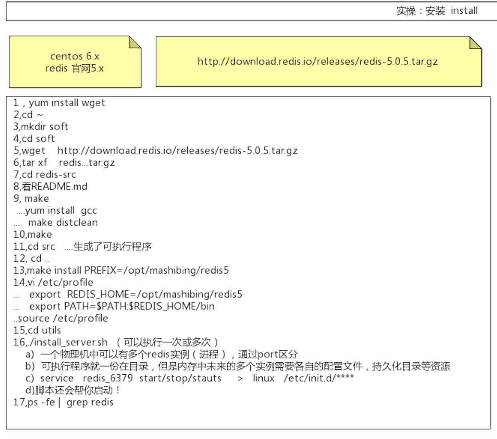

##临界知识
编译安装源码包的流程
##gcc vs cc
都是编译期
GCC supports both C and C++ programs, while CC only supports C programs.
[](https://askanydifference.com/difference-between-gcc-and-cc-compiler/)
##make&Makefile(build)
[](https://www.ruanyifeng.com/blog/2015/02/make.html)
代码变成可执行文件，叫做编译（compile）；先编译这个，还是先编译那个（即编译的安排），叫做构建（build）
make只是一个根据指定的Shell命令进行构建的工具
构建规则都写在Makefile文件里面，要学会如何Make命令，就必须学会如何编写Makefile文件
##service & init 
```asp
在类Unix 的计算机操作系统中，Init（初始化的简称）是在启动计算机系统期间启动的第一个进程。

Init 是一个守护进程，它将持续运行，直到系统关闭。它是所有其他进程的直接或间接的父进程。

因为init 的参数全在/etc/init.d目录下，所以使用 init 启动一个服务，应该这样做
```
```asp
service 是去/etc/init.d目录下执行相关程序，服务配置文件的存放目录就是/etc/init.d.

使用 service 启动一个服务
sudo /etc/init.d/nginx start
// 等价于
service nginx start
```
##redis编译安装源码
1.readme.md

