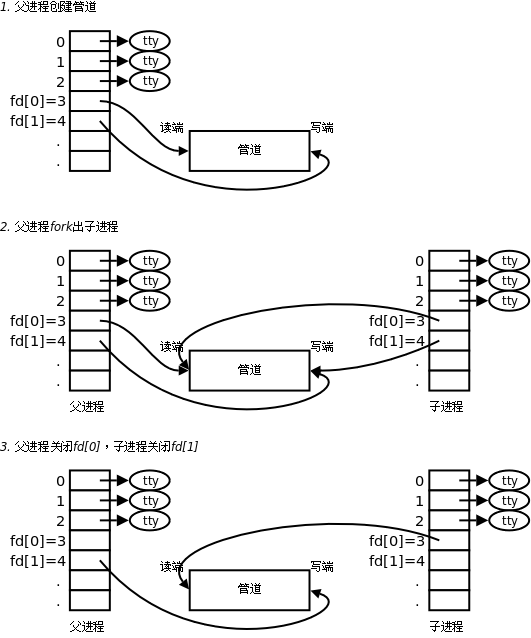
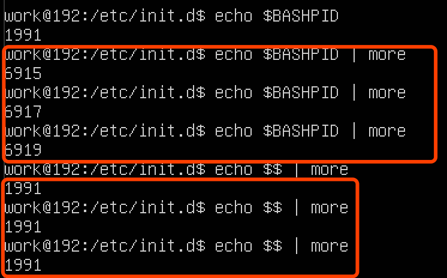

##后台运行
nohup ./mqnamesrv >./log.txt  2>&1 &
```asp
nohup:忽略内部的挂断信号，不挂断运行
&:后台运行
>:重定向
2>&1:
0表示标准输入
1表示标准输出
2表示标准错误输出
> 默认为标准输出重定向，与 1> 相同
2>&1 意思是把 标准错误输出 重定向到 标准输出.
&>file 意思是把 标准输出 和 标准错误输出 都重定向到文件file中
```
##man使用
```asp
1      User Commands

2      System Calls

3      C Library Functions

4      Devices and Special Files

5      File Formats and Conventions

6      Games et. Al.

7      Miscellanea

8      System Administration tools and Deamons
```
##管道



1.前一个命令(进程)的输出流fd(1)作为后一个命令的输入流fd(0)
2.管道会触发创建子进程
3.管道和命令有优先级概念

```asp
echo $$ | more,//$$优先级高于|,$$先执行,一般都是优先级高于管道(优先于管道执行),比如查看日志ls -l | grep
echo $BASHPID | more,//$BASHPID优先级低于|,|先执行,然后子进程$BASHPID
```
##常用过滤
egrep 'a|b'

###递归查找文本
grep -n -ri "grafana.staging.mifi.pt.com" .

###批量删除某个端口号的进程
lsof -i tcp:5601 | awk '{if(NR>1){print $2}}'| xargs -n 1 kill -9

###过滤第一行
NR>1
