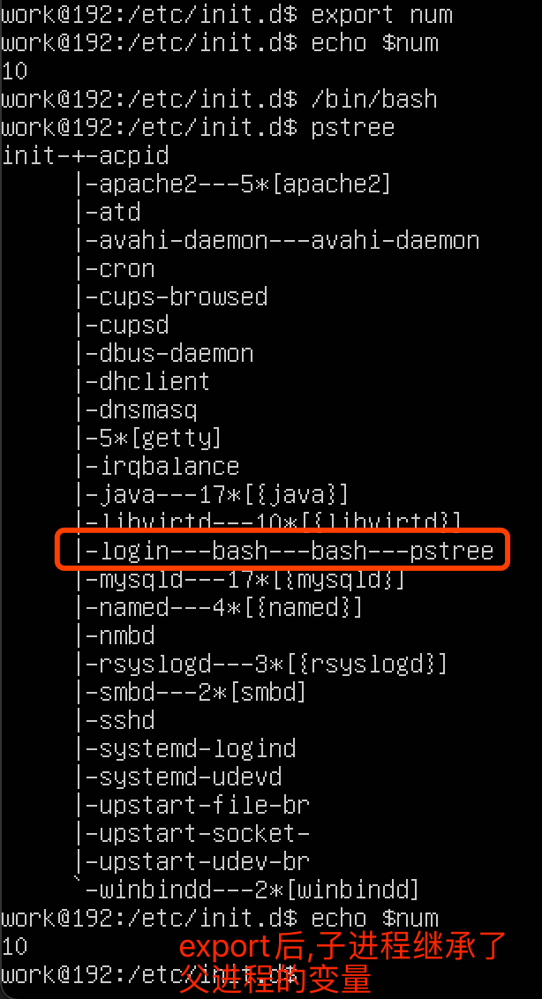

##临界知识
每个shell命令会开启一个新的进程,进程执行完退出
##环境变量
全局变量，存在与所有的shell 中，在你登陆系统的时候就已经有了相应的系统定义的环境变量了。
Linux 的环境变量具有继承性，即子shell 会继承父shell 的环境变量
##本地变量

当前shell 中的变量，显然本地变量中肯定包含环境变量。Linux 的本地变量不具备继承性
##export

用于把变量变成当前shell 和其子shell 的环境变量，存活期是当前的shell 及其子shell，
因此重新登陆以后，它所设定的环境变量就消失了，export命令可以用于传递一个或多个变量的值到任何后继脚本
当一个脚本程序运行完毕，它的脚本shell将终止，可以返回到执行该脚本之前的shell。从这种意义上来说，
用户可以有许多shell，每个shell都是由某个shell（称为父shell）派生的。在子shell中定义的变量只在该子shell内有效。
如果在一个shell脚本程序中定义了一个变量，当该脚本程序运行时，这个定义的变量只是该脚本程序内的一个局部变量，其他的shell不能引用它，
要使某个变量的值可以在其他shell中被改变，可以使用export命令对已定义的变量进行输出。export命令将使系统在创建每一个新的shell时定义
这个变量的一个拷贝。这个过程称之为变量输出
##source
```asp
source 命令可以影响执行脚本的父shell的环境，而 export 则只能影响其子shell的环境。source a.sh 同直接执行 ./a.sh 有什么不同呢，
比如你在一个脚本里export $KKK=111 ,如果你用./a.sh执行该脚本，执行完毕后，你运行 echo $KKK ,发现没有值，如果你用source来执行 ，
然后再echo ,就会发现KKK=111。因为调用./a.sh来执行shell是在一个子shell里运行的，所以执行后，结果并没有反应到父shell里，不过source不同，
他就是在本shell中执行的，所以能看到结果。source 命令会强制执行脚本中的全部命令,而忽略文件的权限

```
##环境变量文件
[](https://blog.csdn.net/grantlee1988/article/details/7783847)
etc/profile :系统级别
/etc/bashrc:bash级别
~/.bash_profile:用户级别
~/.bashrc:用户级别

