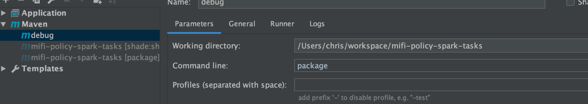
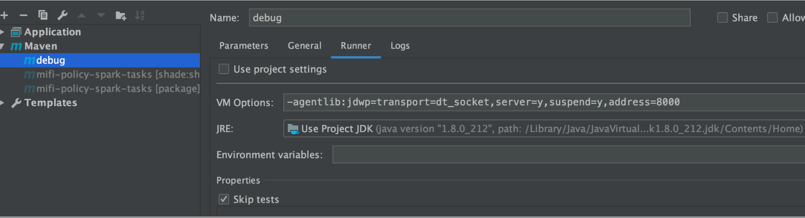
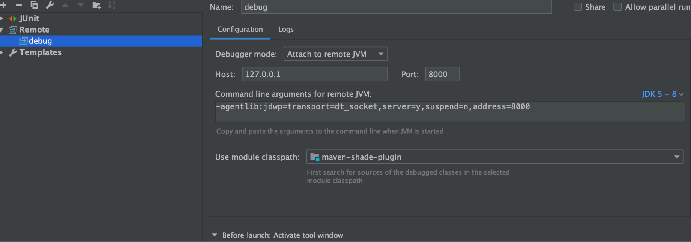

##0.例子maven-shade-plugins
调试端:业务项目


-agentlib:jdwp=transport=dt_socket,server=y,suspend=y,address=8000

被调试端:maven插件

##1.如何debug maven
[](https://shengulong.github.io/blog/2019/07/23/maven%E6%8F%92%E4%BB%B6%E8%B0%83%E8%AF%95%E6%96%B9%E6%B3%95/)
##2.debug如何运作?
###概念模型
```
           Components                          Debugger Interfaces

                /    |--------------|
               /     |     VM       |
 debuggee ----(      |--------------|  <------- JVM TI - Java VM Tool Interface
               \     |   back-end   |
                \    |--------------|
                /           |
 comm channel -(            |  <--------------- JDWP - Java Debug Wire Protocol
                \           |
                     |--------------|
                     | front-end    |
                     |--------------|  <------- JDI - Java Debug Interface
                     |      UI      |
                     |--------------|
```

[官网](https://docs.oracle.com/javase/8/docs/technotes/guides/jpda/architecture.html)
有哪些对象
对象如何交互
###实现模型
[](https://younghz.github.io/java-debug-architecture)

[](https://www.jianshu.com/p/86ec47435cfc)

##attach机制


