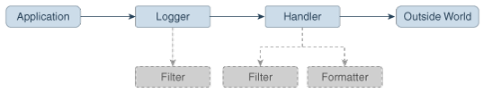
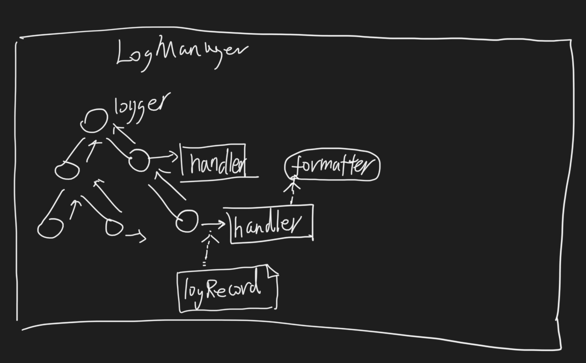
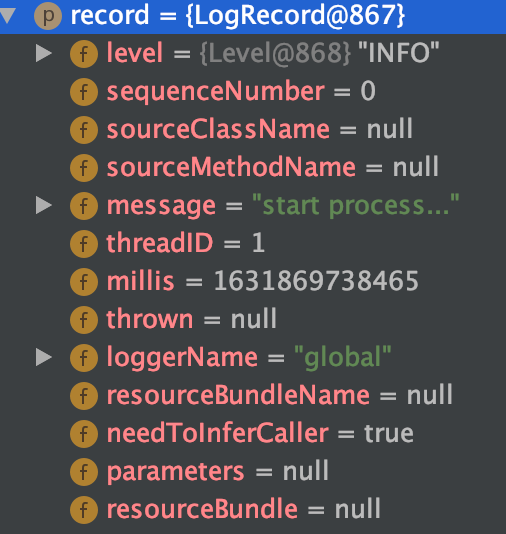

##对象模型


[](https://docs.oracle.com/javase/10/core/java-logging-overview.htm#JSCOR-GUID-B83B652C-17EA-48D9-93D2-563AE1FF8EDA)
###logger
日志输出单元,一个logger和一个handler(输出处理器)搭配,一个looger也可以和多个handler搭配,
logger类似门面,handler是日志输出执行者
logger有树状层次模型,孩子节点的输出会传给父亲节点
###handler
日志输出执行者,StreamHandler,ConsoleHandler,FileHandler
###LogRecord
日志结构化包装类,包含level,msg等信息
###LogManager
日志管理器,全局单例,负责管理logger层次结构,以及日志配置信息
###LoggerContext
// LoggerContext for system loggers and user loggers
private final LoggerContext systemContext = new SystemLoggerContext();
private final LoggerContext userContext = new LoggerContext();
日志环境上下文,全局单例
###Formatters
日志输出格式
##层次关系
###logger namespace树形
Applications make logging calls on Logger objects. 
Logger objects are organized in a hierarchical namespace and child Logger objects may inherit some logging properties from their parents in the namespace

Each Logger object keeps track of a set of output Handler objects. By default all Logger objects also send their output to their parent Logger. 
But Logger objects may also be configured to ignore Handler objects higher up the tree.
###level 粒度
logger级别
包名级别
##临界知识
###logger层次&向上输出
[Logger.log]
```
public void log(LogRecord record) {
        if (!isLoggable(record.getLevel())) {
            return;
        }
        Filter theFilter = filter;
        if (theFilter != null && !theFilter.isLoggable(record)) {
            return;
        }

        // Post the LogRecord to all our Handlers, and then to
        // our parents' handlers, all the way up the tree.

        Logger logger = this;
        while (logger != null) {
            final Handler[] loggerHandlers = isSystemLogger
                ? logger.accessCheckedHandlers()
                : logger.getHandlers();

            for (Handler handler : loggerHandlers) {
                handler.publish(record);
            }

            final boolean useParentHdls = isSystemLogger
                ? logger.useParentHandlers
                : logger.getUseParentHandlers();

            if (!useParentHdls) {
                break;
            }

            logger = isSystemLogger ? logger.parent : logger.getParent();
        }
    }
```
###record信使

###格式化&消息输出
[StreamHandler.publish]
```
@Override
    public synchronized void publish(LogRecord record) {
        if (!isLoggable(record)) {
            return;
        }
        String msg;
        try {
            msg = getFormatter().format(record);
        } catch (Exception ex) {
            // We don't want to throw an exception here, but we
            // report the exception to any registered ErrorManager.
            reportError(null, ex, ErrorManager.FORMAT_FAILURE);
            return;
        }

        try {
            if (!doneHeader) {
                writer.write(getFormatter().getHead(this));
                doneHeader = true;
            }
            writer.write(msg);
        } catch (Exception ex) {
            // We don't want to throw an exception here, but we
            // report the exception to any registered ErrorManager.
            reportError(null, ex, ErrorManager.WRITE_FAILURE);
        }
    }
```
###ring buffer
