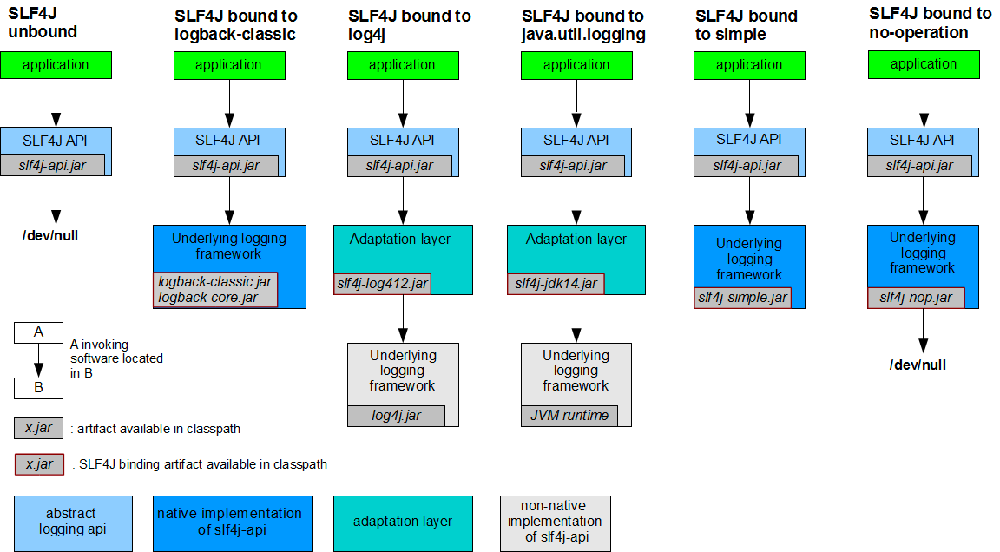
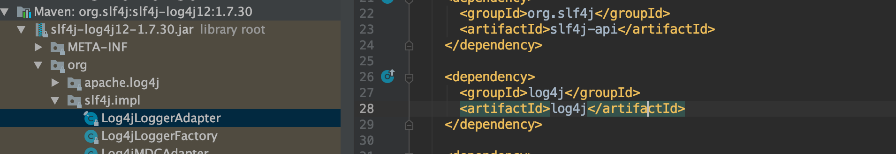

##门面
##绑定依赖库
Binding with a logging framework at deployment time

slf4j-log4j12-${latest.stable.version}.jar

slf4j-jdk14-${latest.stable.version}.jar
###扫描机制StaticLoggerBinder
LoggerFactory.bind()  
[扫描机制](https://www.cnblogs.com/waterystone/p/11329645.html)  
每个bind依赖库都有自己的StaticLoggerBinder,通过StaticLoggerBinder
确定具体的日志框架
bind依赖库依赖中会依赖log4j-api等接口依赖包

