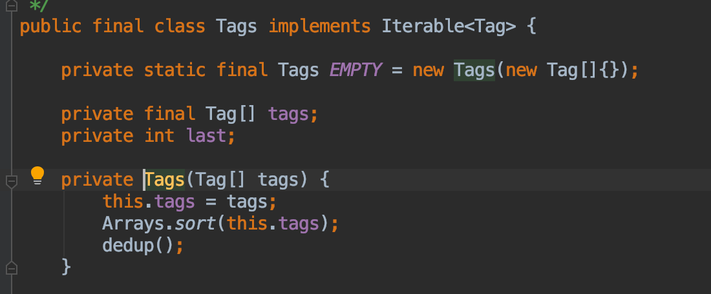
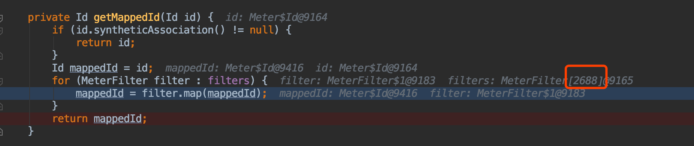
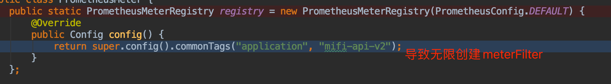
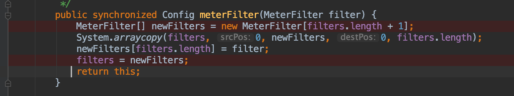

##结果过程
1.内存占用 ，jmap -histo pid | head -20
2.cpu, top , top -Hp pid
3.升级内存,调整新生代为2G，然后增加流量，发现CPU暴增300%，jstack发现是prometheus排序问题

4.过了大概28小时,minor gc、major gc频繁报警,cpu也时常报警
2021-09-19T23:07:08.259+0800: 103237.067
5.gc日志
ide.jvm.string_table_gc.log
6.parNew日志,CMS日志，full gc日志
7.内存占用情况

8.cpu占用情况
top -Hp pid
./jstack  pid | grep pid(16进制)

9.本地复现
本地复现发现Tag是什么,debug发现创建了很多公共meterFilter,原因是自己错误复写config()，导致每次调用config()都生成一个meterFilter，每个meterFilter都会追加tag到原始tag,然后进行排序(导致cpu暴涨原因)

11.查询字符串是否使用同一个
select s from java.lang.String s where s.toString().startsWith("weChatVersion")
12.优化避免重复字符串
发现只有15个重复字符串,说明后序复用了,不再优化

all(#3)：   最新的3个点，每个点都满足条件
max(#3)：最新的3个点中的最大值满足条件
min(#3)： 最新的3个点中的最小值满足条件
sum(#3)：最新的3个点的和满足条件
avg(#3)： 最新的3个点的平均值满足条件
diff(#3)：  最新的1个点（被减数），与不包含当前点的最新的3个点（减数）分别相减，得到3个差，只要有一个差满足条件
pdiff(#3)：最新的1个点，与不包含当前点的最新的3个点（减数）相减，得到3个差，再将3个差值分别除以减数，得到3个值之后再分别乘以100（百分比），只要有一个值满足条件
exists(#2/3)：最新的3个点中，有2个满足条件

##总结临界知识
###确定现象
1.查看内存信息
gc信息:gc.log,服务性能视图,内存快照hprof
内存数据:top查看内存占比,jmap查看内存实例排行榜,jstack查看线程状态
2.查看cpu信息
top查看进程,top -Hp查看线程
###寻找原因
1.复现问题
如果本地能搭建环境,则搭建环境复现
2.缩小范围
确定所在系统对象和流程,缩小流程范围
