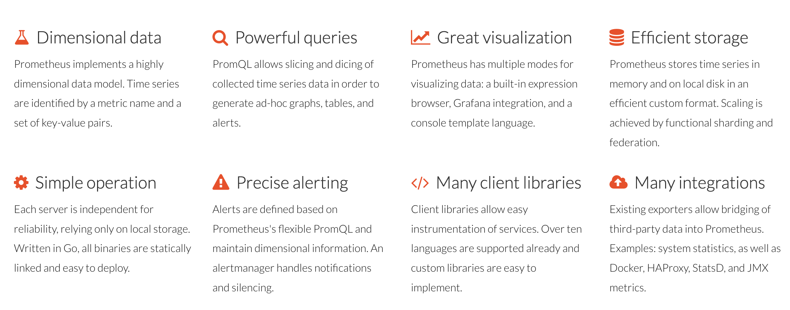
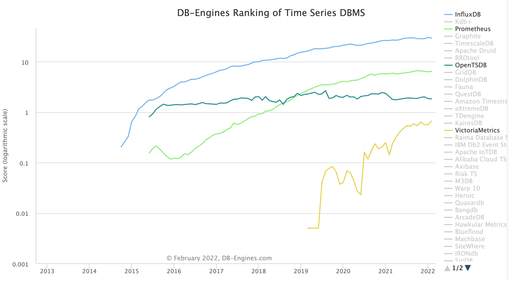

#定位
Power your metrics and alerting with the leading open-source monitoring solution

```asp
- prometheus以丰富的promql实时查询聚合引擎
- 强悍的性能：单机千万级别并发写入的qps
```
#opentsdb vs influxdb vs prometheus vs es
HBase vs Cassandra

#时序数据库特点
时序数据库就是存放时序数据的数据库，并且需要支持时序数据的快速写入、持久化、多纬度的聚合查询等基本功能
##写入平稳、持续、高并发高吞吐
```asp
- 时序数据的写入是比较平稳的，这点与应用数据不同，应用数据通常与应用的访问量成正比，而应用的访问量通常存在波峰波谷
- 时序数据的产生通常是以一个固定的时间频率产生，不会受其他因素的制约，其数据生成的速度是相对比较平稳的
```
##写多读少
```asp
- 时序数据上95%-99%的操作都是写操作，是典型的写多读少的数据
- 这与其数据特性相关，例如监控数据，你的监控项可能很多，但是你真正去读的可能比较少，通常只会关心几个特定的关键指标或者在特定的场景下才会去读数据
```
##实时写入最近生成的数据，无更新
```asp
- 时序数据的写入是实时的，且每次写入都是最近生成的数据，这与其数据生成的特点相关，因为其数据生成是随着时间推进的，而新生成的数据会实时的进行写入
- 数据写入无更新，在时间这个维度上，随着时间的推进，每次数据都是新数据，不会存在旧数据的更新，不过不排除人为的对数据做订正。
```
##查询特点
```asp
- 按时间范围读取：通常来说，你不会去关心某个特定点的数据，而是一段时间的数据。
- 最近的数据被读取的概率高
- 历史数据以粗粒度查询
- 多种精度查询
- 多维度分析
```
##数据存储的特点
###数据量大
```asp
- 拿监控数据来举例，如果我们采集的监控数据的时间间隔是1s，那一个监控项每天会产生86400个数据点
- 若有10000个监控项，则一天就会产生864000000个数据点。在物联网场景下，这个数字会更大。整个数据的规模，是TB甚至是PB级的。
```
###冷热分明
时序数据有非常典型的冷热特征，越是历史的数据，被查询和分析的概率越低
###具有时效性
- 时序数据具有时效性，数据通常会有一个保存周期，超过这个保存周期的数据可以认为是失效的，可以被回收
- 一方面是因为越是历史的数据，可利用的价值越低；另一方面是为了节省存储成本，低价值的数据可以被清理
###多精度数据存储
在查询的特点里提到时序数据出于存储成本和查询效率的考虑，会需要一个多精度的查询，同样也需要一个多精度数据的存储
#时序数据库关键问题
```asp
- 时序数据的写入：如何支持每秒钟上千万上亿数据点的写入。
- 时序数据的读取：又如何支持在秒级对上亿数据的分组聚合运算。
- 成本敏感：由海量数据存储带来的是成本问题。如何更低成本的存储这些数据，将成为时序数据库需要解决的重中之重
```
#演化
[](https://zhuanlan.zhihu.com/p/32900004)
