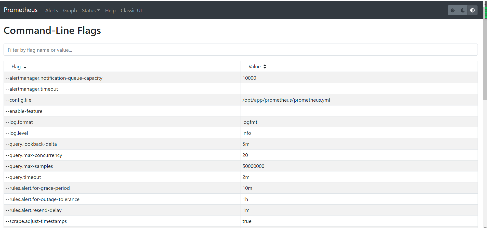

#正则
##类似
[](https://prometheus.io/docs/prometheus/latest/querying/basics/)
- `=` 等于
- `!=` 不等于
- `=~` 正则匹配
- `!~` 正则非匹配
##不区分大小写
[](https://stackoverflow.com/questions/53312007/prometheus-query-and-case-sensitivity)
(?i:model)
#命令参数


##alertmanager
##配置文件
##web
```asp
--web.listen-address="0.0.0.0:9090"

- 代表prometheus监听的地址
- 多个prometheus实例在一起时候会争抢
```
##热更新
```asp
--web.enable-lifecycle代表开启热更新配置

curl -X POST -vvv  localhost:9090/-/reload 
```
##storage
```asp
--storage.tsdb.path="data/"  本地tsdb存储位置
```
##retention
--storage.tsdb.retention.time 代表数据保留时间 默认15天
#内置标签
__name__
#黑盒探针
工作日接入
