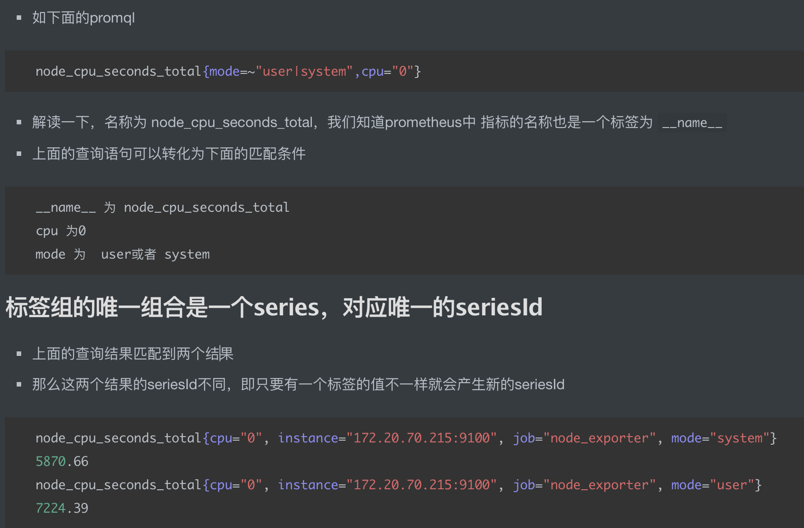

#长尾效应
#毛刺
#Point 数据点
```asp
type Point struct {
	T int64
	V float64
}
```
一个时间戳和一个value组合成的数据点
#Label 标签
```asp
type Label struct {
	Name, Value string
}
```
#sample 数据点
```asp
type Sample struct {
	Point

	Metric labels.Labels
}
```
#seriesId
seriesId唯一标识标签组,只要有一个标签的值不一样就会产生新的seriesId

