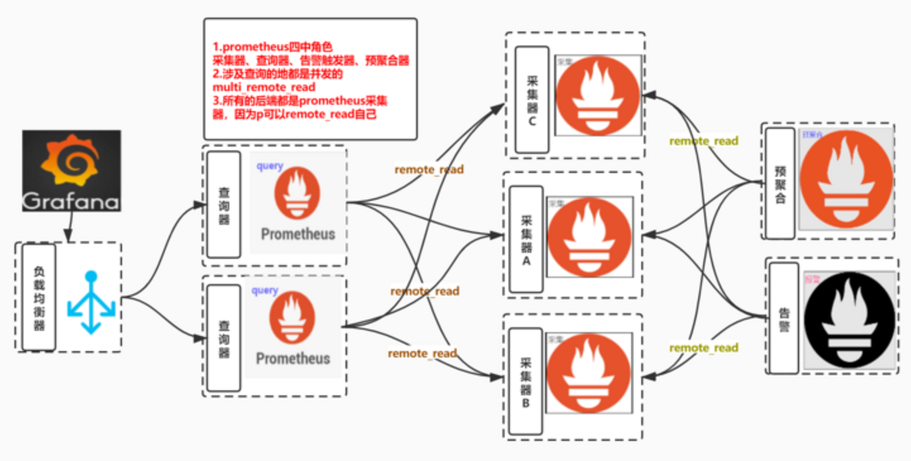

[](https://www.eet-china.com/mp/a26095.html)
[cortex](https://zhuanlan.zhihu.com/p/258163845)
#采集端高可用
[](http://www.xuyasong.com/?p=1921#i-7)
#存储高可用

```asp
- Prometheus可以将其提取的样本以标准格式写入远程URL。
- Prometheus可以以标准格式从其他Prometheus服务器接收样本。
- Prometheus可以以标准化格式从远程URL读取（返回）样本数据。
```
##读取和写入协议都使用基于HTTP/2的快速压缩协议缓冲区编码
##不支持分布式promql，数据需要在查询端完成
```asp
- 请注意，在读取路径上，Prometheus仅从远端获取一组标签选择器和时间范围的原始系列数据
- PromQL对原始数据的所有评估仍然在Prometheus本身中进行
- 这意味着远程读取查询具有一定的可伸缩性限制，因为所有必需的数据都需要先加载到查询的Prometheus服务器中，然后再在该服务器中进行处理。
- 但是，暂时认为支持PromQL的完全分布式评估是不可行的
```
##现有支持的远程端点和存储
InfluxDB
Thanos,我们公司,读写都支持
Elasticsearch,只支持写入
Kafka,只支持写入
OpenTSDB,只支持写入

注意是各个存储在内部代码中适配prometheus,不是prometheus适配其他存储，可见大家都在抱prometheus大腿
##prometheus 联邦
```asp
- 本质上就是采集级联
- 说白了就是 a 从 b,c,d那里再采集数据过来
- 可以搭配match指定只拉取某些指标
```
```asp
scrape_configs:
  - job_name: 'federate'
    scrape_interval: 15s

    honor_labels: true
    metrics_path: '/federate'

    params:
      'match[]':
        - '{job="prometheus"}'
        - '{__name__=~"job:.*"}'

    static_configs:
      - targets:
        - 'source-prometheus-1:9090'
        - 'source-prometheus-2:9090'
        - 'source-prometheus-3:9090'
```
因为是将本地的数据发送走，所以首先创建一个localstorage 的Querier
如果没有过滤那么只是一股脑把分片的数据集中到了一起，没意义,很多时候是因为数据量太大了，分散在多个采集器的数据是不能被一个联邦消化的
###正确使用联邦的姿势
```asp
- 使用match加过滤，将采集数据分位两类
  - 第一类需要再聚合的数据，通过联邦收集在一起
    - 举个例子
      - 只收集中间件的数据的联邦
      - 只收集业务数据的联邦
  - 其余数据保留在采集器本地即可
- 这样可以在各个联邦上执行`预聚合`和`alert`，使得查询速度提升
```
##multi_remote_read

多个采集的prometheus + 多个无状态的prometheus query实现prometheus的高可用方案
```asp
- 监控数据存储在多个采集器的本地，可以是机器上的prometheus
- 也可以是k8s中的prometheus statefulset
- prometheus query remote_read 填写多个`prometheus/api/v1/read/`地址
```
##公司高可用方案
[](https://zhuanlan.zhihu.com/p/311257416)

###hash分片(relabel)
consul+动态配置+一致性hash算法,需要drop掉不属于自己的分片
每个prometheus采集段都去拉?

###远程时序数据库
分片集群+remote时序数据库VictoriaMetrics,需要查询所有分片
[](https://mojo-zd.github.io/2019/06/26/promtheus-VictoriaMetrics%E7%BB%84%E5%90%88%E6%8A%80/)

[](https://blog.cong.moe/post/2021-08-23-use-victoria-metrics-replace-prometheus/)
###数据重复怎么办(自动去重)
```asp
- 不用管，上面提到了query会做merge，多个数据只会保留一份
- 到正可以利用这个特点模拟副本机制：
  - 重要的采集job由两个以上的采集prometheus采集
  - 查询的时候merge数据
  - 可以避免其中一个挂掉时没数据的问题
```
###那么这种方案的缺点在哪里
```asp
- 并发查询必须要等最慢的那个返回才返回，所以如果有个慢的节点会导致查询速度下降，举个例子

  - 有个美东的节点，网络基础延迟是1秒，那么所有查询无论返回多快都必须叠加1秒的延迟
- 应对重查询时可能会把query打挂

  - 但也正是这个特点，会很好的保护后端存储分片
  - 重查询的基数分散给多个采集器了
- 由于是无差别的并发query，也就是说所有的query都会打向所有的采集器，会导致一些采集器总是查询不存在他这里的数据

  - 那么一个关键性的问题就是，查询不存在这个prometheus的数据的资源开销到底是多少
  - 据我观察，新版本速度还是很快的说明资源开销不会在很深的地方才判断出不属于我的数据
  - m3db有布隆过滤器来防止这个问题
```
###remote_read查询series比直接查询要慢很多
```asp
remote_read源码解析
- remote_read代码中有遍历往 heap中push的动作，是为了去重deduplicates
- 内层调用又会遍历Sample导致速度比较慢
```

#告警高可用
##gossip协议
alertmanager

```asp
- 新接收到的告警信息
  - 通知发送状态同步：告警通知发送完成后，基于Push-based同步告警发送状态。Wait阶段可以确保集群状态一致
- silence静默信息
- 查看代码可以知道共有两个地方被`SetBroadcast`
  - 即动态接受数据的地方可以gossip，配置如inhibit、route则不可以
- 调用gossip的地方
```
```asp
- Gossip 是周期性的散播消息，把周期限定为 1 秒
- 被感染节点随机选择 k 个邻接节点（fan-out）散播消息，这里把 fan-out 设置为 3，每次最多往 3 个节点散播。
- 每次散播消息都选择尚未发送过的节点进行散播
- 收到消息的节点不再往发送节点散播，比如 A -> B，那么 B 进行散播的时候，不再发给 A。
- Gossip 过程是异步的，也就是说发消息的节点不会关注对方是否收到，即不等待响应；不管对方有没有收到，它都会每隔 1 秒向周围节点发消息。异步是它的优点，而消息冗余则是它的缺点。
```

[](z_01_分布式_临界知识_共识(consensus)算法_paxos_选举(强leader算法)_raft(共识算法_强领导算法_强一致性)_zab(顺序一致性_强领导算法)_gossip(共识算法_最终一致性_无领导算法)_bully.md)


###通信方式


[](https://yunlzheng.gitbook.io/prometheus-book/part-ii-prometheus-jin-jie/readmd/alertmanager-high-availability)
```asp
- 在 Gossip 协议下，网络中两个节点之间有三种通信方式:
- Push: 节点 A 将数据 (key,value,version) 及对应的版本号推送给 B 节点，B 节点更新 A 中比自己新的数据
- Pull：A 仅将数据 key, version 推送给 B，B 将本地比 A 新的数据（Key, value, version）推送给 A，A 更新本地
- Push/Pull：与 Pull 类似，只是多了一步，A 再将本地比 B 新的数据推送给 B，B 则更新本地
- 如果把两个节点数据同步一次定义为一个周期，则在一个周期内，Push 需通信 1 次，Pull 需 2 次，Push/Pull 则需 3 次
- 虽然消息数增加了，但从效果上来讲，Push/Pull 最好，理论上一个周期内可以使两个节点完全一致
- 直观上，Push/Pull 的收敛速度也是最快的。
```
###Gossip 的特点
```asp
1. 扩展性
   - 网络可以允许节点的任意增加和减少，新增加的节点的状态最终会与其他节点一致。
2. 容错
   - 网络中任何节点的宕机和重启都不会影响 Gossip 消息的传播，Gossip 协议具有天然的分布式系统容错特性。
3. 去中心化
   - Gossip 协议不要求任何中心节点，所有节点都可以是对等的，任何一个节点无需知道整个网络状况，只要网络是连通的，任意一个节点就可以把消息散播到全网。
4. 一致性收敛
   - Gossip 协议中的消息会以一传十、十传百一样的指数级速度在网络中快速传播，因此系统状态的不一致可以在很快的时间内收敛到一致。消息传播速度达到了 logN。
5. 简单
   - Gossip 协议的过程极其简单，实现起来几乎没有太多复杂性。
```
###Gossip 的缺陷
```asp
- 分布式网络中，没有一种完美的解决方案，Gossip 协议跟其他协议一样，也有一些不可避免的缺陷，主要是两个：

1. 消息的延迟

   - 由于 Gossip 协议中，节点只会随机向少数几个节点发送消息，消息最终是通过多个轮次的散播而到达全网的，
   - 因此使用 Gossip 协议会造成不可避免的消息延迟。不适合用在对实时性要求较高的场景下。
2. 消息冗余

   - Gossip 协议规定，节点会定期随机选择周围节点发送消息
   - 而收到消息的节点也会重复该步骤，因此就不可避免的存在消息重复发送给同一节点的情况
   - 造成了消息的冗余，同时也增加了收到消息的节点的处理压力
   - 而且，由于是定期发送，因此，即使收到了消息的节点还会反复收到重复消息，加重了消息的冗余。
```

##dedupe
- step1：gossip启动两个alertm，配置保持一致

- step2：调两个alertm地址发送同一条告警
```asp
- 可以在第二个节点不启动接收端
- 所以当日志中没出现 connection refused说明 第二个节点没有发送告警
- 达到我们用gossip 去掉重复告警的目的
- 其实是第一个节点发送告警后  gossip通知了第二个节点
```
##公司
alertmanager2台->nginx+ grafana 2台
