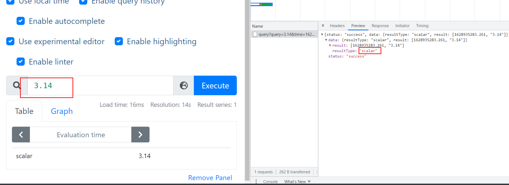

[](https://www.eet-china.com/mp/a26095.html)
[cortex](https://zhuanlan.zhihu.com/p/258163845)
#配置
```asp
- scrape_configs 采集配置段 做采集器
- rule_files 告警、预聚合配置文件段
- remote_read 远程查询段
- remote_write 远程写入段
- alerting: Alertmanager信息段
```
```asp
# 全局配置段
global:
  # 采集间隔 
  scrape_interval:     15s # Set the scrape interval to every 15 seconds. Default is every 1 minute.
  # 计算报警和预聚合间隔
  evaluation_interval: 15s # Evaluate rules every 15 seconds. The default is every 1 minute.
  # 采集超时时间
  scrape_timeout: 10s 
  # 查询日志，包含各阶段耗时统计
  query_log_file: /opt/logs/prometheus_query_log
  # 全局标签组
  # 通过本实例采集的数据都会叠加下面的标签
  external_labels:
    account: 'huawei-main'
    region: 'beijng-01'


# Alertmanager信息段
alerting:
  alertmanagers:
  - scheme: http
    static_configs:
    - targets:
      - "localhost:9093"

# 告警、预聚合配置文件段
rule_files:
    - /etc/prometheus/rules/record.yml
    - /etc/prometheus/rules/alert.yml

# 采集配置段
scrape_configs:
  # The job name is added as a label `job=<job_name>` to any timeseries scraped from this config.
  - job_name: 'prometheus'

    # metrics_path defaults to '/metrics'
    # scheme defaults to 'http'.

    static_configs:
    - targets: ['localhost:9090']

# 远程查询段
remote_read:
  # prometheus 
  - url: http://prometheus/v1/read
    read_recent: true

  # m3db 
  - url: "http://m3coordinator-read:7201/api/v1/prom/remote/read"
    read_recent: true

# 远程写入段
remote_write:
  - url: "http://m3coordinator-write:7201/api/v1/prom/remote/write"
    queue_config:
      capacity: 10000
      max_samples_per_send: 60000
    write_relabel_configs:
      - source_labels: [__name__]
        separator: ;
        # 标签key前缀匹配到的drop
        regex: '(kubelet_|apiserver_|container_fs_).*'
        replacement: $1
        action: drop
```
##采集段(服务发现)
```asp
# 采集配置段
scrape_configs:
  # The job name is added as a label `job=<job_name>` to any timeseries scraped from this config.
  - job_name: 'prometheus'

    # metrics_path defaults to '/metrics'
    # scheme defaults to 'http'.

    static_configs:
    - targets: ['localhost:9090']
```
```asp
- job_name: prometheus
  # true代表使用原始数据的时间戳，false代表使用prometheus采集器的时间戳
  honor_timestamps: true
  # 多久执行一次采集，就是这个job 多久执行一次
  scrape_interval: 15s
  # 采集的超时
  scrape_timeout: 15s
  # 就是采集target的 metric暴露 http path，默认是/metrics ,比如探针型的就是/probe
  metrics_path: /metrics
  # 采集目标的协议 是否是https
  scheme: http
  # 是否跟踪 redirect 
  follow_redirects: true
  static_configs:
  - targets:
    - localhost:9090
```
#预聚合
#查询
##即时向量 `Instant vector`

一个时刻的结果
##范围向量 `Range vector`

一段时间的结果
##标量

##offset 同环比
##分位值histogram_quantile
```asp
分位值的意义是什么？

- 分位值即把所有的数值从小到大排序，取前N%位置的值，即为该分位的值。
- 一般用分位值来观察大部分用户数据，平均值会“削峰填谷”消减毛刺，同时高分位的稳定性可以忽略掉少量的长尾数据。
- 高分位数据不适用于全部的业务场景，例如金融支付行业，可能就会要求100%成功。

分位值是如何计算的？

- 以95分位值为例： 将采集到的100个数据，从小到大排列，95分位值就是取出第95个用户的数据做统计。
- 同理，50分位值就是第50个人的数据。
```
##成功的/总的 = 成功率
##聚合

##范围向量选择器(Range Vector Selectors)
为每个结果范围向量元素提取多远的时间值
rate(promhttp_metric_handler_requests_total[3s])
1.时间范围不能脱离rate等函数，不然会报错,时间范围 
2.不能低于采集间隔,采集8秒 ，查询3秒则无数据
## topK
倒排索引 + 最大堆

#数据类型
##gauge当前值
##counter计数器
累积指标单调递增计数器
##histogram直方图
服务端算分位值,histogram在客户端就是简单的分桶和分桶计数,适合高并发
```asp
histogram_quantile(0.95, sum(rate(http_request_duration_seconds_bucket[5m])) by (le))
```
###histogram_quantile为何需要先算rate
```asp
- 因为每个bucket都是`counter`型的，如果不算rate那么分位值的结果曲线是一条直线
- 原理是因为`counter`型累加，不算rate并不知道当前bucket的增长情况，换句话说不知道这些bucket是多久积攒到现在这个值的
```
###什么是线性插值法
```asp
- 其中`bucket` 代表事先定义好的bucket
- `upperBound`代表这个bucket的上限值
- `count` 代表这个小于等于这个`upperBound`的个数/次数
- `workqueue_work_duration_seconds_bucket{name="crd_openapi_controller",le="10"} 65246 `
- 所以上述表达式含义为`workqueue_work_duration_seconds`小于`10`秒的有`65246 `个

type bucket struct {
	upperBound float64
	count      float64
}

type buckets []bucket

func (b buckets) Len() int           { return len(b) }
func (b buckets) Swap(i, j int)      { b[i], b[j] = b[j], b[i] }
func (b buckets) Less(i, j int) bool { return b[i].upperBound < b[j].upperBound }


a := []bucket{
    {upperBound: 0.05, count: 199881},
    {upperBound: 0.1, count: 212210},
    {upperBound: 0.2, count: 215395},
    {upperBound: 0.4, count: 319435},
    {upperBound: 0.8, count: 419576},
    {upperBound: 1.6, count: 469593},
    {upperBound: math.Inf(1), count: 519593},
}

q75 := bucketQuantile(0.75, a)


```
```asp
- 其计算逻辑为：根据记录总数和分位值求目标落在第几个bucket段`b`
- 根据`b`得到起始bucket大小`bucketStart`,终止bucket大小`bucketEnd` ，本bucket宽度 ，本bucket记录数
- 根据本段记录数和分位值算出目标分位数在本bucket排行`rank`
- 最终的计算方式为`分位值=起始bucket大小+(本bucket宽度)*(目标分位数在本bucket排行/本bucket记录数)`
- 换成本例中：`q75=0.4+(0.8-0.4)*(70259.75/100141) = 0.6806432929569308`
```
```asp
2021/02/02 19:08:55 记录总数 = 519593
2021/02/02 19:08:55 目标落在第几个bucket段= 4
2021/02/02 19:08:55 起始bucket大小= 0.4
2021/02/02 19:08:55 终止bucket大小= 0.8
2021/02/02 19:08:55 本bucket宽度= 0.4
2021/02/02 19:08:55 本bucket记录数= 100141
2021/02/02 19:08:55 目标分位数在本bucket排行= 70259.75
2021/02/02 19:08:55 分位值=起始bucket大小+(本bucket宽度)*(目标分位数在本bucket排行/本bucket记录数)
2021/02/02 19:08:55 0.4+(0.8-0.4)*(70259.75/100141) = 0.6806432929569308
```
##summary摘要
[](https://blog.csdn.net/wtan825/article/details/94616813)
客户端算分位值，summary就是解决百分位准确的问题而来的。summary直接存储了 quantile 数据，而不是根据统计区间计算出来的
采样点分位图统
```asp
Summary 结构有频繁的全局锁操作，对高并发程序性能存在一定影响。histogram仅仅是给每个桶做一个原子变量的计数就可以了，而summary要每次执行
算法计算出最新的X分位value是多少，算法需要并发保护。会占用客户端的cpu和内存

summary的百分位是提前在客户端里指定的，在服务端观测指标数据时不能获取未指定的分为数。而histogram则可以通过promql随便指定，
虽然计算的不如summary准确，但带来了灵活性
```
```asp
# HELP go_gc_duration_seconds A summary of the pause duration of garbage collection cycles.
# TYPE go_gc_duration_seconds summary
go_gc_duration_seconds{quantile="0"} 0.000734711
go_gc_duration_seconds{quantile="0.25"} 0.0010731
go_gc_duration_seconds{quantile="0.5"} 0.001139736
go_gc_duration_seconds{quantile="0.75"} 0.00123169
go_gc_duration_seconds{quantile="1"} 0.006106601
go_gc_duration_seconds_sum 16.28009843
go_gc_duration_seconds_count 13959
```
##histogram vs summary
| 对比点             | histogram                                                    | summary                                                      |
| ------------------ | ------------------------------------------------------------ | ------------------------------------------------------------ |
| 查询表达式对比     | `histogram_quantile(0.95, sum(rate(http_request_duration_seconds_bucket[5m])) by (le))` | `http_request_duration_seconds_summary{quantile="0.95"}`     |
| 所需配置           | 选择合适的buckets                                            | 选择所需的φ分位数和滑动窗口。其他φ分位数和滑动窗口以后无法计算。 |
| 客户端性能开销     | 开销低，因为它们只需要增加计数器                             | 开销高，由于流式分位数计算                                   |
| 服务端性能开销     | 开销高，因为需要在服务端实时计算(而且bucket值指标基数高)     | 开销低，可以看做是gauge指标上传，仅查询即可                  |
| 分位值误差         | 随bucket精度变大而变大(线性插值法计算问题)                   | 误差在φ维度上受可配置值限制                                  |
| 是否支持聚合       | 支持                                                         | 不支持(配置sum avg等意义不大)                                |
| 是否提供全局分位值 | 支持(根据promql匹配维度决定)                                 | 不支持(因为数据在每个实例/pod/agent侧已经算好，无法聚合)     |
