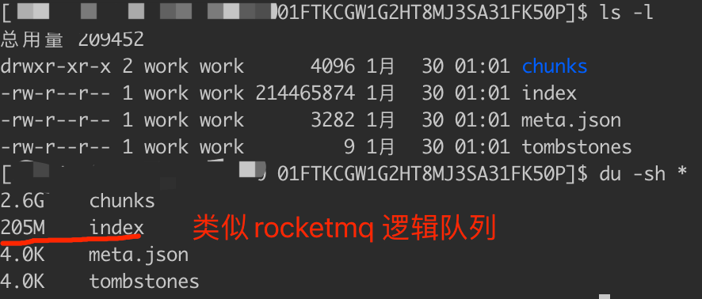
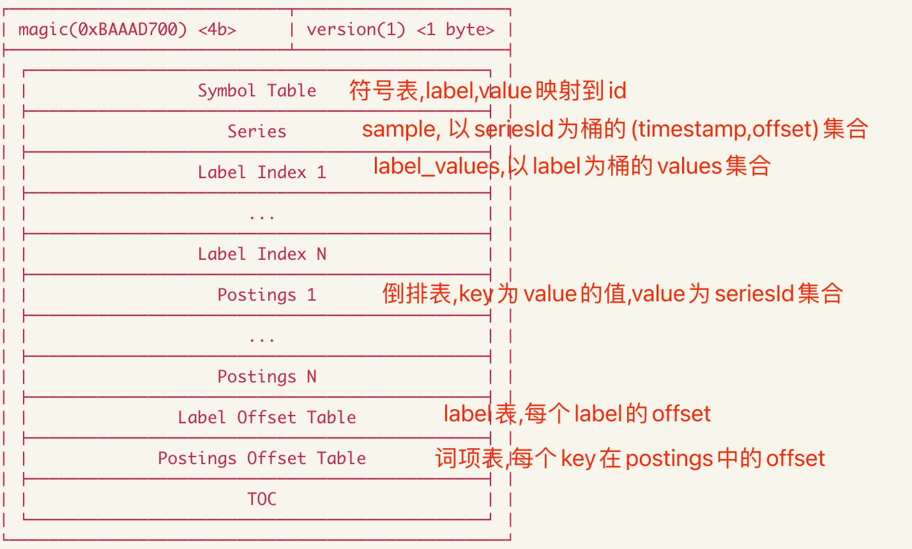
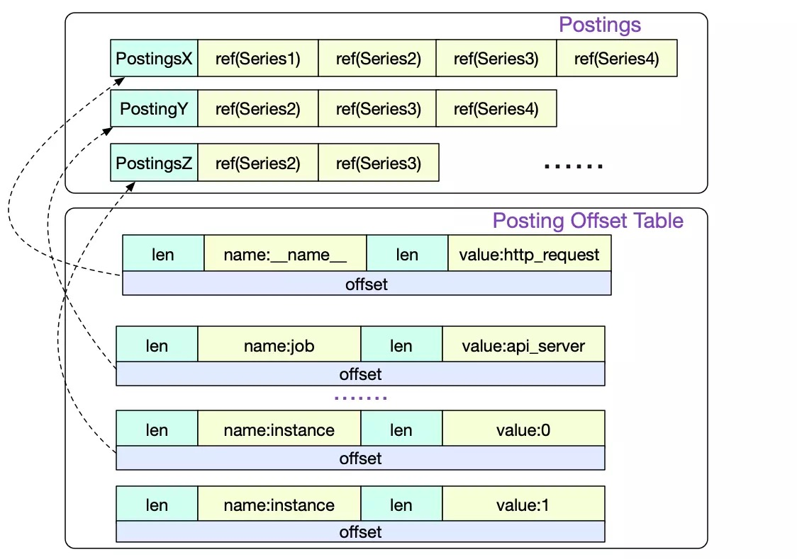
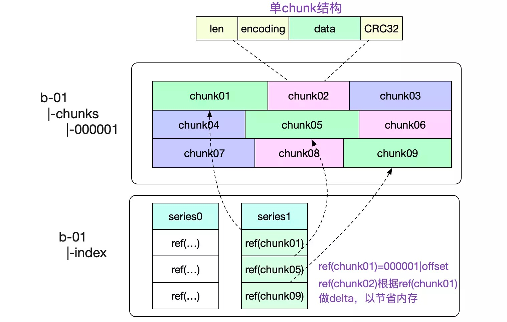

#临界知识
倒排表
词项字典
压缩算法dod,xor
#LSM存储
[z_01_分布式_临界知识_LSM.md]
#压缩
##海量时序数据存储空间问题

##为什么要做数据点压缩
```asp
- 因为存储一般是一套大系统中的资源开销大户
- 以时序监控系统来说，假设查询模块需要10cpu，20G内存，100G磁盘，那么存储模块往往需要100cpu，2000G内存，3T磁盘。
- 所以能对存储中的数据点进行压缩，那么能直接降低内存和磁盘空间/io的开销，所以这也是tsdb开发人员不断努力的地方
```
##facebook_gorilla压缩算法
此处说明数据量

[](https://www.zhangaoo.com/article/gorilla-tsdb-compression)
###Delta-Of-Delta)

###XOR编码
[](http://www.wangyapu.com/2020/03/27/xor/)


##prometheus压缩算法
###采集间隔固定
如prometheus配置job中的scrape_interval参数每隔15秒采集一次
```asp
- job_name: node_exporter
    honor_timestamps: true
    scrape_interval: 15s
    scrape_timeout: 10s
    metrics_path: /metrics
    scheme: http
    follow_redirects: true
    static_configs:
    - targets:
      - 172.20.70.215:9100
```
###Delta-Of-Delta


###xor


###压缩率计算

##定时压实 compact
```asp
- 标记删除
- Compaction主要操作包括合并block、删除过期数据、重构chunk数据
- 其中合并多个block成为更大的block，可以有效减少block个数，当查询覆盖的时间范围较长时，避免需要合并很多block的查询结果。
- 为提高删除效率，删除时序数据时，会记录删除的位置，只有block所有数据都需要删除时，才将block整个目录删除，因此block合并的大小也需要进行限制，
```
#IO
##mmap
##sendfile
##sendfile+DMA Scatter/Gather

#磁盘数据结构

##WAL

##Index Disk Format


[文件结构](https://github.com/prometheus/prometheus/blob/release-2.26/tsdb/docs/format/index.md)


[](https://www.cnblogs.com/YaoDD/p/11391335.html)
[](https://liujiacai.net/blog/2021/04/11/prometheus-storage-engine/)
###Postings Offset Table

这部分直接对每个label的key和value以及相关索引在Postings中的位置进行存储。同样，它会首先被加载到内存中，如果需要知道包含某个label的所有series，
再通过相关索引的偏移位置从Postings中依次获取
###Postings N
这部分存储的显然是倒排索引的信息，每一个条目存储的都是包含某个label pair的所有series的ID。但是与Label Index相似，条目中并没有指定具体的key和value
###Series

```asp
存储的自然是series的相关信息，首先存储series的各个label，正如上文所述，存储的是对应key和value在Symbol Table中的编号。
紧接着存储series相关的chunks信息，包含每个chunk的时间窗口，以及该chunk在chunks子目录下具体的位置信息。
```
###Label Offset Table
##Chunks
该文件在chunks/块目录中创建。每个段文件的最大大小为512MiB
[chunks](https://github.com/prometheus/prometheus/blob/release-2.26/tsdb/docs/format/chunks.md)
##head chunks
[](https://github.com/prometheus/prometheus/blob/release-2.26/tsdb/docs/format/head_chunks.md)
##Tombstones(已删除数据)
```asp
tombstones用于存储对于series的删除记录。如果删除了某个时间序列，Prometheus并不会立即对它进行清理，而是会在tombstones做一次记录，
等到下一次Block压缩合并的时候统一清理
```

[](https://github.com/prometheus/prometheus/blob/release-2.26/tsdb/docs/format/tombstones.md)
##wal
在默认情况下被限制为128MB
```asp
- 该预写日志在编号和顺序，如段工作000000，000001，000002等，在默认情况下被限制为128MB
- 段写入到32KB的页面中。仅最近段的最后一页可能是不完整的
- WAL记录是一个不透明的字节片，如果超过当前页面的剩余空间，它将被分成子记录。记录永远不会跨段边界拆分
- 如果单个记录超过了默认的段大小，则将创建一个更大的段。页面的编码很大程度上是从LevelDB / RocksDB的预写日志中借用的。
```


