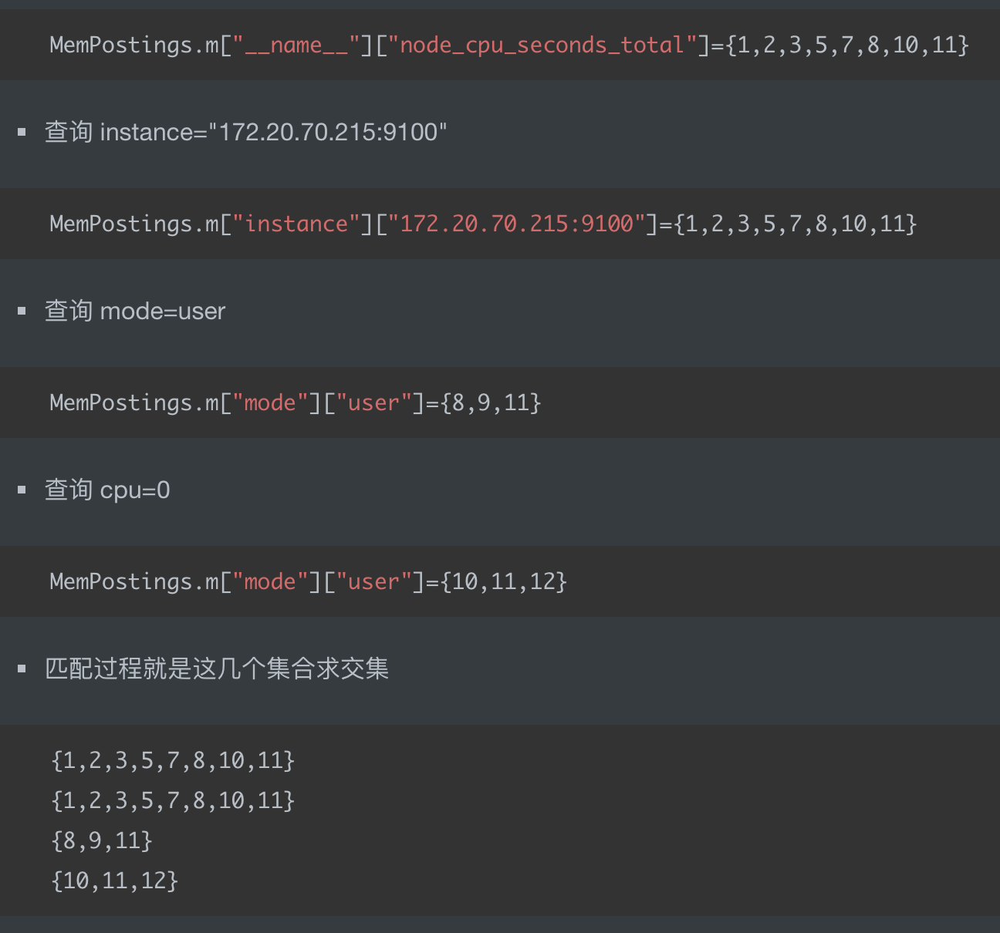
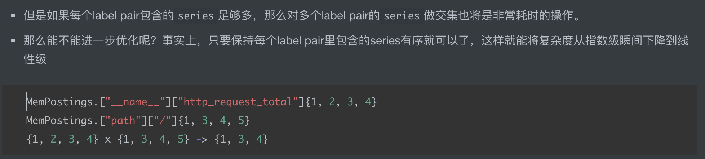
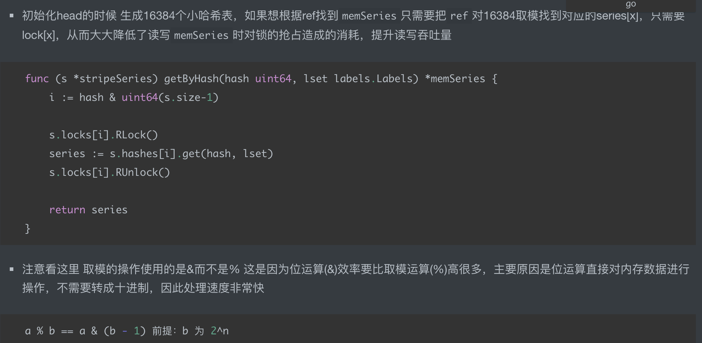

#倒排索引
##数据结构
```asp
type MemPostings struct {
	mtx     sync.RWMutex
	m       map[string]map[string][]uint64
	ordered bool
}
```
```asp
- 核心结构MemPostings是一个双层map 
- 第一层map的key 是标签的名字 ，如 instance或者 job
- 第一层map的value是一个map
- 第二层map的key 是标签的值，如node_exporter 
- 第二层map的value 是对应seriesId 的数组，如1,2,3 
```
##创建索引
```asp
- 假设这个 `node_cpu_seconds_total{cpu="0", instance="172.20.70.215:9100", job="node_exporter", mode="system"}` 的 seriesId=10
- 假设这个 `node_cpu_seconds_total{cpu="0", instance="172.20.70.215:9100", job="node_exporter", mode="user"}` 的 seriesId=11
- 更新双层map示意过程如下

MemPostings.m["__name__"]["node_cpu_seconds_total"]={..,10,..}
MemPostings.m["mode"]["system"]={..,10,..}
MemPostings.m["cpu"]["0"]={..,10,..}
MemPostings.m["instance"]["172.20.70.215:9100"]={..,10,..}


MemPostings.m["__name__"]["node_cpu_seconds_total"]={..,10,11,..}
MemPostings.m["mode"]["user"]={..,11,..}
MemPostings.m["cpu"]["0"]={..,10,11,..}
MemPostings.m["instance"]["172.20.70.215:9100"]={..,10,11,..}
```
##查询索引
```asp
node_cpu_seconds_total{cpu="0", instance="172.20.70.215:9100", job="node_exporter", mode="user"}
查询指标的名字 
```

结果就是id=11 也就是  `node_cpu_seconds_total{cpu="0", instance="172.20.70.215:9100", job="node_exporter", mode="user"}`
###id求交集的优化

###锁的粒度的优化
olang中的map不是并发安全的，而Prometheus中又有大量对于`memSeries`的增删操作，如果在读写上述结构时简单地用一把大锁锁住，显然无法满足性能要求
prometheus的解决方法就是拆分锁
```asp
const (
	// DefaultStripeSize is the default number of entries to allocate in the stripeSeries hash map.
	DefaultStripeSize = 1 << 14
)

// stripeSeries locks modulo ranges of IDs and hashes to reduce lock contention.
// The locks are padded to not be on the same cache line. Filling the padded space
// with the maps was profiled to be slower – likely due to the additional pointer
// dereferences.
type stripeSeries struct {
	size                    int
	series                  []map[uint64]*memSeries
	hashes                  []seriesHashmap
	locks                   []stripeLock
	seriesLifecycleCallback SeriesLifecycleCallback
}

type stripeLock struct {
	sync.RWMutex
	// Padding to avoid multiple locks being on the same cache line.
	_ [40]byte
}
```

