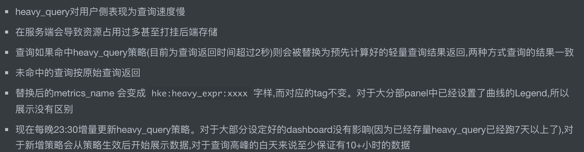

#降低采样
```asp
- 缓存系统内存使用降低
  - 监控系统为了加快查询速度会在各个环节上设置缓存
  - 那么如果采集指标过多，无疑会使缓存内存使用变多
- 存储系统磁盘使用降低
  - 持久话存储的磁盘使用量和监控指标的数量是成正比的
- 组件间网络传输流量降低
  - 更多的监控指标数据意味着，组件间网络传输流量更大
- 查询速度提升降低
  - 更多的监控指标意味着查询的速度会被拖慢
```
#采集端高基数
##资源原因
```asp
- 通俗的说就是返回的series或者查询到的series数量过多
- 查询表现出来返回时间较长，对应调用服务端资源较多的查询
- 数量多少算多 10w~100w
- 一般我们定义在1小时内的range_query 响应时间超过`3秒`则认为较重了
```
[马士兵vip]
前端,1个亿
标签的值过多
```asp
- Top 10 label names with value count： 标签中value最多的10个
- Top 10 series count by metric names： metric_name匹配的series最多的10个
- Top 10 label names with high memory usage： 标签消耗内存最多的10个
- Top 10 series count by label value pairs： 标签对数量最多的10个
基于内存中的倒排索引 算最大堆取 top10
```


```asp
- 一个高基数的查询会把存储打挂
- 一个50w基数查询1小时数据内存大概的消耗为1G，再叠加cpu等消耗
```
label乘积太多 ，比如bucket有50种，再叠加4个10种的业务标签，所以总基数为`50*10*10*10*10=50w`
[](https://segmentfault.com/a/1190000017553625)
```asp
- 因为tsdb都有压缩算法对datapoint压缩，比如dod 和xor
- 那么当查询时数据必然涉及到解压放大的问题
- 比如压缩正常一个datapoint大小为16byte
- 一个heavy_query加载1万个series，查询时间24小时，30秒一个点来算，所需要的内存大小为 439MB，所以同时多个heavy_query会将prometheus内存打爆，
prometheus也加了上面一堆参数去限制
```
##高基数危害
oom 和内核态cpu暴涨


##判断高基数
count统计
topk(5,count({__name__=~".+"}) by(__name__) > 100 )
##高基数优化(预查询)
[](https://zhuanlan.zhihu.com/p/228042105)

#实时查询/聚合 VS 预查询/聚合
## 实时查询的优点很明显

- 查询/聚合条件随意组合，比如 rate后再sum然后再叠加一个histogram_quantile

## 实时查询的缺点也很明显

- 那就是慢，或者说资源消耗大

## 实时查询的优缺点反过来就是预查询/聚合的优缺点

- 一个预聚合的例子请看我写的falcon组件[监控聚合器系列之: open-falcon新聚合器polymetric](https://segmentfault.com/a/1190000023092934)
- 所有的聚合方法提前定义好，并定时被计算出结果
- 查询时不涉及任何的聚合，直接查询结果
- 比如实时聚合需要每次加载10万个series，预聚合则只需要查询几个结果集

## 那么问题来了prometheus有没有预查询/聚合呢

- 答案是有的
#长期查询降采样
