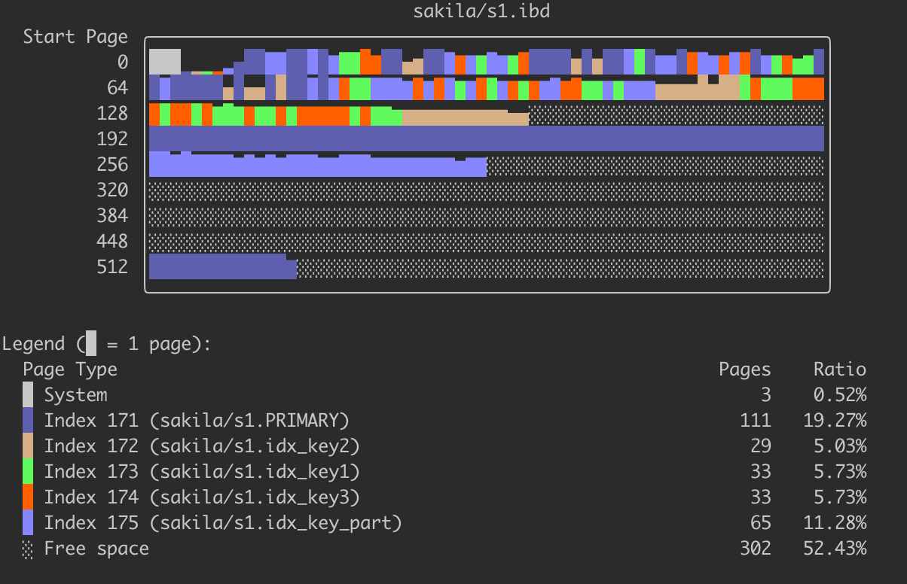
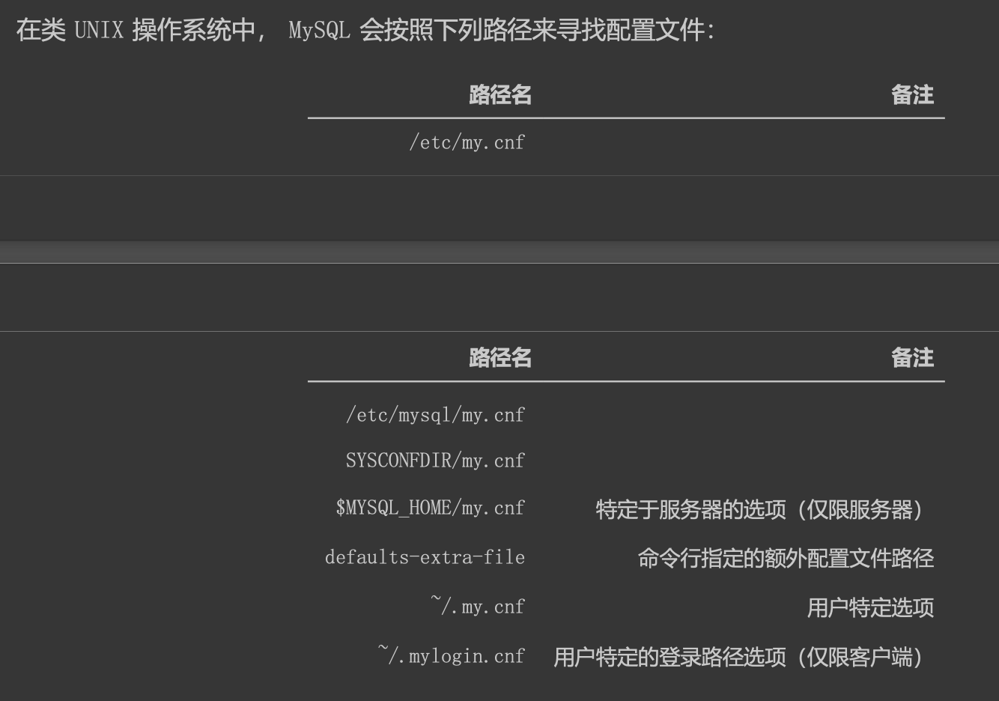

##临界知识
应用监控都可以查看线程,tcp连接,缓存
mysql官网索引预习
应用启动可进行参数配置(约定大于配置)
命令自助--help
##性能分析
###查询计划explain
explain sql;
###优化过程详情
```asp
mysql> SHOW VARIABLES LIKE 'optimizer_trace';
+-----------------+--------------------------+
| Variable_name   | Value                    |
+-----------------+--------------------------+
| optimizer_trace | enabled=off,one_line=off |
+-----------------+--------------------------+

mysql> SET optimizer_trace="enabled=on";
Query OK, 0 rows affected (0.00 sec)

select * ....

SELECT * FROM information_schema.OPTIMIZER_TRACE;

QUERY :表示我们的查询语句。
TRACE :表示优化过程的JSON格式文本。
MISSING_BYTES_BEYOND_MAX_MEM_SIZE :由于优化过程可能会输出很多，如果超过某个限制时，多余的文本
将不会被显示，这个字段展示了被忽略的文本字节数。
INSUFFICIENT_PRIVILEGES :表示是否没有权限查看优化过程，默认值是0，只有某些特殊情况下才会是 1 ，我们暂时不关心这个字段的值。

```
###执行延时profile
SET profiling = 1;
SHOW PROFILES//概述
SHOW PROFILE;//详情,MySQL提供可以用来分析当前会话中语句执行的资源消耗情况，可以用于SQL的调优的测量

[](https://dev.mysql.com/doc/refman/8.0/en/show-profile.html)

```asp
mysql> SHOW PROFILES;
+----------+------------+-----------------------------+
| Query_ID | Duration   | Query                       |
+----------+------------+-----------------------------+
|        1 | 0.00237600 | select * from global_grants |
+----------+------------+-----------------------------+
```
```asp
mysql> SHOW PROFILE;
+--------------------------------+----------+
| Status                         | Duration |
+--------------------------------+----------+
| starting                       | 0.000406 |
| Executing hook on transaction  | 0.000050 |
| starting                       | 0.000036 |
| checking permissions           | 0.000056 |
| Opening tables                 | 0.000084 |
| init                           | 0.000295 |
| System lock                    | 0.000207 |
| optimizing                     | 0.000028 |
| statistics                     | 0.000037 |
| preparing                      | 0.000013 |
| executing                      | 0.000782 |
| end                            | 0.000010 |
| query end                      | 0.000003 |
| waiting for handler commit     | 0.000050 |
| closing tables                 | 0.000083 |
| freeing items                  | 0.000141 |
| cleaning up                    | 0.000095 |
+--------------------------------+----------+
```
查看CPU使用
```asp
mysql> SHOW PROFILE CPU FOR QUERY 1;
+--------------------------------+----------+----------+------------+
| Status                         | Duration | CPU_user | CPU_system |
+--------------------------------+----------+----------+------------+
| starting                       | 0.000406 | 0.000055 |   0.000087 |
| Executing hook on transaction  | 0.000050 | 0.000008 |   0.000016 |
| starting                       | 0.000036 | 0.000010 |   0.000008 |
| checking permissions           | 0.000056 | 0.000009 |   0.000013 |
| Opening tables                 | 0.000084 | 0.000043 |   0.000024 |
| init                           | 0.000295 | 0.000007 |   0.000061 |
| System lock                    | 0.000207 | 0.000013 |   0.000041 |
| optimizing                     | 0.000028 | 0.000011 |   0.000010 |
| statistics                     | 0.000037 | 0.000017 |   0.000011 |
| preparing                      | 0.000013 | 0.000011 |   0.000001 |
| executing                      | 0.000782 | 0.000093 |   0.000310 |
| end                            | 0.000010 | 0.000005 |   0.000004 |
| query end                      | 0.000003 | 0.000003 |   0.000001 |
| waiting for handler commit     | 0.000050 | 0.000014 |   0.000014 |
| closing tables                 | 0.000083 | 0.000022 |   0.000028 |
| freeing items                  | 0.000141 | 0.000017 |   0.000039 |
| cleaning up                    | 0.000095 | 0.000013 |   0.000006 |
+--------------------------------+----------+----------+------------+
```
```asp
type是可选的，取值范围可以如下：

ALL 显示所有性能信息
BLOCK IO 显示块IO操作的次数
CONTEXT SWITCHES 显示上下文切换次数，不管是主动还是被动
CPU 显示用户CPU时间、系统CPU时间
IPC 显示发送和接收的消息数量
MEMORY [暂未实现]
PAGE FAULTS 显示页错误数量
SOURCE 显示源码中的函数名称与位置
SWAPS 显示SWAP的次数
```
###性能分析performance_schema
```asp
performance_schema通过监视server的事件来实现监视server内部运行情况， “事件”就是server内部活动中所做的任何事情以及对应的时间消耗，
利用这些信息来判断server中的相关资源消耗在了哪里？一般来说，事件可以是函数调用、操作系统的等待、SQL语句执行的阶段
（如sql语句执行过程中的parsing 或 sorting阶段）或者整个SQL语句与SQL语句集合。事件的采集可以方便的提供server中的相关存储引擎对磁盘文件、表I/O、表锁等资源的同步调用信息

performance_schema的表中的数据不会持久化存储在磁盘中，而是保存在内存中，一旦服务器重启，这些数据会丢失（包括配置表在内的整个performance_schema下的所有数据）
```
运行过程中的性能相关的数据
[](https://dev.mysql.com/doc/refman/8.0/en/performance-schema-quick-start.html)
SHOW VARIABLES LIKE 'performance_schema';
use performance_schema;
show tables like '%wait%';
####当前所有线程状态
select * from events_waits_current\G
```asp
--当配置完成之后可以查看当前server正在做什么，可以通过查询events_waits_current表来得知，该表中每个线程只包含一行数据，用于显示每个线程的最新监视事件

/*该信息表示线程id为11的线程正在等待buf_dblwr_mutex锁，等待事件为30880
属性说明：
	id:事件来自哪个线程，事件编号是多少
	event_name:表示检测到的具体的内容
	source:表示这个检测代码在哪个源文件中以及行号
	timer_start:表示该事件的开始时间
	timer_end:表示该事件的结束时间
	timer_wait:表示该事件总的花费时间
注意：_current表中每个线程只保留一条记录，一旦线程完成工作，该表中不会再记录该线程的事件信息
*/
```
####线程历史事件
/*
_history表中记录每个线程应该执行完成的事件信息，但每个线程的事件信息只会记录10条，再多就会被覆盖，*_history_long表中记录所有线程的事件信息，但总记录数量是10000，超过就会被覆盖掉
*/
select thread_id,event_id,event_name,timer_wait from events_waits_history order by thread_id limit 21;
####线程事件汇总
/*
summary表提供所有事件的汇总信息，该组中的表以不同的方式汇总事件数据（如：按用户，按主机，按线程等等）。例如：要查看哪些instruments占用最多的时间，可以通过对events_waits_summary_global_by_event_name表的COUNT_STAR或SUM_TIMER_WAIT列进行查询（这两列是对事件的记录数执行COUNT（*）、事件记录的TIMER_WAIT列执行SUM（TIMER_WAIT）统计而来）
*/
SELECT EVENT_NAME,COUNT_STAR FROM events_waits_summary_global_by_event_name  ORDER BY COUNT_STAR DESC LIMIT 10;
####事件生产者/消费者
show create table performance_schema.setup_consumers;
```
instruments: 生产者，用于采集mysql中各种各样的操作产生的事件信息，对应配置表中的配置项我们可以称为监控采集配置项。
consumers:消费者，对应的消费者表用于存储来自instruments采集的数据，对应配置表中的配置项我们可以称为消费存储配置项。

--打开等待事件的采集器配置项开关，需要修改setup_instruments配置表中对应的采集器配置项
UPDATE setup_instruments SET ENABLED = 'YES', TIMED = 'YES'where name like 'wait%';

--打开等待事件的保存表配置开关，修改setup_consumers配置表中对应的配置项
UPDATE setup_consumers SET ENABLED = 'YES'where name like '%wait%';
```

####语句事件记录表
```asp
语句事件记录表，这些表记录了语句事件信息，当前语句事件表events_statements_current、历史语句事件表events_statements_history和长语句历史
事件表events_statements_history_long、以及聚合后的摘要表summary，其中，summary表还可以根据帐号(account)，主机(host)，程序(program)，
线程(thread)，用户(user)和全局(global)再进行细分)
```
show tables like '%statement%';
####等待事件记录表
show tables like '%wait%';
####阶段事件记录表
show tables like '%stage%';
####事务事件记录表
show tables like '%transaction%';
####监控文件系统层调用的表
show tables like '%file%';
/*
instance表记录了哪些类型的对象会被检测。这些对象在被server使用时，在该表中将会产生一条事件记录，例如，file_instances表列出了文件I/O操作及其关联文件名
*/
select * from file_instances limit 20; 
####监视内存使用的表
show tables like '%memory%';
###元数据information_schema
###所有sql语句执行排名
SELECT DIGEST_TEXT,COUNT_STAR,FIRST_SEEN,LAST_SEEN FROM events_statements_summary_by_digest ORDER BY COUNT_STAR DESC
###慢查询
show variables like 'slow%';
show variables like 'long%';
###预编译
##buffer相关
###buffer pool
SHOW VARIABLES LIKE 'innodb_old_blocks_pct';//冷热分区比例
show variables like 'innodb_read_ahead_threshold';//区域预读阈值
 SHOW VARIABLES LIKE 'innodb_old_blocks_time';//冷区到热区的时间间隔
 SHOW VARIABLES LIKE 'innodb_buffer_pool_instances';//buffer pool实例个数,公司8个
 SHOW VARIABLES LIKE '%buffer_pool%';//查看buffer pool大小,公司一个128G,chunk大小,公司一个128m
 SHOW ENGINE INNODB STATUS\G//查看buffer pool状态
 
 
###sort buffer
[](https://time.geekbang.org/column/article/73479)
mysql> show variables like '%sort_buffer_size%';
```asp
+-------------------------+---------+
| Variable_name           | Value   |
+-------------------------+---------+
| innodb_sort_buffer_size | 1048576 |
| myisam_sort_buffer_size | 8388608 |
| sort_buffer_size        | 262144  |
+-------------------------+---------+
```
```asp
1.是否使用临时表,使用了多少个临时表;
2.参与排序的行数
3.排序方式:全字段排序vs rowid排序

/* 打开optimizer_trace，只对本线程有效 */
SET optimizer_trace='enabled=on'; 

/* @a保存Innodb_rows_read的初始值 */
select VARIABLE_VALUE into @a from performance_schema.session_status where variable_name = 'Innodb_rows_read';

/* 执行语句 */
select city, name,age from t where city='杭州' order by name limit 1000; 

/* 查看 OPTIMIZER_TRACE 输出 */
SELECT * FROM `information_schema`.`OPTIMIZER_TRACE`\G

/* @b保存Innodb_rows_read的当前值 */
select VARIABLE_VALUE into @b from performance_schema.session_status where variable_name = 'Innodb_rows_read';

/* 计算Innodb_rows_read差值 */
select @b-@a;
```

###join_buffer
Block Nested-Loop Join缓存驱动表条目,加速join过程
join_buffer_size
```asp
mysql> show variables like 'join_buffer_size';
+------------------+--------+
| Variable_name    | Value  |
+------------------+--------+
| join_buffer_size | 262144 |
+------------------+--------+
```
##临时表
show variables like "max_heap_table_size";
show variables like 'tmpdir';
##数据库连接相关
SHOW FULL PROCESSLIST;
###连接超时
show variables like "%timeout%";
```asp
+-----------------------------------+----------+
| Variable_name                     | Value    |
+-----------------------------------+----------+
| connect_timeout                   | 10       |
| delayed_insert_timeout            | 300      |
| have_statement_timeout            | YES      |
| innodb_flush_log_at_timeout       | 1        |
| innodb_lock_wait_timeout          | 50       |
| innodb_rollback_on_timeout        | OFF      |
| interactive_timeout               | 28800    |
| lock_wait_timeout                 | 31536000 |
| mysqlx_connect_timeout            | 30       |
| mysqlx_idle_worker_thread_timeout | 60       |
| mysqlx_interactive_timeout        | 28800    |
| mysqlx_port_open_timeout          | 0        |
| mysqlx_read_timeout               | 30       |
| mysqlx_wait_timeout               | 28800    |
| mysqlx_write_timeout              | 60       |
| net_read_timeout                  | 30       |
| net_write_timeout                 | 60       |
| rpl_stop_slave_timeout            | 31536000 |
| slave_net_timeout                 | 60       |
| wait_timeout                      | 28800    |
+-----------------------------------+----------+
```
###连接数
```asp
mysql> show variables like '%max_connections%';
+------------------------+-------+
| Variable_name          | Value |
+------------------------+-------+
| max_connections        | 151   |
| mysqlx_max_connections | 100   |
+------------------------+-------+
```
show status like  'Threads%';
###连接详情
SHOW FULL PROCESSLIST;

##表物理信息分析innodb_space
[innodb_ruby官方](https://github.com/jeremycole/innodb_ruby/wiki#space-page-type-summary)
SHOW TABLE STATUS LIKE 'single_table'\G
```asp
mysql> SHOW TABLE STATUS LIKE 'single_table'\G
*************************** 1. row ***************************
           Name: single_table
         Engine: InnoDB
        Version: 10
     Row_format: Dynamic
           Rows: 14399,//估算值
 Avg_row_length: 110
    Data_length: 1589248,//Data_length = 聚簇索引的页面数量 x 每个页面的大小
Max_data_length: 0
   Index_length: 3047424
      Data_free: 4194304
 Auto_increment: 46177
    Create_time: 2021-11-05 18:11:33
    Update_time: NULL
     Check_time: NULL
      Collation: utf8_general_ci
       Checksum: NULL
 Create_options:
        Comment:
```
###表空间可视化(数据页)
```asp
show variables like 'datadir';//数据目录
innodb_space -s /Users/chris/Library/Application\ Support/com.tinyapp.DBngin/Engines/mysql/10249D8A-1975-4E97-9DDD-2085652161E7/ibdata1 -T mysql/varchar_size_demo -p 3 page-illustrate
```

###表空间
```asp
innodb_space -s /Users/chris/Library/Application\ Support/com.tinyapp.DBngin/Engines/mysql/10249D8A-1975-4E97-9DDD-2085652161E7/ibdata1 -T sakila/s1 space-extents-illustrate
```

##查看系统LSN
SHOW ENGINE INNODB STATUS
##系统变量
SHOW VARIABLES [LIKE 匹配的模式];
SHOW [GLOBAL|SESSION] VARIABLES [LIKE 匹配的模式];

SHOW VARIABLES LIKE 'default_storage_engine';
SHOW VARIABLES like 'max_connections';
SET GLOBAL default_storage_engine = MyISAM;
SET @@GLOBAL.default_storage_engine = MyISAM;

###表信息行格式
show create table setup_consumers; 
show table status like "test"\G
公司mysql版本为5.7.25,使用行格式Compact

自己的mysql版本为8.0.21,使用行格式Dynamic

###设置系统变量
SET [GLOBAL|SESSION] 系统变量名 = 值;
SET [@@(GLOBAL|SESSION).]var_name = XXX;
###存储引擎
show engines;
show variables like '%storage_engine%';
show table status like "test" ;

###编码相关/字符集
SHOW VARIABLES LIKE 'character_set_server';
SHOW VARIABLES LIKE 'character_set_database';
show create table test;
SHOW VARIABLES LIKE 'character_set_client';
SHOW VARIABLES LIKE 'character_set_connection';
SHOW VARIABLES LIKE 'character_set_results';

```$xslt
MySQL中的utf8和utf8mb4
我们上边说 utf8 字符集表示一个字符需要使用1~4个字节，但是我们常用的一些字符使用1~3个字节就可以表 示了。而在 MySQL 中字符集表示一个字符所用最大字节长度在某些方面会影响系统的存储和性能，所以设计
MySQL 的大叔偷偷的定义了两个概念:
utf8mb3 :阉割过的 utf8 字符集，只使用1~3个字节表示字符。
utf8mb4 :正宗的 utf8 字符集，使用1~4个字节表示字符。
有一点需要大家十分的注意，在 MySQL 中 utf8 是 utf8mb3 的别名，所以之后在 MySQL 中提到 utf8 就意味着使 用1~3个字节来表示一个字符，
如果大家有使用4字节编码一个字符的情况，比如存储一些emoji表情啥的，那请 使用 utf8mb4 。
```

###mysql版本
show variables like '%version%'

[](https://www.jianshu.com/p/052402a18c7c)
##线程状态变量
SHOW [GLOBAL|SESSION] STATUS [LIKE 匹配的模式];
SHOW STATUS LIKE 'thread%';

##事务相关
SHOW VARIABLES LIKE 'transaction_isolation';//公司使用REPEATABLE-READ
SELECT @@transaction_isolation;
show variables like '%tx_isolation%';

SET GLOBAL TRANSACTION ISOLATION LEVEL SERIALIZABLE;
SET SESSION TRANSACTION ISOLATION LEVEL SERIALIZABLE;
SET TRANSACTION ISOLATION LEVEL SERIALIZABLE;
###锁
SELECT ... LOCK IN SHARE MODE;
SELECT ... FOR UPDATE;
##mysql启动配置(连接/tmp/socket失败,连接127.0.0.1失败)
DBngin:mysql -uroot --socket=/tmp/mysql_3306.sock
```asp
MySQL 程序在启动时会寻找多个路径下的配置文件，这些路径有的是固定的，有的是可以在命令行指定的。根据 操作系统的不同，
配置文件的路径也有所不同，
```

mysql -h127.0.0.1 -uroot -p
```asp
ERROR 2003 (HY000): Can't connect to MySQL server on '127.0.0.1' (61)
```
mysqld --skip-networking
```asp
--启动选项1[=值1] --启动选项2[=值2] ... --启动选项n[=值n]
```
###常用启动项
mysql -uroot --socket=/tmp/mysql_3306.sock
mysqld -P3307/mysqld -P 3307

###mysql vs mysqld vs mysqld_safe
mysqld_safe->mysqld->mysql

###my.conf
```asp
defaults-extra- file 启动选项来指定额外的配置文件路径
mysqld --defaults-file=/tmp/myconfig.txt
注意`defaults-extra-file`和`defaults-file`的区别，使用`defaults-extra-file`可以指定额外的 配置文件搜索路径(也就是说那些固定的配置文件路径也会被搜索)
```
```asp
[server] (具体的启动选项...)
[mysqld] (具体的启动选项...)
[mysqld_safe] (具体的启动选项...)
[client] (具体的启动选项...)
[mysql] (具体的启动选项...)
[mysqladmin] (具体的启动选项...)
```

##binlog
show variables like '%binlog%format%';
show binlog events in '**-bin.000001' from 6048;
##集群状态
show SLAVE status;

##主从复制
show variables like '%slave_parallel_workers%';
公司是16个
