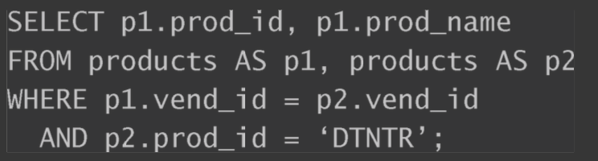

##临界知识
select关于关键字顺序的思考
select 字段在选择列select/group by/order by中的关联
select可以出现条件语句的位置,where vs having
where子句的类型,单值/范围/复合操作逻辑运算
多表连接查询
视图,查询语句变量化(类似grafana变量)
存储过程,执行逻辑模板化(类似grafana模板)
##检索&聚合DQL
###执行顺序
[](https://blog.csdn.net/u014044812/article/details/51004754)

```asp
select 考生姓名, max(总成绩) as max总成绩 
 
from tb_Grade 
 
where 考生姓名 is not null 
 
group by 考生姓名 
 
having max(总成绩) > 600 
 
order by max总成绩 
```
```asp
 (1). 首先执行 FROM 子句, 从 tb_Grade 表组装数据源的数据 

 (2). 执行 WHERE 子句, 筛选 tb_Grade 表中所有数据不为 NULL 的数据 

 (3). 执行 GROUP BY 子句, 把 tb_Grade 表按 "学生姓名" 列进行分组(注：这一步开始才可以使用select中的别名，他返回的是一个游标，而不是一个表，所以在where中不可以使用select中的别名，而having却可以使用，感谢网友  zyt1369  提出这个问题)
 (4). 计算 max() 聚集函数, 按 "总成绩" 求出总成绩中最大的一些数值 

 (5). 执行 HAVING 子句, 筛选课程的总成绩大于 600 分的. 

 (7). 执行 ORDER BY 子句, 把最后的结果按 "Max 成绩" 进行排序. 
```
###查询语句结构

```asp
select -> from-> where->group by->having->order by.
```
```asp
解析器执行顺序
from-> where->group by->having->select->order by.
order by拿到的结果里已经是group by以后的结果
```
###单列函数
####字符串处理
####时间处理
####数值处理
###where子句
SELECT field1, field2,...fieldN FROM table_name1, table_name2...
[WHERE condition1 [AND [OR]] condition2.....

1.单值比较
2.范围比较
3.逻辑操作符,and,or,in,not
4.正则匹配,like % _.  REGEXP

####聚合函数
where 子句的作用是在对查询结果进行分组前，将不符合where条件的行去掉，即在分组之前过滤数据，条件中不能包含聚组函数，使用where条件显示特定的行
###group by分组/聚合/多列函数
group by 后面只能放非聚合函数的列
####聚合函数/多列函数
####分组与排序
####having vs where
HAVING和WHERE的差别 这里有另一种理解方法，WHERE在数据 分组前进行过滤，HAVING在数据分组后进行过滤。这是一个重 要的区别，  
where 子句的作用是在对查询结果进行分组前，将不符合where条件的行去掉，即在分组之前过滤数据，条件中不能包含聚组函数，使用where条件显示特定的行  
having 子句被限制子已经在SELECT语句中定义的列和聚合表达式上。通常，你需要通过在HAVING子句中重复聚合函数表达式来引用聚合值

###排序order by
1.通过非选择列进行排序是完全合法的
2.按多个列排序时，排序完全按所规定的顺序进行
###like、REGEXP正则匹配原理

##多表查询
表连接join
###from join vs from where


###内部连接/等值连接
选择那些唯一的列进行连接

###自连接


###自然连接
自然联结排除多次出现，使每个列只返回一次，你只能选择那些唯一的列
###外部连接
##组合查询union
##insert/update/delete
##视图

可以把整个查询包装成一个名为productcustomers的虚拟表

视图为虚拟的表。它们包含的不是数据而是根据需要检索数据的查 询。视图提供了一种MySQL的SELECT语句层次的封装，可用来简化数据
处理以及重新格式化基础数据或保护基础数据

##存储过程
sql脚本,增删改查组合
