##临界知识
mysql连接session状态需要消耗内存/cpu/io,因此mysql连接受限于计算机硬件资源
mysql 常用于OLTP（on-line transaction processing),需要BIO访问
mysql bio成本与性能的权衡
mysql行存储原因:方便随机对数据增删改查
回答问题结合操作系统机制io,page cache,生产环境使用,运维经验
说说mysql的索引:需求,选型对比,结论;数据结构依托于操作系统页缓存,磁盘读写特点
##描述一下数据库事务隔离级别？
画图,原理
[z_9_mysql_02_undo_事务id_事务原子性_回滚段.md]
[z_9_mysql_03_事务_隔离级别_MVCC_锁_锁释放_readview视图_readview生成时机_脏写_脏读_不可重复读_幻读.md]
```asp
ACID:
A:原子性,定义+原理(undo log)
C:
I:隔离性,四个隔离级别,(mvcc版本并发控制,undo log,readview,三个隐藏字段
D:redo log,二阶段提交(binlog + redo log 
```
##mysql幻读怎么解决？
涉及当前读时RR级别产生幻读,使用gap 锁
[z_9_mysql_03_事务_隔离级别_MVCC_锁_锁释放_readview视图_readview生成时机_脏写_脏读_不可重复读_幻读.md]
##说说mysql的join原理?
[z_3_mysql_查询优化_03_join优化_连接优化_joinbuffer_Index-Nested_block-Nested_semi-join.md]
##索引的数据结构/原理?
画图+体系

io(磁盘读取次数少)+数据结构(io读取量少)
1.io,程序满足局部性原理,磁盘预读,操作系统以4k为单位读到page cache缓存,mysql读取16k
2.二叉树->平衡二叉树->b树->b+树,避免深度过深,减少io读取次数,有序读取,为了加快索引,16k页尽可能多读索引,所以使用b+

```asp
b树 vs b+
b+叶子节点包含所有数据,叶子节点是双向链表
b树,叶子节点不是链表,不包含所有数据
```
[z_8_mysql_数据结构_B+树.md]
##谈谈mysql索引?
mysql使用b+树,加快数据访问,提高查询效率
mysql使用行存解决OLTP问题,需要解决key-value形式的查询,范围查询,排序
我们的查询数据结构有hashmap,二叉树,B树,B+树
选型对比
B树和B+树的对比(局部性原型,空间局部性,时间局部性->磁盘预读,page cache 4K, mysql每次读取16k,每次预读16k,尽可能少产生io)
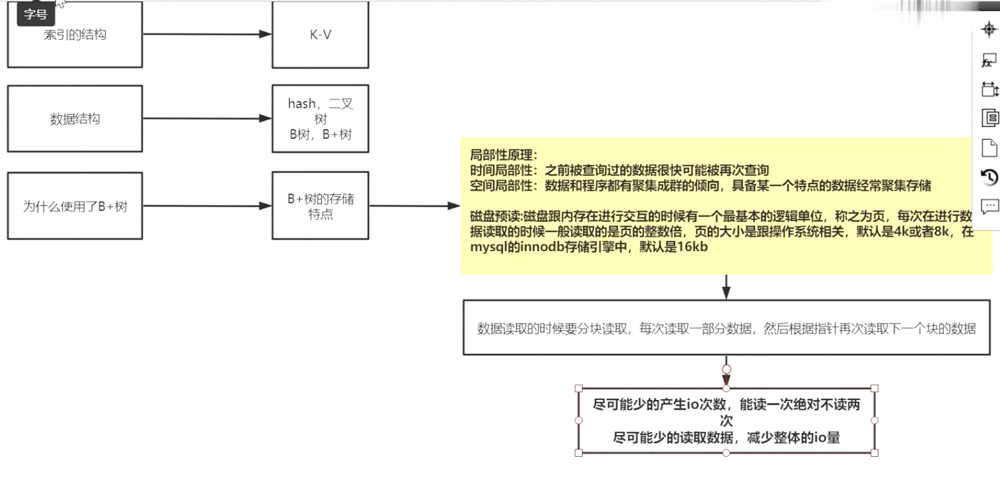
hash
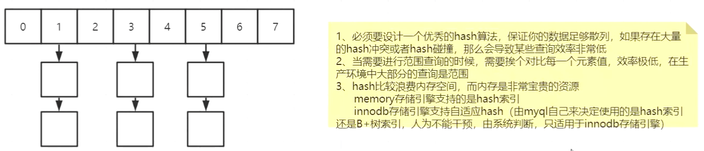
二叉树,BST,AVL,红黑树
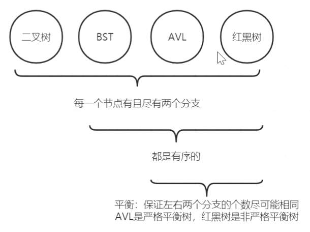
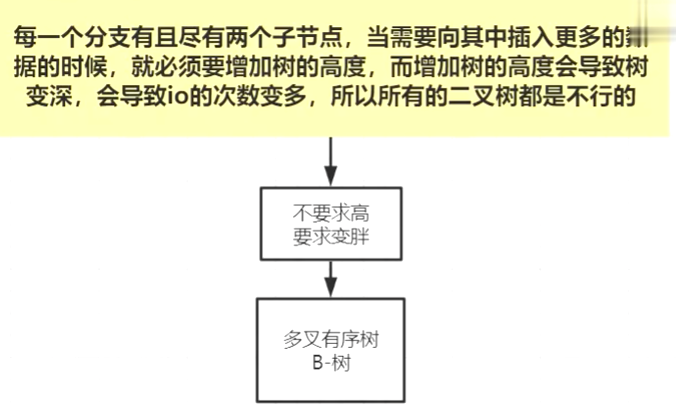
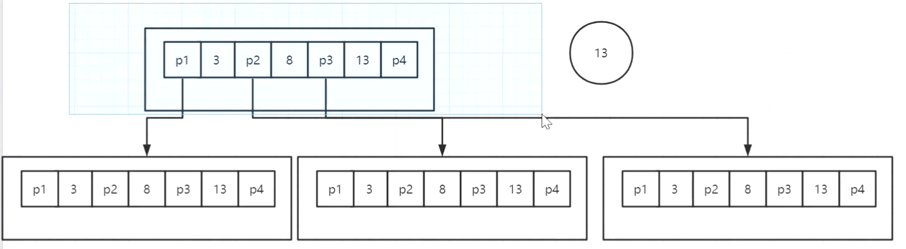
B树
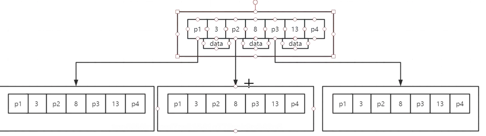
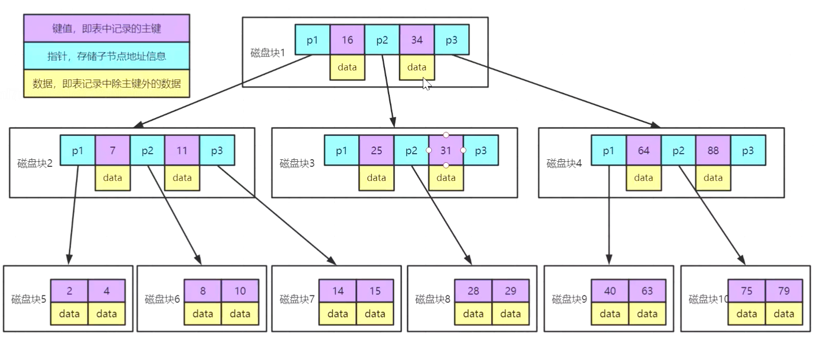
B+树
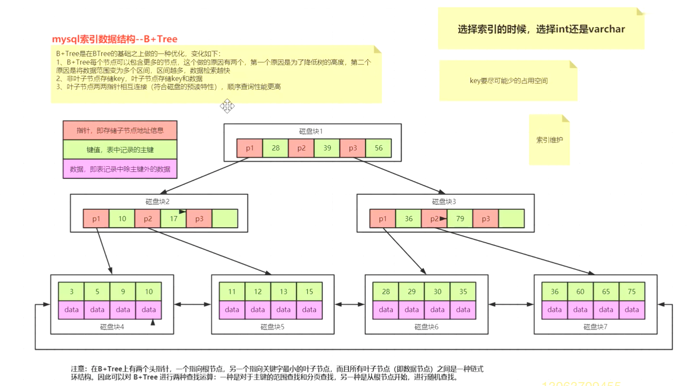
一般情况b+树多少层:3层,4层可以支持千万级别
索引选择使用int/long(21亿),insert buffer,2、3层索引尽可能少占用空间支持数据量大
索引的执行计划,优化
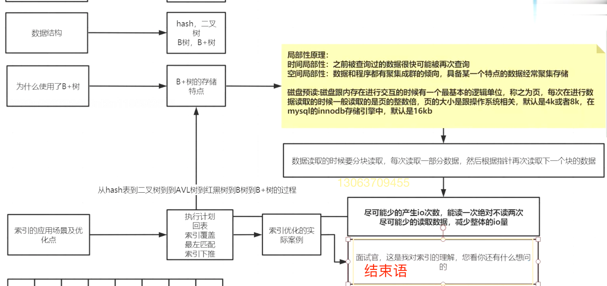

##什么时候索引会失效?如何避免?
[z_3_mysql_查询优化_00_聚集索引_二级索引_覆盖索引_全表扫描_回表_范围区间_多个单索引_索引合并.md]
##mysql如何做分库分表的？集群方案，如何做数据迁移?
[z_10_mysql_集群架构_架构类型_高可用方案_双主被动_keepalive虚拟ip_热备.md]
0.主从复制,读写分离
1.集群架构:MMM,MHA,MGR
2.中间件:shardingsphere(催收账务表)
3.水平分库，水平分表，垂直分库，垂直分表

1.分片算法
2.一致性算法减少数据迁移
3.HAProxy
##哪些存储引擎？myisam vs innodb
show engines;
MEMORY:临时表
PERFORMANCE_SCHEMA:监控性能
InnoDB:事务,
```asp
+--------------------+---------+----------------------------------------------------------------+--------------+------+------------+
| Engine             | Support | Comment                                                        | Transactions | XA   | Savepoints |
+--------------------+---------+----------------------------------------------------------------+--------------+------+------------+
| InnoDB             | DEFAULT | Supports transactions, row-level locking, and foreign keys     | YES          | YES  | YES        |
| MRG_MYISAM         | YES     | Collection of identical MyISAM tables                          | NO           | NO   | NO         |
| MEMORY             | YES     | Hash based, stored in memory, useful for temporary tables,临时表      | NO           | NO   | NO         |
| BLACKHOLE          | YES     | /dev/null storage engine (anything you write to it disappears) | NO           | NO   | NO         |
| MyISAM             | YES     | MyISAM storage engine                                          | NO           | NO   | NO         |
| CSV                | YES     | CSV storage engine                                             | NO           | NO   | NO         |
| ARCHIVE            | YES     | Archive storage engine                                         | NO           | NO   | NO         |
| PERFORMANCE_SCHEMA | YES     | Performance Schema   (监控)                                          | NO           | NO   | NO         |
| FEDERATED          | NO      | Federated MySQL storage engine                                 | NULL         | NULL | NULL       |
+--------------------+---------+----------------------------------------------------------------+--------------+------+------------+
```
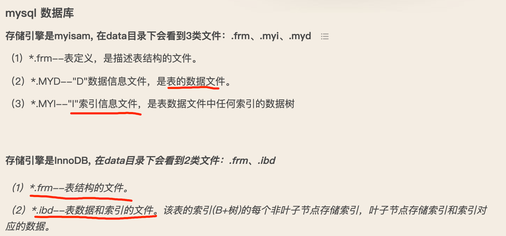
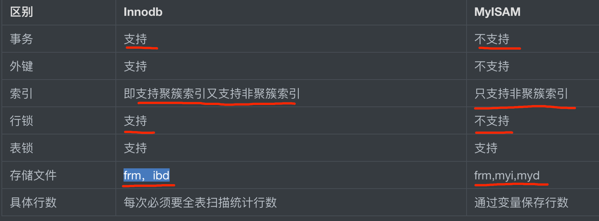
##聚簇索引和非聚簇索引的区别?
跟数据绑定在一起的索引我们称之为聚簇索引，没有跟数据绑定在一起的索引我们称之为非聚簇索引
myisam都是非聚簇索引
innodb,一个聚簇索引，多个非聚簇索引

##描述一下mysql主从复制的机制的原理？mysql主从复制主要有几种模式？
[z_10_mysql_集群架构_架构类型_高可用方案_双主被动_keepalive虚拟ip_热备.md]
[z_10_mysql_集群架构_binlog_relaylog_主从复制_异步复制_半同步复制_复制优化.md]
##如何解决主从复制延时问题?
从库sql多线程,组提交,GTID
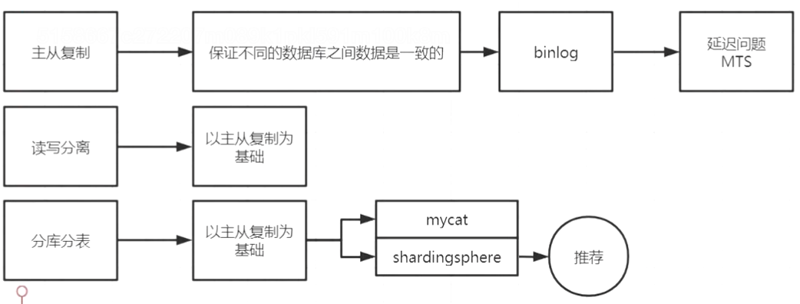

##如何优化sql，查询计划的结果中看哪些些关键数据？
[z_3_mysql_查询优化_00_explain_优化过程查看_profile_查询优化_查询成本.md]
[z_3_mysql_查询优化_00_成本估算.md]
保证type在range以上
##mysql一条数据的select读流程
[z_1_mysql_sql读写执行过程.md]
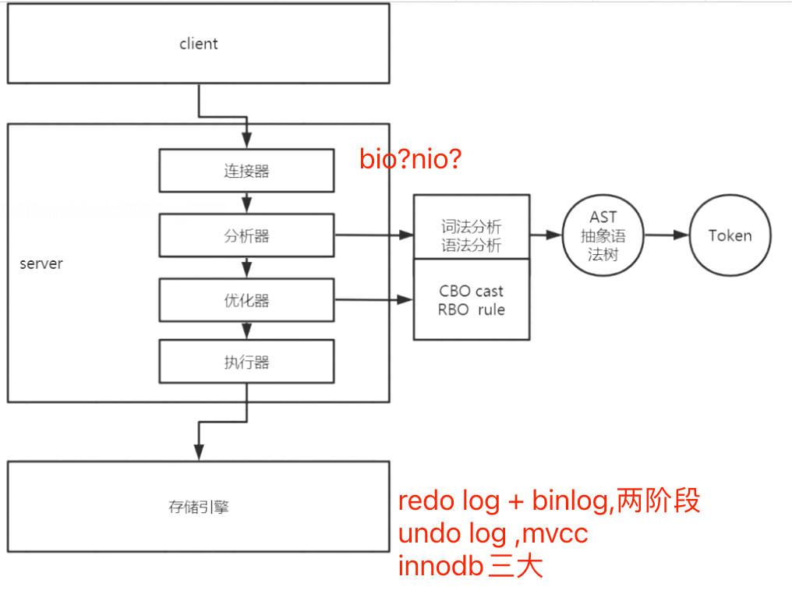
[z_3_mysql_查询优化_00_成本估算.md]
[](http://mysql.taobao.org/monthly/2017/01/10/)
[](https://time.geekbang.org/column/article/68319)
```asp
1.连接器,mysql客户端和服务器端进行TCP连接,客户端如果太长时间没动静，连接器就会自动将它断开。这个时间是由参数 wait_timeout 控制的，默认值是 8 小时
2.分析器,词法分析语法分析,使用AST抽象语法树分解出token
3.优化器,执行计划生成,成本估计,计算cpu和io成本,选定索引,优化器是在表里面有多个索引的时候，决定使用哪个索引；或者在一个语句有多表关联（join）的时候，决定各个表的连接顺序
4.执行器,server层会把索引信息传给引擎，在引擎层遍历索引去读取数据
5.读取的数据页缓存在Buffer Pool中,提供以后读取,缓存命中率,如果是
```
##mysql一条数据的update写流程
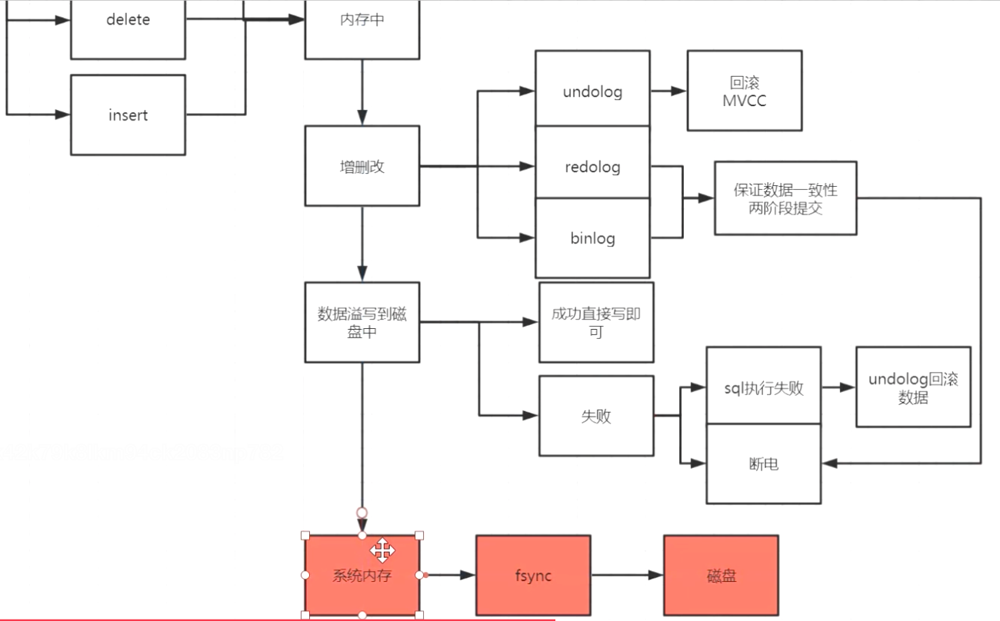
##mysql一条数据的insert写流程
[z_0_mysql_innodb三大特性.md]

[](http://mysql.taobao.org/monthly/2017/09/10/)
```asp
1.连接器,mysql客户端和服务器端进行TCP连接,客户端如果太长时间没动静，连接器就会自动将它断开。这个时间是由参数 wait_timeout 控制的，默认值是 8 小时
2.分析器,词法分析语法分析,使用AST抽象语法树分解出token
3.优化器,执行计划生成,成本估计,计算cpu和io成本,选定索引,优化器是在表里面有多个索引的时候，决定使用哪个索引；或者在一个语句有多表关联（join）的时候，决定各个表的连接顺序
4.执行器,操作引擎,返回结果
5.引擎,插入记录时,innodb默认使用RR隔离级别,形成事务视图read view,每条记录写入undo log,也就是MVCC,事务提交时依次写入binlog redolog,两阶段提交
6.如果写入失败,undolog 回滚,如果断电重启时根据binlog redolog的事务日志来决定提交或者回滚
7.如果表中有非聚簇索引,会写入insert buffer
8.这里持久化刷盘决策,fsync,如果是1,刷盘成功后返回结果
9.如果是主从异步,binglog dump线程定期复制到从库,半同步,在返回结果前将结果复制到从库,然后返回结果
```
##mysql一条数据的delete写流程
[](https://time.geekbang.org/column/article/68633)
##两阶段提交redolog + binlog
##项目中的问题
###公司mysql架构&吞吐指标
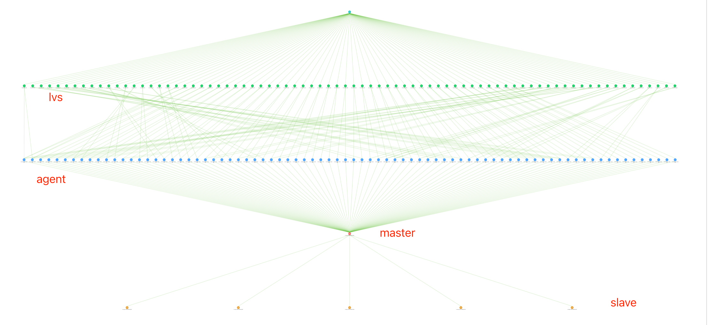
MHA两主互备,多从库，主库信息
qps 20000+,峰值:26000+, IO_read:15M/S
tps  300+,峰值:1000+,IO_write:10M/s
current_connected 1387
流量:10M,流量峰值:48.54 MB/s
双机房,mysql,innodb缓存池72G
swap禁用
数据库磁盘使用量750GB

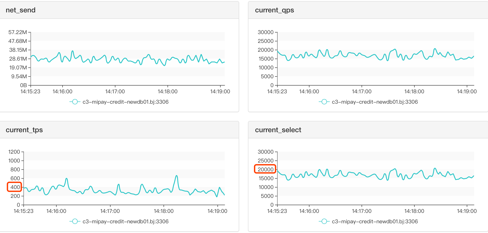
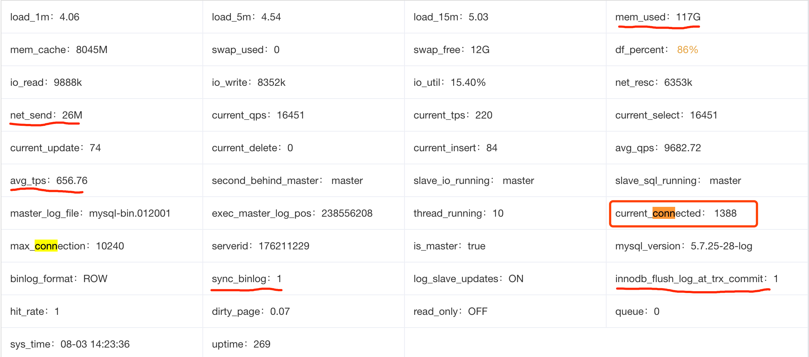

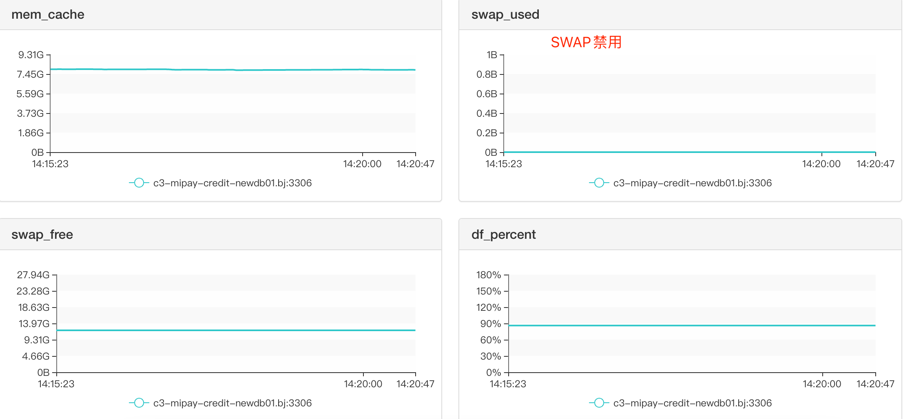
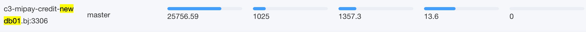
###慢查询
1.
##聊聊WAL
1.write ahead log,主要是为了加快持久化进度,落盘是随机写需要寻址,为了加快持久化先顺序写日志,不需要寻址
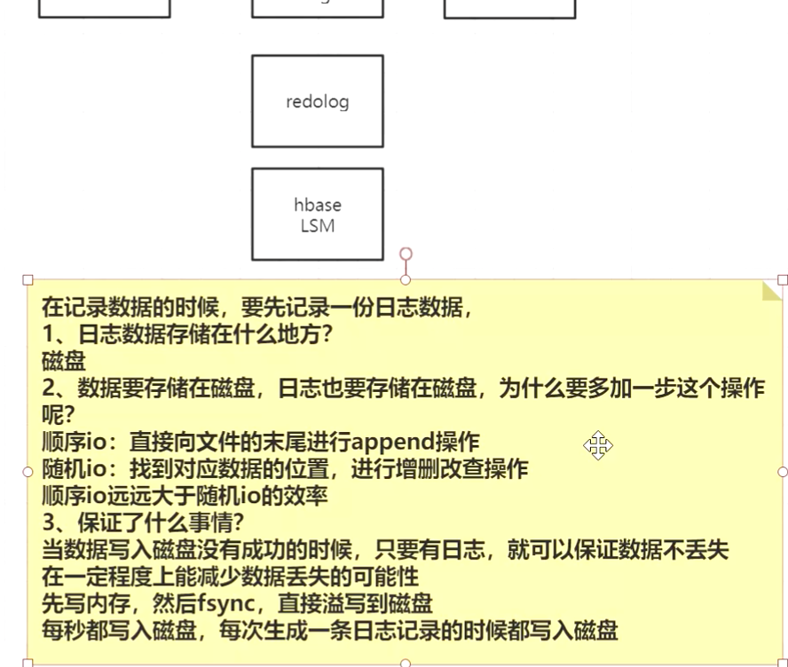
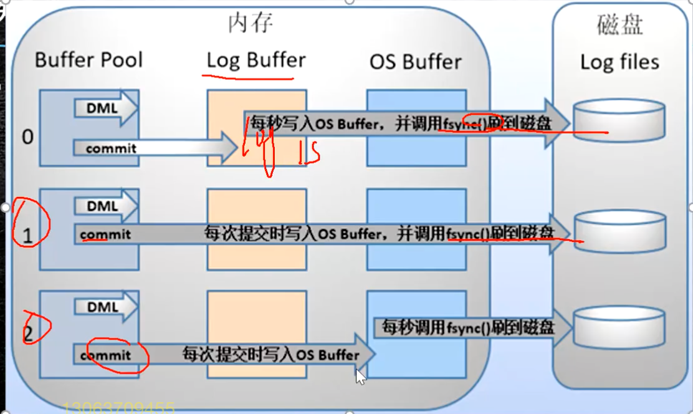
##为啥mysql没有使用nio,而是bio
[](https://www.zhihu.com/question/23084473)
```asp
对DB来说，关键是要限制连接的数目。这个要求无论是DB连接池还是NIO的连接管理都能做到
在一个连接中，SQL语句的执行必须是串行、同步的。这是由于对于每一个Session，DB都要维护一组状态来支持查询，比如事务隔离级别，当前Session的变量
维护这些状态需要耗费内存，同时也会消耗CPU和磁盘IO。这样，限制对DB的连接数，就是在限制对DB资源的消耗

可以实现用IO多路复用来访问DB。实际上很多其他语言/框架里都是这么干的。比如Nodejs
有大量场景是需要BIO的DB查询支持的。批处理数据分析代码都是这样的场景。这样的程序写成NIO就会得不偿失
```
##为啥mysql设计成行存储
[](https://www.zhihu.com/question/24110442/answer/851671343)
行存储,列数固定,每行即使没有数据也会占用磁盘空间,方便对该列数据的增删改查
无法从根本上解决查询性能和维护成本等问题
```asp
1、适合随机的增删改查操作;

2、需要在行中选取所有属性的查询操作;

3、需要频繁插入或更新的操作，其操作与索引和行的大小更为相关。
```
##表很大,数据很多时为啥性能会下降?
表大,数据量很大,用户数增加,TPS增大,
同时访问mysql的连接增多,mysql使用bio,内存缓存页替换频繁fan,
磁盘寻址变多,磁盘吞吐量有上限1G/s

