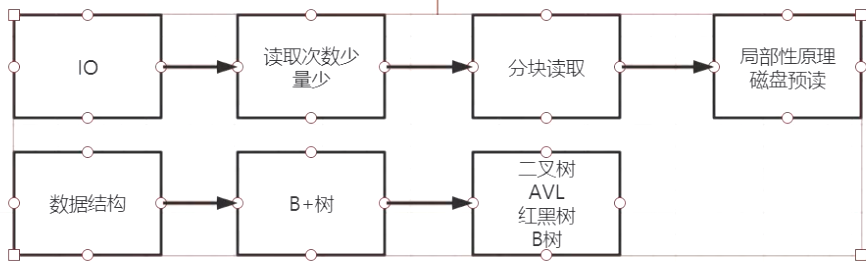

##临界知识
mysql连接session状态需要消耗内存/cpu/io,因此mysql连接受限于计算机硬件资源
mysql 常用于OLTP（on-line transaction processing),需要BIO访问
mysql bio成本与性能的权衡
mysql行存储原因:方便随机对数据增删改查
回答问题结合操作系统机制io,page cache,生产环境使用,运维经验
##描述一下数据库事务隔离级别？
画图,原理
[z_9_mysql_02_undo_事务id_事务原子性_回滚段.md]
[z_9_mysql_03_事务_隔离级别_MVCC_锁_锁释放_readview视图_readview生成时机_脏写_脏读_不可重复读_幻读.md]
```asp
ACID:
A:原子性,定义+原理(undo log)
C:
I:隔离性,四个隔离级别,(mvcc版本并发控制,undo log,readview,三个隐藏字段
D:redo log,二阶段提交(binlog + redo log 
```
##mysql幻读怎么解决？
涉及当前读时RR级别产生幻读,使用gap 锁
[z_9_mysql_03_事务_隔离级别_MVCC_锁_锁释放_readview视图_readview生成时机_脏写_脏读_不可重复读_幻读.md]
##说说mysql的join原理?
[z_3_mysql_查询优化_03_join优化_连接优化_joinbuffer_Index-Nested_block-Nested_semi-join.md]
##索引的数据结构/原理?
画图

io(磁盘读取次数少)+数据结构(io读取量少)
1.io,程序满足局部性原理,磁盘预读,操作系统以4k为单位读到page cache缓存,mysql读取16k
2.二叉树->平衡二叉树->b树->b+树,避免深度过深,减少io读取次数,有序读取,为了加快索引,16k页尽可能多读索引,所以使用b+

```asp
b树 vs b+
b+叶子节点包含所有数据,叶子节点是双向链表
b树,叶子节点不是链表,不包含所有数据
```
[z_8_mysql_数据结构_B+树.md]
##什么时候索引会失效?如何避免?
[z_3_mysql_查询优化_00_聚集索引_二级索引_覆盖索引_全表扫描_回表_范围区间_多个单索引_索引合并.md]
##mysql如何做分库分表的？集群方案
[z_10_mysql_集群架构_架构类型_高可用方案_双主被动_keepalive虚拟ip_热备.md]
0.主从复制,读写分离
1.集群架构:MMM,MHA,MGR
2.中间件:shardingsphere(催收账务表)
3.水平分库，水平分表，垂直分库，垂直分表
##项目中的问题

##为啥mysql没有使用nio,而是bio
[](https://www.zhihu.com/question/23084473)
```asp
对DB来说，关键是要限制连接的数目。这个要求无论是DB连接池还是NIO的连接管理都能做到
在一个连接中，SQL语句的执行必须是串行、同步的。这是由于对于每一个Session，DB都要维护一组状态来支持查询，比如事务隔离级别，当前Session的变量
维护这些状态需要耗费内存，同时也会消耗CPU和磁盘IO。这样，限制对DB的连接数，就是在限制对DB资源的消耗

可以实现用IO多路复用来访问DB。实际上很多其他语言/框架里都是这么干的。比如Nodejs
有大量场景是需要BIO的DB查询支持的。批处理数据分析代码都是这样的场景。这样的程序写成NIO就会得不偿失
```
##为啥mysql设计成行存储
[](https://www.zhihu.com/question/24110442/answer/851671343)
行存储,列数固定,每行即使没有数据也会占用磁盘空间,方便对该列数据的增删改查
无法从根本上解决查询性能和维护成本等问题
```asp
1、适合随机的增删改查操作;

2、需要在行中选取所有属性的查询操作;

3、需要频繁插入或更新的操作，其操作与索引和行的大小更为相关。
```
##表很大,数据很多时为啥性能会下降?
表大,数据量很大,用户数增加,TPS增大,
同时访问mysql的连接增多,mysql使用bio,内存缓存页替换频繁fan,
磁盘寻址变多,磁盘吞吐量有上限1G/s

