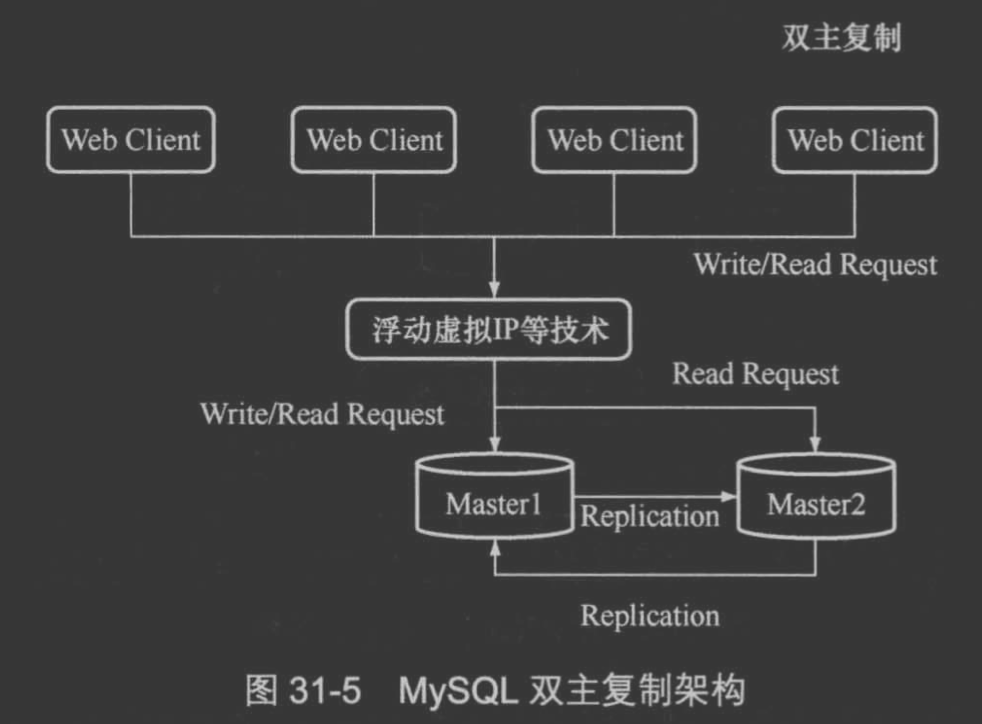

#架构类型
##一主多从

主库异步推送
##多级复制

结合BLACKHOLE引擎
##双主复制

##主从切换
手动切换

[](https://time.geekbang.org/column/article/76446)
##双主被动模式故障切换
MHA+半同步,[深入浅出mysql 33]


keepalive+双主被动
[](https://www.cnblogs.com/wjxzs/p/14245019.html)

###双主被动与主从的区别
双主开复制线程
主从的从库没有开复制线程
###双主循环问题
规定两个库的 server id 必须不同，如果相同，则它们之间不能设定为主备关系；
```asp
从节点 A 更新的事务，binlog 里面记的都是 A 的 server id；
传到节点 B 执行一次以后，节点 B 生成的 binlog 的 server id 也是 A 的 server id；
再传回给节点 A，A 判断到这个 server id 与自己的相同，就不会再处理这个日志。所以，死循环在这里就断掉了
```
##双主主动问题&方案
[](https://blog.csdn.net/weixin_32075843/article/details/113595112)
