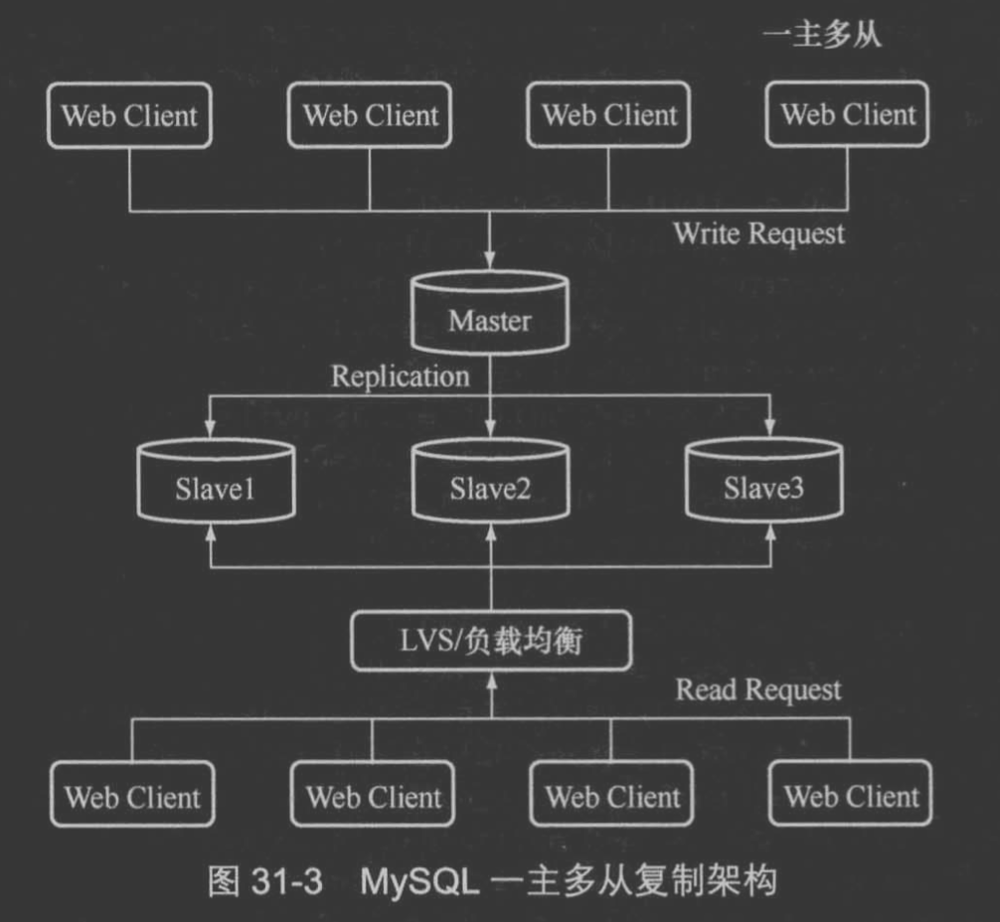
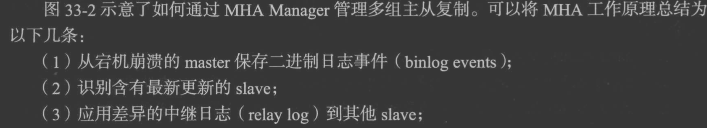

#临界知识
MMM,MHA MGR
#架构类型
##一主多从

主库异步推送
##多级复制

结合BLACKHOLE引擎
##双主复制

##主从切换
手动切换

[](https://time.geekbang.org/column/article/76446)
##双主被动模式故障切换(MMM,MHA)

MHA+半同步,[深入浅出mysql 33]



keepalive+双主被动
[](https://www.cnblogs.com/wjxzs/p/14245019.html)

###MMM VS MHA VS MGR(master group replication)
MMM:master master manager
MHA:master high availability(lvs+keepalive)


###双主被动与主从的区别
两台服务器地位一样，但新增只用一台服务器，另一台设置为只读。当写服务器发生故障时，可以迅速改读服务器的配置为可读可写。
[](https://segmentfault.com/a/1190000009724090)
主 vs 从: 主库有binlog dump线程,从库没有
只读主库,有binlog dump线程但只读
从库可读写 vs 主库：
```asp
将MySQL从只读设置为读写状态的命令：
mysql> unlock tables;
mysql> set global read_only=0;
```
[](https://blog.csdn.net/yumushui/article/details/41645469)
###双主循环问题
规定两个库的 server id 必须不同，如果相同，则它们之间不能设定为主备关系；
```asp
从节点 A 更新的事务，binlog 里面记的都是 A 的 server id；
传到节点 B 执行一次以后，节点 B 生成的 binlog 的 server id 也是 A 的 server id；
再传回给节点 A，A 判断到这个 server id 与自己的相同，就不会再处理这个日志。所以，死循环在这里就断掉了
```
##双主主动问题&方案
[](https://cloud.tencent.com/developer/article/1670484)
设置相同步长，不同初始值，可以避免auto increment生成冲突主键；

不依赖数据库，业务调用方自己生成全局唯一ID是一个好方法
#MMM VS MHA VS MGR
##GTID模式(Global Transaction ID)
##binlog 格式
[z_9_mysql_00_binlog_两阶段提交_逻辑日志.md]
##MMM
##MHA
[](https://blog.csdn.net/William0318/article/details/106855431)
##MGR(paxos,gtid全局事务id)
[](https://www.51cto.com/article/615706.html)

[](https://zhuanlan.zhihu.com/p/149991963)
[](https://blog.csdn.net/William0318/article/details/106855431)

