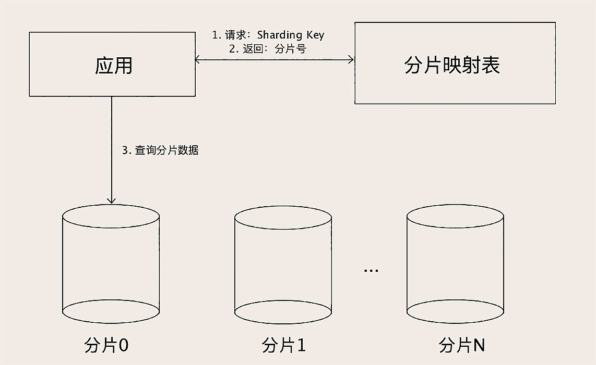

#临界知识
mysql分表方案

#分库
并发高
#分表
数据量大;
分表的依据
##基于范围来分片
###有热点问题
基于范围来分片容易产生热点问题，范围分片特别适合那种数据量非常大，但并发访问量不大的 ToB 系统
##哈希分片算法
选定了 Sharding Key 是用户 ID，那我们决定某个用户的订单应该落到那个分片上的算法是，拿用户 ID 除以 24，得到的余数就是分片号。
这是最简单的取模算法,，使用订单 ID 作为查询条件来查订单的时候，就没办法找到订单在哪个分片了。这个问题的解决办法是，在生成订单 ID 的时候，
把用户 ID 的后几位作为订单 ID 的一部分，比如说，可以规定，18 位订单号中，第 10-14 位是用户 ID 的后四位，这样按订单 ID 查询的时候，
就可以根据订单 ID 中的用户 ID 找到分片。
###分布不均
##查表法
###解决分布不均
类似redis分槽slot,

