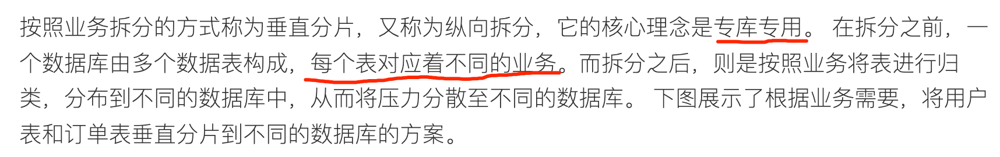
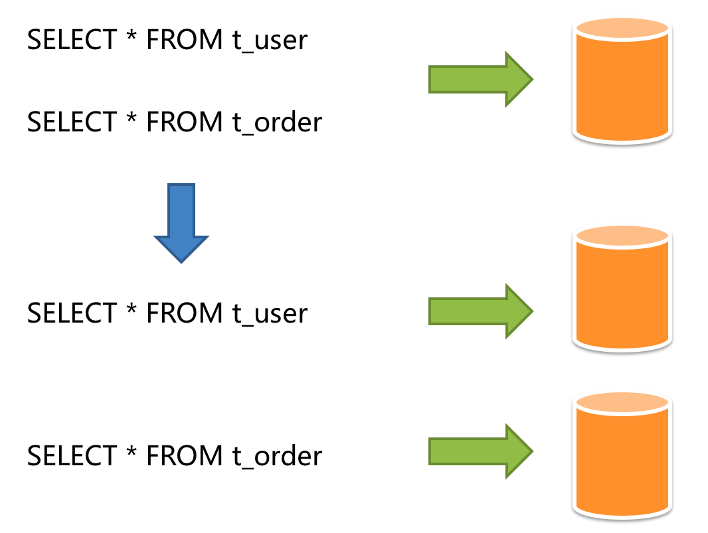
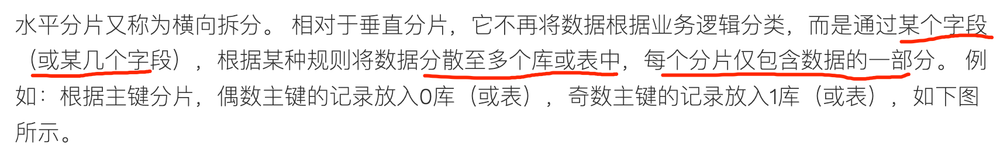
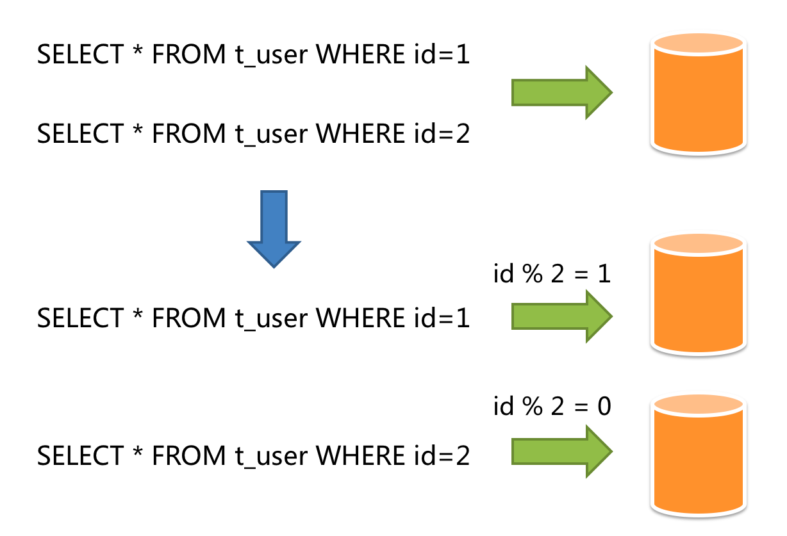
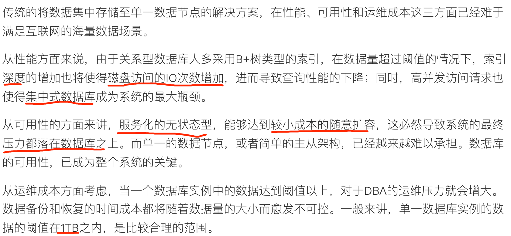
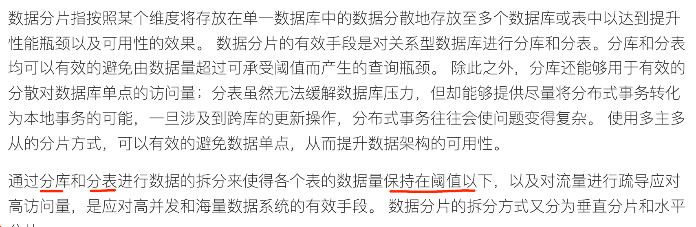
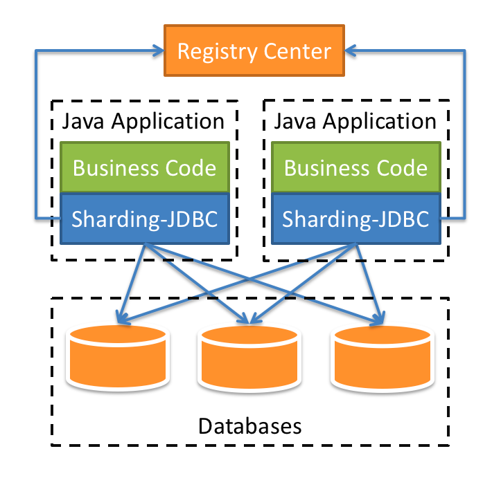
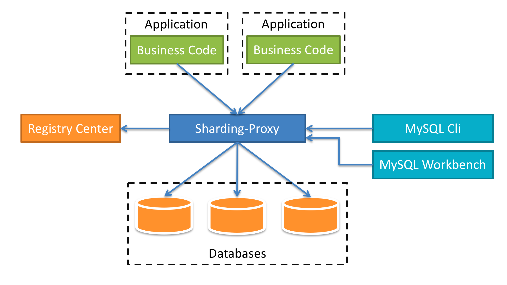
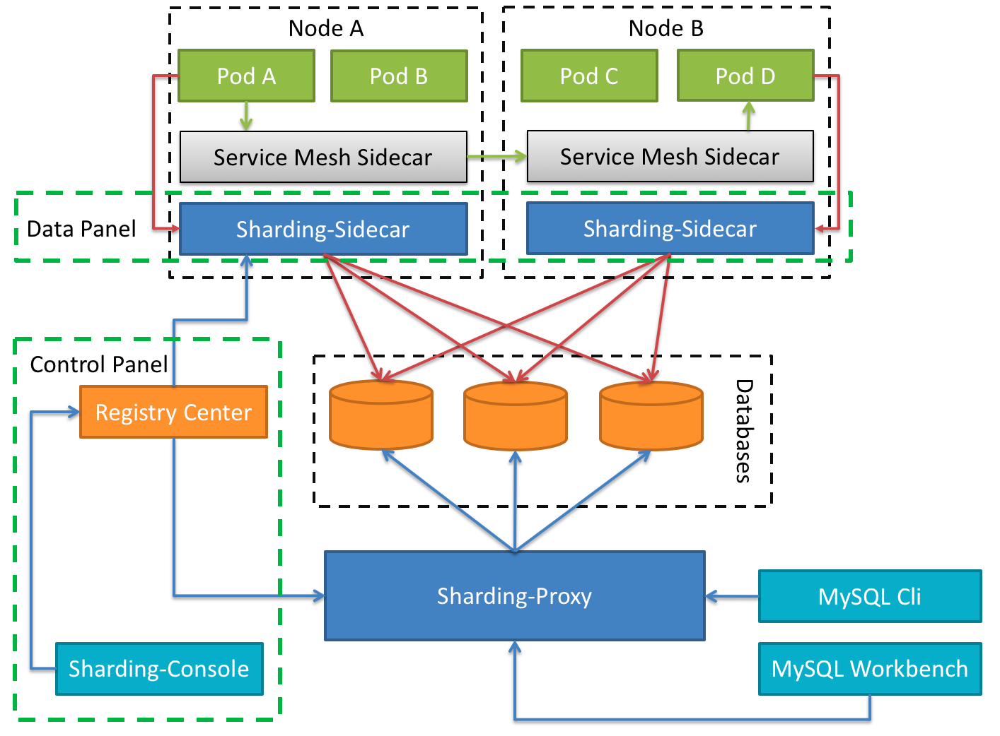

#临界知识
mysql分表方案

#垂直分片

催收,决策引擎,贷款三个业务都分库

#水平分片

催收账务表,按时间范围分片(热点数据数据,每日访问量少)
#分库(解决并发高)

是为了应对高并发的问题。应对高并发的思想我们之前也说过，一个数据库实例撑不住，就把并发请求分散到多个实例中去，所以，解决高并发的问题是需要分库的
单个mysql实例保持在1TB以下

#分表(解决查询慢)
解决查询慢，只要减少每次查询的数据总量就可以了，也就是说，分表就可以解决问题
数据量大;
分表的依据
那就是能不拆就不拆，能少拆不多拆

选择这个 Sharding Key 最重要的参考因素是，我们的业务是如何访问数据的。

##基于范围来分片(催收系统,1000w)
###有热点问题
基于范围来分片容易产生热点问题，范围分片特别适合那种数据量非常大，但并发访问量不大的 ToB 系统,
##哈希分片算法
哈希分片比较容易把数据和查询均匀地分布到所有分片中

选定了 Sharding Key 是用户 ID，那我们决定某个用户的订单应该落到那个分片上的算法是，拿用户 ID 除以 24，得到的余数就是分片号。
这是最简单的取模算法,，使用订单 ID 作为查询条件来查订单的时候，就没办法找到订单在哪个分片了。这个问题的解决办法是，在生成订单 ID 的时候，
把用户 ID 的后几位作为订单 ID 的一部分，比如说，可以规定，18 位订单号中，第 10-14 位是用户 ID 的后四位，这样按订单 ID 查询的时候，
就可以根据订单 ID 中的用户 ID 找到分片。
###分布不均
##查表法
###解决分布不均
类似redis分槽slot,

#分库分表问题(结果合并,事务)
##分页、排序、聚合分组
##跨库事务
基于XA的分布式事务由于在并发度高的场景中性能无法满足需要,带来分布式事务问题,最终一致性的柔性事务
#分片算法
#中间件
##shardingsphere
开源的分布式数据库中间件解决方案组成的生态圈

Sharding-JDBC采用无中心化架构，适用于Java开发的高性能的轻量级OLTP应用；Sharding-Proxy提供静态入口以及异构语言的支持，适用于OLAP应用以及对分片数据库进行管理和运维的场景
