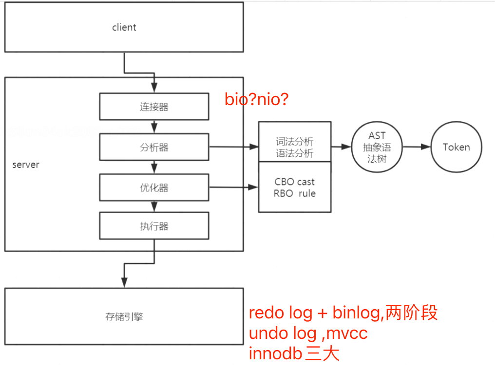

##mysql一条数据的select读流程
[z_1_mysql_sql读写执行过程.md]

[z_3_mysql_查询优化_00_成本估算.md]
[](http://mysql.taobao.org/monthly/2017/01/10/)
[](https://time.geekbang.org/column/article/68319)
```asp
1.连接器,mysql客户端和服务器端进行TCP连接,客户端如果太长时间没动静，连接器就会自动将它断开。这个时间是由参数 wait_timeout 控制的，默认值是 8 小时
2.分析器,词法分析语法分析,使用AST抽象语法树分解出token
3.优化器,执行计划生成,成本估计,计算cpu和io成本,选定索引,优化器是在表里面有多个索引的时候，决定使用哪个索引；或者在一个语句有多表关联（join）的时候，决定各个表的连接顺序
4.执行器,server层会把索引信息传给引擎，在引擎层遍历索引去读取数据
5.读取的数据页缓存在Buffer Pool中,提供以后读取,缓存命中率,如果是
```
##mysql一条数据的update写流程

##mysql一条数据的insert写流程
[z_0_mysql_innodb三大特性.md]

[](http://mysql.taobao.org/monthly/2017/09/10/)
```asp
1.连接器,mysql客户端和服务器端进行TCP连接,客户端如果太长时间没动静，连接器就会自动将它断开。这个时间是由参数 wait_timeout 控制的，默认值是 8 小时
2.分析器,词法分析语法分析,使用AST抽象语法树分解出token
3.优化器,执行计划生成,成本估计,计算cpu和io成本,选定索引,优化器是在表里面有多个索引的时候，决定使用哪个索引；或者在一个语句有多表关联（join）的时候，决定各个表的连接顺序
4.执行器,操作引擎,返回结果
5.引擎,插入记录时,innodb默认使用RR隔离级别,形成事务视图read view,每条记录写入undo log,也就是MVCC,事务提交时依次写入binlog redolog,两阶段提交
6.如果写入失败,undolog 回滚,如果断电重启时根据binlog redolog的事务日志来决定提交或者回滚
7.如果表中有非聚簇索引,会写入insert buffer
8.这里持久化刷盘决策,fsync,如果是1,刷盘成功后返回结果
9.如果是主从异步,binglog dump线程定期复制到从库,半同步,在返回结果前将结果复制到从库,然后返回结果
```
##mysql一条数据的delete写流程
[](https://time.geekbang.org/column/article/68633)
