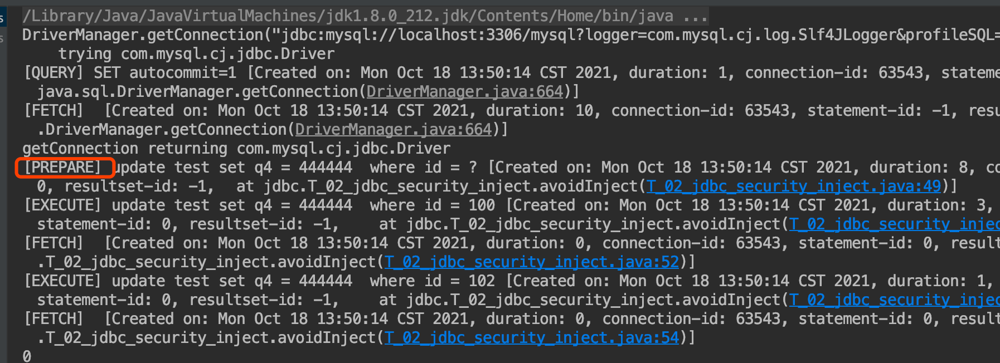
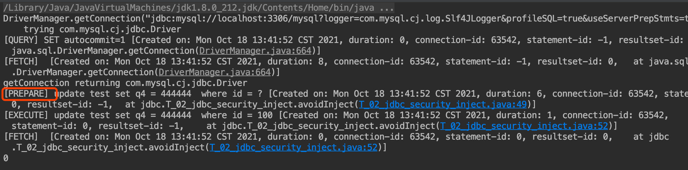

##临界知识
1.所有的框架都可以进行日志输出,排查问题
2.涉及到重复创建/使用时,都可以使用缓存
3.预编译使用,sql语句参数化/模板化
4.客户端预编译模拟&缓存,服务端预编译&缓存
5.LRUCache
##注入问题
###注入
```asp
String id = "100 or 1=1";
String sql = "update test set q4 = 33333  where id =" + id;
```
###预编译PreparedStatement/防注入
客户端
```asp
String id = "100 or 1=1";
String sql = "update test set q4 = 444444  where id = ?";

//5、获取执行sql语句的对象
PreparedStatement stat = con.prepareStatement(sql);
```
mysql客户端
```asp
prepare ins from 'insert into t select ?,?';
set @a=999,@b='hello';
execute ins using @a,@b;
```
[](https://dev.mysql.com/doc/refman/8.0/en/sql-prepared-statements.html)
```asp
Less overhead for parsing the statement each time it is executed. Typically, database applications process large volumes of almost-identical statements, with only changes to literal or variable values in clauses such as WHERE for queries and deletes, SET for updates, and VALUES for inserts.

Protection against SQL injection attacks. The parameter values can contain unescaped SQL quote and delimiter characters.
```
##Prepare预编译使用
[](https://yoga7xm.top/2020/02/02/prepare/)
###预编译实现
在使用PreparedStatement执行SQL命令时，会带着占位符被数据库进行编译和解析，然后放到命令缓冲区。接受客户端发来的参数，利用服务端缓存，拼接Sql语句解析执行，
这里虽然会再被解析一次，但不会再次被编译，可以把这个过程看作sql语句的模板化或参数化。

###预编译作用范围
session连接级别
###客户端预编译模拟/转义符处理
processEscapeCodesForPrepStmts=true;
useServerPrepStmts=false;
ClientPreparedStatement.isEscapeNeededForString
```asp
2021-10-18T06:54:32.789260Z	63556 Query	SET NAMES utf8mb4
2021-10-18T06:54:32.790474Z	63556 Query	SET character_set_results = NULL
2021-10-18T06:55:04.315873Z	63556 Query	SET autocommit=1
2021-10-18T06:56:16.867598Z	63556 Query	update test set q4 = 444444  where id = '100''1'
```
###服务端预编译
useServerPrepStmts=true
```asp
2021-10-18T06:56:51.063293Z	63558 Query	SET NAMES utf8mb4
2021-10-18T06:56:51.064231Z	63558 Query	SET character_set_results = NULL
2021-10-18T06:56:51.064957Z	63558 Query	SET autocommit=1
2021-10-18T06:56:51.102641Z	63558 Prepare	update test set q4 = 444444  where id = ?
2021-10-18T06:56:51.112463Z	63558 Execute	update test set q4 = 444444  where id = '100\'#'
```
##Prepare缓存
###客户端缓存
开启客户端预编译缓存,cachePrepStmts
```asp
ConnectionImpl
if (this.cachePrepStmts.getValue()) {
    createPreparedStatementCaches();
}
serverSideStatementCache
LRUCache

```
###服务端缓存
服务端不缓存预编译
开启服务端预编译,useServerPrepStmts
同一连接会话中,已经预编译的sql只会编译一次

###预编译+缓存效果
[](https://blog.csdn.net/HeatDeath/article/details/79702663)
##预编译使用
###预编译使用
useServerPrepStmts=true
jdbc:mysql://localhost:3306/mysql?logger=com.mysql.cj.log.Slf4JLogger&profileSQL=true&useServerPrepStmts=true

