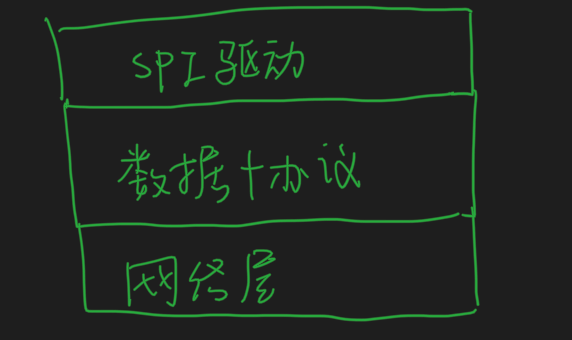

##临界知识
jdbc是数据库访问接口规范  
驱动加载通过spi 
sql执行会话层 
数据协议层  
网络连接层  
池化技术  
模板变量sql  
sql安全问题  


[](https://segmentfault.com/a/1190000040580622)
##jdbc连接过程
JDBC 使用 SPI 机制加载数据库驱动，这是为了解决 BootstrapClassloader 无法加载第三方的类的问题，将第三方的类委托给线程上下文类加载器来加载。
获取数据库连接对象 Connection，实际上是对数据库建立 Socket 连接。可以使用数据库连接池，以重复利用 Connection。
通过 Statement 来查询数据，底层是向 Socket 写入二进制数据，再从 Socket 读取二进制数据，封装在 Resultset 对象之中。

##jdbc接口层与实现层(驱动层)
```asp
┌ ─ ─ ─ ─ ─ ─ ─ ─ ─ ─ ┐

│  ┌───────────────┐  │
   │   Java App    │
│  └───────────────┘  │
           │
│          ▼          │
   ┌───────────────┐
│  │JDBC Interface │<─┼─── JDK
   └───────────────┘
│          │          │
           ▼
│  ┌───────────────┐  │
   │  JDBC Driver  │<───── mysql
│  └───────────────┘  │
           │
└ ─ ─ ─ ─ ─│─ ─ ─ ─ ─ ┘
           ▼
   ┌───────────────┐
   │   Database    │
   └───────────────┘
```
##驱动寻找(SPI)
```asp
static {
    loadInitialDrivers();
    println("JDBC DriverManager initialized");
}
```
##网络连接层BIO
```asp
public ConnectionImpl(HostInfo hostInfo) throws SQLException {
    // ...
    createNewIO(false); // 关键位置
    // ...
}
```
##sql执行会话层
```asp
public <T extends Resultset> T execSQL(Query callingQuery, String query, int maxRows, NativePacketPayload packet, boolean streamResults, ProtocolEntityFactory<T, NativePacketPayload> resultSetFactory, ColumnDefinition cachedMetadata, boolean isBatch) {
    // ...
    return packet == null
            ? ((NativeProtocol) this.protocol).sendQueryString(callingQuery, query, this.characterEncoding.getValue(), maxRows, streamResults, cachedMetadata, resultSetFactory)
            : ((NativeProtocol) this.protocol).sendQueryPacket(callingQuery, packet, maxRows, streamResults, cachedMetadata, resultSetFactory);
}
```
##数据协议层
```asp
public final <T extends Resultset> T sendQueryPacket(Query callingQuery, NativePacketPayload queryPacket, int maxRows, boolean streamResults, ColumnDefinition cachedMetadata, ProtocolEntityFactory<T, NativePacketPayload> resultSetFactory) throws IOException {
    // ...
    // Send query command and sql query string
    NativePacketPayload resultPacket = sendCommand(queryPacket, false, 0);
    T rs = readAllResults(maxRows, streamResults, resultPacket, false, cachedMetadata, resultSetFactory); // 读取列数
    return rs;
}
```
##PreparedStatement
##mysql连接池
##安全问题
##为啥使用BIO,而不是NIO
