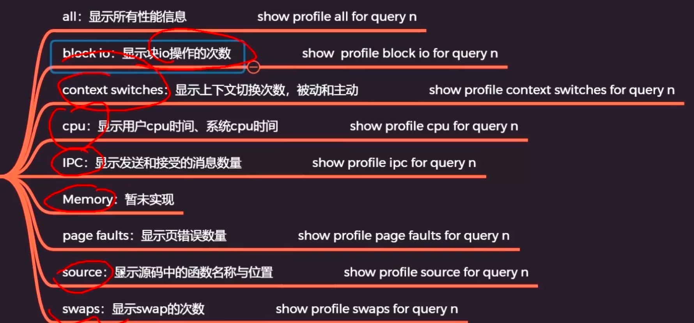
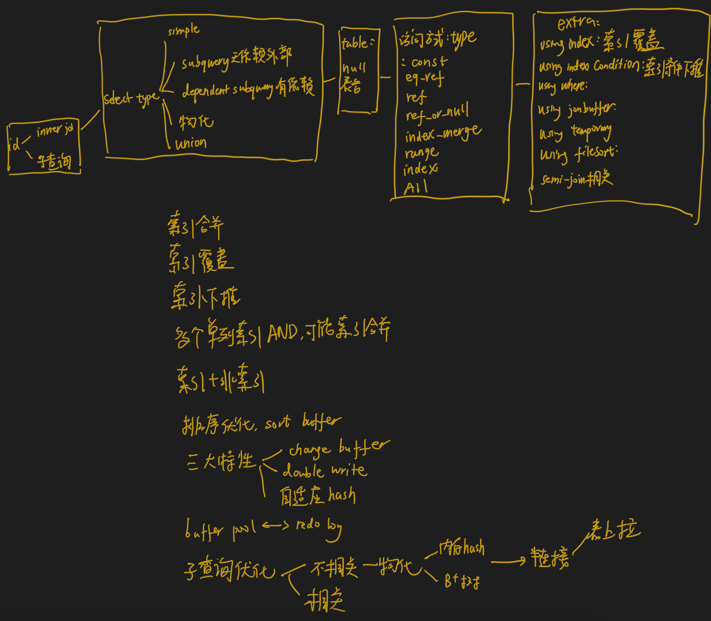
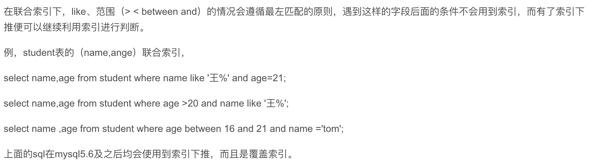
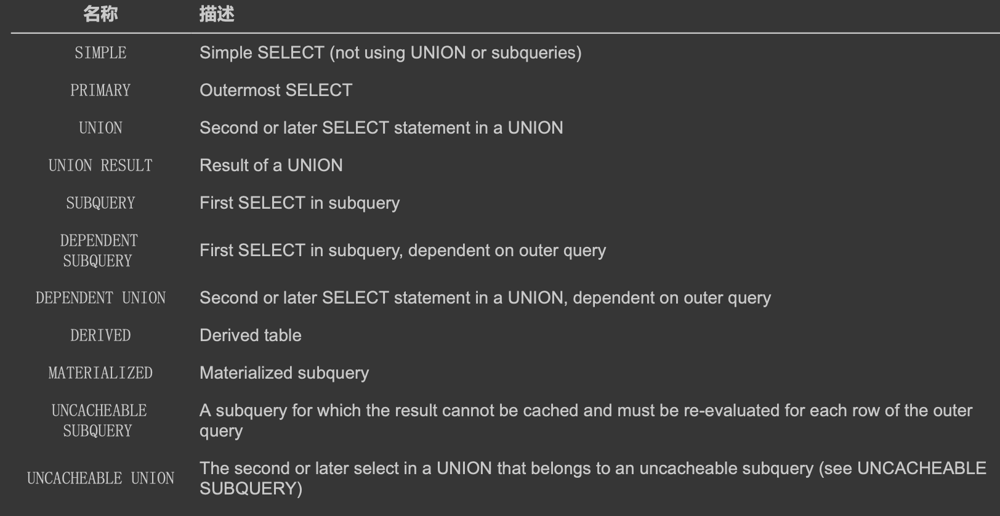
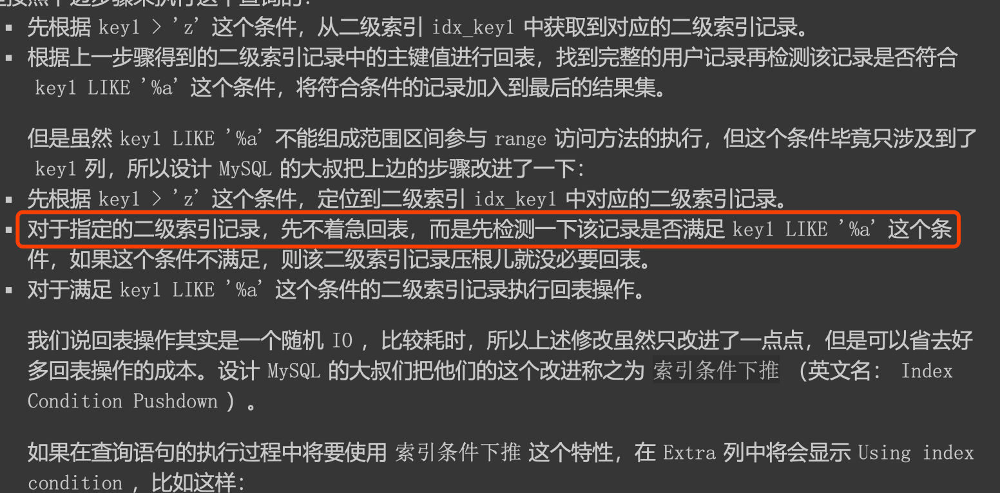

#执行延时
SET profiling = 1;
SHOW PROFILES
SHOW PROFILE
show profile for query 1;


#索引下推
where条件中无法使用二级索引索引的列也会尽量使用二级索引索引结果去过滤
```asp
有些搜索条件中虽然出现了索引列，但却不能使用到索引，比如下边这个查询:
SELECT * FROM s1 WHERE key1 > 'z' AND key1 LIKE '%a';
其中的 key1 > 'z' 可以使用到索引，但是 key1 LIKE '%a' 却无法使用到索引
```
可以有效减少回表的次数，大大提升了查询的效率
索引下推是在非主键索引，或者说二级索引/联合索引的情形下，索引的匹配规则遵循最左原则，最左原则会因为like或范围判断而后面的索引失效，
这时在mysql5.6后引入了索引下推的概念，来优化查询效率

[](https://blog.csdn.net/suifengyongyuan/article/details/117737730)
#索引覆盖
#索引合并
#explain
[](https://dev.mysql.com/doc/refman/8.0/en/explain-output.html)
##id
###相同id
查询语句中每出现一个 SELECT 关键字，设计 MySQL 的大叔就会为它分配一个唯一的 id 值
```asp
1.在连接查询的执行计划中，每个表都会对应一条记录，这些记录的id列的值是相同的，出 现在前边的表表示驱动表，出现在后边的表表示被驱动表
mysql> EXPLAIN SELECT * FROM s1 INNER JOIN s2;
+----+-------------+-------+------------+------+---------------+------+---------+------+-------+----------+---------------------------------------+
| id | select_type | table | partitions | type | possible_keys | key  | key_len | ref  | rows  | filtered | Extra                                 |
+----+-------------+-------+------------+------+---------------+------+---------+------+-------+----------+---------------------------------------+
|  1 | SIMPLE      | s2    | NULL       | ALL  | NULL          | NULL | NULL    | NULL |  9333 |   100.00 | NULL                                  |
|  1 | SIMPLE      | s1    | NULL       | ALL  | NULL          | NULL | NULL    | NULL | 18128 |   100.00 | Using join buffer (Block Nested Loop) |
+----+-------------+-------+------------+------+---------------+------+---------+------+-------+----------+---------------------------------------+
```
###不同id
```asp
2.包含子查询的查询语句来说，就可能涉及多个 SELECT 关键字，所以在包含子查询的查询语句的执行计划 中，每个 SELECT 关键字都会对应一个唯一的 id 值
mysql> EXPLAIN SELECT * FROM s1 WHERE key1 IN (SELECT key1 FROM s2) ;
+----+--------------+-------------+------------+--------+---------------+------------+---------+----------------+-------+----------+-------------+
| id | select_type  | table       | partitions | type   | possible_keys | key        | key_len | ref            | rows  | filtered | Extra       |
+----+--------------+-------------+------------+--------+---------------+------------+---------+----------------+-------+----------+-------------+
|  1 | SIMPLE       | s1          | NULL       | ALL    | idx_key1      | NULL       | NULL    | NULL           | 18128 |   100.00 | Using where |
|  1 | SIMPLE       | <subquery2> | NULL       | eq_ref | <auto_key>    | <auto_key> | 303     | sakila.s1.key1 |     1 |   100.00 | NULL        |
|  2 | MATERIALIZED | s2          | NULL       | index  | idx_key1      | idx_key1   | 303     | NULL           |  9333 |   100.00 | Using index |
+----+--------------+-------------+------------+--------+---------------+------------+---------+----------------+-------+----------+-------------+
```
##select_type
设计 MySQL 的大叔为每一个 SELECT 关键字代表的小查询都定义了一个称之为 select_type 的属性，意思是
我们 只要知道了某个小查询的 select_type 属性，就知道了这个小查询在整个大查询中扮演了一个什么角色

###SIMPLE
EXPLAIN SELECT * FROM s1;
EXPLAIN SELECT * FROM s1 INNER JOIN s2;//连接查询也算是 SIMPLE 类型
###SUBQUERY
如果包含子查询的查询语句不能够转为对应的 semi-join 的形式，并且该子查询是不相关子查询，并且查询 优化器决定采用将该子查询
物化的方案来执行该子查询时，该子查询的第一个 SELECT 关键字代表的那个查 询的 select_type 就是 SUBQUERY 

EXPLAIN SELECT * FROM s1 WHERE key1 IN (SELECT key1 FROM s2) OR key3 = 'a';

由于select_type为SUBQUERY的子查询由于会被物化，所以只需要执行一遍
###MATERIALIZED
EXPLAIN SELECT * FROM s1 WHERE key1 IN (SELECT key3 FROM s2 WHERE common_field ='a');
当查询优化器在执行包含子查询的语句时，选择将子查询物化之后与外层查询进行连接查询时，该子查询对 应的 select_type 属性就是 MATERIALIZED 
###DEPENDENT SUBQUERY
EXPLAIN SELECT * FROM s1 WHERE key1 IN (SELECT key1 FROM s2 WHERE s1.key2 = s2.key2)
如果包含子查询的查询语句不能够转为对应的 semi-join 的形式，并且该子查询是相关子查询，则该子查询
的第一个 SELECT 关键字代表的那个查询的 select_type 就是 DEPENDENT SUBQUERY
###PRIMARY
EXPLAIN SELECT * FROM s1 UNION SELECT * FROM s2;//包含 UNION 、 UNION ALL 或者子查询的大查询来说，它是由几个小查询组成的，其中最左边的那个查询 的 select_type 值就是 PRIMARY
###DERIVED
EXPLAIN SELECT * FROM (SELECT key1, count(*) as c FROM s1 GROUP BY key1) AS derived_s1 where c > 1;
对于采用物化的方式执行的包含派生表的查询，该派生表对应的子查询的 select_type 就是 DERIVED
大家注意看它的 table 列显示的是
<derived2> ，表示该查询是针对将派生表物化之后的表进行查询的
###UNION
EXPLAIN SELECT * FROM s1  UNION SELECT * FROM s2;//对于包含 UNION 或者 UNION ALL 的大查询来说，它是由几个小查询组成的，其中除了最左边的那个小查询以 外，其余的小查询的 select_type 值就是 UNION 
###DEPENDENT UNION
###UNION RESULT
EXPLAIN SELECT * FROM s1  UNION SELECT * FROM s2;//MySQL 选择使用临时表来完成 UNION 查询的去重工作，针对该临时表的查询的 select_type 就是 UNION RESULT 
##table
###NULL
```asp
1.标量
mysql> EXPLAIN SELECT 1;
+----+-------------+-------+------------+------+---------------+------+---------+------+------+----------+----------------+
| id | select_type | table | partitions | type | possible_keys | key  | key_len | ref  | rows | filtered | Extra          |
+----+-------------+-------+------------+------+---------------+------+---------+------+------+----------+----------------+
|  1 | SIMPLE      | NULL  | NULL       | NULL | NULL          | NULL | NULL    | NULL | NULL |     NULL | No tables used |
+----+-------------+-------+------------+------+---------------+------+---------+------+------+----------+----------------+
```
###表名
```asp
2.简单表
mysql> EXPLAIN SELECT * FROM s1;
+----+-------------+-------+------------+------+---------------+------+---------+------+-------+----------+-------+
| id | select_type | table | partitions | type | possible_keys | key  | key_len | ref  | rows  | filtered | Extra |
+----+-------------+-------+------------+------+---------------+------+---------+------+-------+----------+-------+
|  1 | SIMPLE      | s1    | NULL       | ALL  | NULL          | NULL | NULL    | NULL | 18128 |   100.00 | NULL  |
+----+-------------+-------+------------+------+---------------+------+---------+------+-------+----------+-------+

3.简单表(inner join)
mysql> EXPLAIN SELECT * FROM s1 INNER JOIN s2;
+----+-------------+-------+------------+------+---------------+------+---------+------+-------+----------+---------------------------------------+
| id | select_type | table | partitions | type | possible_keys | key  | key_len | ref  | rows  | filtered | Extra                                 |
+----+-------------+-------+------------+------+---------------+------+---------+------+-------+----------+---------------------------------------+
|  1 | SIMPLE      | s2    | NULL       | ALL  | NULL          | NULL | NULL    | NULL |  9333 |   100.00 | NULL                                  |
|  1 | SIMPLE      | s1    | NULL       | ALL  | NULL          | NULL | NULL    | NULL | 18128 |   100.00 | Using join buffer (Block Nested Loop) |
+----+-------------+-------+------------+------+---------------+------+---------+------+-------+----------+---------------------------------------+
```
###<subquery2>(物化子查询)
###<union1,2>(union去重)
EXPLAIN SELECT * FROM s1  UNION SELECT * FROM s2;
###<derived2>(from驱动表)
##type
我们前边说过执行计划的一条记录就代表着 MySQL 对某个表的执行查询时的访问方法，其中的 type 列就表明了 这个访问方法是个啥
###system
当表中只有一条记录并且该表使用的存储引擎的统计数据是精确的，比如MyISAM、Memory,那么对该表的 访问方法就是 system 
###const
当我们根据主键或者唯一二级索引列与常数进行等值匹配时，对单表的访问方法 就是 const
EXPLAIN SELECT * FROM s1 WHERE id = 5;
###eq_ref
如果被驱动表是通过主键或者唯一二级索引列等值匹配的方式进行访问的(如果该主键或者
唯一二级索引是联合索引的话，所有的索引列都必须进行等值比较)，则对该被驱动表的访问方法就是
eq_ref 
EXPLAIN SELECT * FROM s1 INNER JOIN s2 ON s1.id = s2.id;
###ref
EXPLAIN SELECT * FROM s1 WHERE key1 = 'ff';
当通过普通的二级索引列与常量进行等值匹配时来查询某个表，那么对该表的访问方法就可能是 ref
###ref_or_null
EXPLAIN SELECT * FROM s1 WHERE key1 = 'ff' or key1 is null;
当对普通二级索引进行等值匹配查询，该索引列的值也可以是 NULL 值时，那么对该表的访问方法就可能是 ref_or_null 
###index_merge
EXPLAIN SELECT * FROM s1 WHERE key1 = 'a' OR key3 = 'a';
单表访问方法时特意强调了在某些场景下可 以使用 Intersection 、 Union 、 Sort-Union 这三种索引合并的方式来执行查询
###unique_subquery
EXPLAIN SELECT * FROM s1 WHERE key2 IN (SELECT id FROM s2 where s1.key1 = s2.key1) OR key3 = 'a';
类似于两表连接中被驱动表的 eq_ref 访问方法， unique_subquery 是针对在一些包含 IN 子查询的查询语 句中，如果查询优化器决定将 IN 子查询转换为 EXISTS 子查询，
而且子查询可以使用到主键进行等值匹配的 话，那么该子查询执行计划的 type 列的值就是 unique_subquery 
###index_subquery
index_subquery 与 unique_subquery 类似，只不过访问子查询中的表时使用的是普通的索引
###range
EXPLAIN SELECT * FROM s1 WHERE key1 IN ('a', 'b', 'c');
如果使用索引获取某些 范围区间 的记录，那么就可能使用到 range 访问方法
###index
当我们可以使用索引覆盖，但需要扫描全部的索引记录时，该表的访问方法就是 index 
EXPLAIN SELECT key_part2 FROM s1 WHERE key_part3 = 'a';//联合索引的第二列
###ALL
###NULL
type = NULL，MYSQL不用访问表或者索引就直接能到结果
##possible_keys & key
不过有一点比较特别，就是在使用 index 访问方法来查询某个表时， possible_keys 列是空的，而 key 列展示
的是实际使用到的索引，比如这样:
EXPLAIN SELECT key_part2 FROM s1 WHERE key_part3 = 'a';
possible_keys列中的值并不是越多越好，可能使用的索引越多，查询优化器计算查询成 本时就得花费更长时间，所以如果可以的话，尽量删除那些用不到的索引
##key_len
key_len 列表示当优化器决定使用某个索引执行查询时，该索引记录的最大长度
```asp
对于使用固定长度类型的索引列来说，它实际占用的存储空间的最大长度就是该固定值，对于指定字符集的 变长类型的索引列来说，比如某个索引列的类型是 VARCHAR(100) ，
使用的字符集是 utf8 ，那么该列实际占 用的最大存储空间就是 100 × 3 = 300 个字节。

如果该索引列可以存储 NULL 值，则 key_len 比不可以存储 NULL 值时多1个字节。 

对于变长字段来说，都会有2个字节的空间来存储该变长列的实际长度。

mysql> EXPLAIN SELECT key_part2 FROM s1 WHERE key_part3 = 'a';
+----+-------------+-------+------------+-------+---------------+--------------+---------+------+-------+----------+--------------------------+
| id | select_type | table | partitions | type  | possible_keys | key          | key_len | ref  | rows  | filtered | Extra                    |
+----+-------------+-------+------------+-------+---------------+--------------+---------+------+-------+----------+--------------------------+
|  1 | SIMPLE      | s1    | NULL       | index | NULL          | idx_key_part | 909     | NULL | 18128 |    10.00 | Using where; Using index |
+----+-------------+-------+------------+-------+---------------+--------------+---------+------+-------+----------+--------------------------+
```
##ref
当使用索引列等值匹配的条件去执行查询时，也就是在访问方法是 const 、 eq_ref 、 ref 、 ref_or_null 、 unique_subquery 、 index_subquery 其中之一时， 
ref 列展示的就是与索引列作等值匹配的东东是个啥
###const
EXPLAIN SELECT * FROM s1 WHERE key1 = 'a';
###列名
EXPLAIN SELECT * FROM s1 INNER JOIN s2 ON s1.id = s2.id;
###函数
EXPLAIN SELECT * FROM s1 INNER JOIN s2 ON s2.key1 = UPPER(s1.key1);
##rows
如果查询优化器决定使用全表扫描的方式对某个表执行查询时，执行计划的 rows 列就代表预计需要扫描的行 数，
如果使用索引来执行查询时，执行计划的 rows 列就代表预计扫描的索引记录行数
##filtered
###全表扫描扇出
```asp
如果使用的是全表扫描的方式执行的单表查询，那么计算驱动表扇出时需要估计出满足搜索条件的记录到底
有多少条
EXPLAIN SELECT * FROM s1 INNER JOIN s2 ON s1.key1 = s2.key1 WHERE s1.common_field ='a';
```
###索引扇出
```
如果使用的是索引执行的单表扫描，那么计算驱动表扇出的时候需要估计出满足除使用到对应索引的搜索条
件外的其他搜索条件的记录有多少条
EXPLAIN SELECT * FROM s1 WHERE key1 > 'z' AND common_field = 'a';
```
##extra
Extra 列是用来说明一些额外信息的，我们可以通过这些额外信息来更准确的理解 MySQL 到底将如何 执行给定的查询语句。
###Using index
EXPLAIN SELECT key1 FROM s1 WHERE key1 = 'a';
当我们的查询列表以及搜索条件中只包含属于某个索引的列，也就是在可以使用索引覆盖的情况下
###Using index condition(索引条件下推)
EXPLAIN SELECT * FROM s1 WHERE key1 > 'z' AND key1 LIKE '%a';

###Using where
当我们使用全表扫描来执行对某个表的查询，并且该语句的 WHERE 子句中有针对该表的搜索条件时，在
Extra 列中会提示上述额外信息
EXPLAIN SELECT * FROM s1 WHERE common_field = 'a';

当使用索引访问来执行对某个表的查询，并且该语句的 WHERE 子句中有除了该索引包含的列之外的其他搜索 条件时，在 Extra 列中也会提示上述额外信息
EXPLAIN SELECT * FROM s1 WHERE key1 = 'a' AND common_field = 'a';

using where表示你的sql语句虽然用到了索引，但是想要查询最终结果还需要进行回表，相对于using index来说，效率较低
###Using join buffer (Block Nested Loop)
join buffer 的内存块来加快查询速度，也就是我们所讲的 基于块的嵌套循环算法
EXPLAIN SELECT * FROM s1 INNER JOIN s2 ON s1.common_field = s2.common_field;
```asp
Using join buffer (Block Nested Loop) :这是因为对表 s2 的访问不能有效利用索引，只好退而求
其次，使用 join buffer 来减少对 s2 表的访问次数，从而提高性能。

Using where :可以看到查询语句中有一个 s1.common_field = s2.common_field 条件，因为 s1 是驱
动表， s2 是被驱动表，所以在访问 s2 表时， s1.common_field 的值已经确定下来了，所以实际上查
询 s2 表的条件就是 s2.common_field = 一个常数 ，所以提示了 Using where 额外信息
```
###Using temporary
EXPLAIN SELECT DISTINCT common_field FROM s1;
###Using filesort
EXPLAIN SELECT * FROM s1 ORDER BY common_field LIMIT 10;
只能在内存中(记录较少的时候)或者磁盘中(记录较多的时候)进行 排序，设计 MySQL 的大叔把这种在内存中或者磁盘上进行排序的方式统称为文件排序
###Start temporary, End temporary
DuplicateWeedout
###LooseScan
###FirstMatch
###Using intersect(...) 、 Using union(...) 和 Using sort_union(...)
###Not exists
当我们使用左(外)连接时，如果 WHERE 子句中包含要求被驱动表的某个列等于 NULL 值的搜索条件，而且 那个列又是不允许存储 NULL 值的，
那么在该表的执行计划的 Extra 列就会提示 Not exists 额外信息
###Impossible WHERE
EXPLAIN SELECT * FROM s1 WHERE 1 != 1;//查询语句的 WHERE 子句永远为 FALSE 时将会提示该额外信息
###No tables used
EXPLAIN SELECT 1;//当查询语句的没有 FROM 子句时将会提示该额外信息
###No matching min/max row
EXPLAIN SELECT MIN(key1) FROM s1 WHERE key1 = 'abcdefg';
当查询列表处有 MIN 或者 MAX 聚集函数，但是并没有符合 WHERE 子句中的搜索条件的记录时，将会提示该 额外信息，
