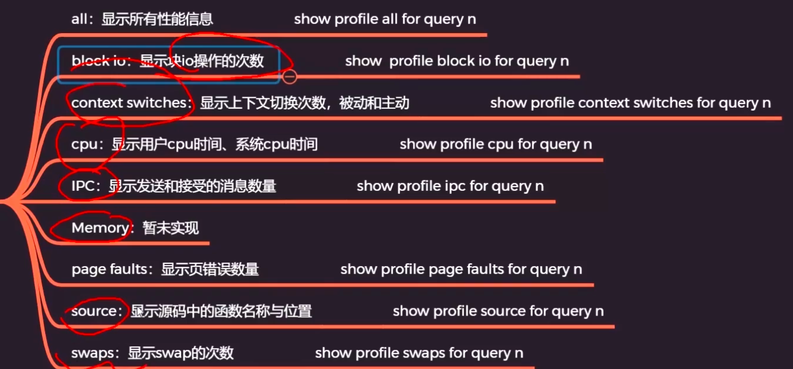
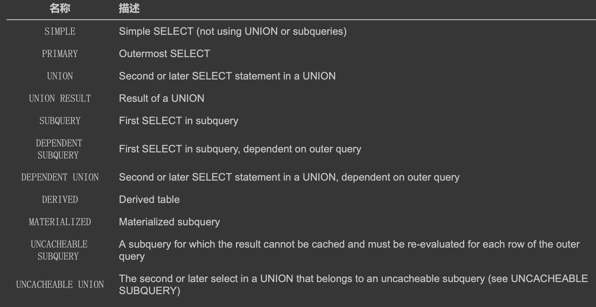

#执行延时
SET profiling = 1;
SHOW PROFILES
SHOW PROFILE
show profile for query 1;

#explain
[](https://dev.mysql.com/doc/refman/8.0/en/explain-output.html)
##id
###相同id
查询语句中每出现一个 SELECT 关键字，设计 MySQL 的大叔就会为它分配一个唯一的 id 值
```asp
1.在连接查询的执行计划中，每个表都会对应一条记录，这些记录的id列的值是相同的，出 现在前边的表表示驱动表，出现在后边的表表示被驱动表
mysql> EXPLAIN SELECT * FROM s1 INNER JOIN s2;
+----+-------------+-------+------------+------+---------------+------+---------+------+-------+----------+---------------------------------------+
| id | select_type | table | partitions | type | possible_keys | key  | key_len | ref  | rows  | filtered | Extra                                 |
+----+-------------+-------+------------+------+---------------+------+---------+------+-------+----------+---------------------------------------+
|  1 | SIMPLE      | s2    | NULL       | ALL  | NULL          | NULL | NULL    | NULL |  9333 |   100.00 | NULL                                  |
|  1 | SIMPLE      | s1    | NULL       | ALL  | NULL          | NULL | NULL    | NULL | 18128 |   100.00 | Using join buffer (Block Nested Loop) |
+----+-------------+-------+------------+------+---------------+------+---------+------+-------+----------+---------------------------------------+
```
###不同id
```asp
2.包含子查询的查询语句来说，就可能涉及多个 SELECT 关键字，所以在包含子查询的查询语句的执行计划 中，每个 SELECT 关键字都会对应一个唯一的 id 值
mysql> EXPLAIN SELECT * FROM s1 WHERE key1 IN (SELECT key1 FROM s2) ;
+----+--------------+-------------+------------+--------+---------------+------------+---------+----------------+-------+----------+-------------+
| id | select_type  | table       | partitions | type   | possible_keys | key        | key_len | ref            | rows  | filtered | Extra       |
+----+--------------+-------------+------------+--------+---------------+------------+---------+----------------+-------+----------+-------------+
|  1 | SIMPLE       | s1          | NULL       | ALL    | idx_key1      | NULL       | NULL    | NULL           | 18128 |   100.00 | Using where |
|  1 | SIMPLE       | <subquery2> | NULL       | eq_ref | <auto_key>    | <auto_key> | 303     | sakila.s1.key1 |     1 |   100.00 | NULL        |
|  2 | MATERIALIZED | s2          | NULL       | index  | idx_key1      | idx_key1   | 303     | NULL           |  9333 |   100.00 | Using index |
+----+--------------+-------------+------------+--------+---------------+------------+---------+----------------+-------+----------+-------------+
```
##select_type
设计 MySQL 的大叔为每一个 SELECT 关键字代表的小查询都定义了一个称之为 select_type 的属性，意思是我们 只要知道了某个小查询的 select_type 属性，就知道了这个小查询在整个大查询中扮演了一个什么角色

###SIMPLE
EXPLAIN SELECT * FROM s1;
EXPLAIN SELECT * FROM s1 INNER JOIN s2;//连接查询也算是 SIMPLE 类型
###SUBQUERY
如果包含子查询的查询语句不能够转为对应的 semi-join 的形式，并且该子查询是不相关子查询，并且查询 优化器决定采用将该子查询
物化的方案来执行该子查询时，该子查询的第一个 SELECT 关键字代表的那个查 询的 select_type 就是 SUBQUERY 

EXPLAIN SELECT * FROM s1 WHERE key1 IN (SELECT key1 FROM s2) OR key3 = 'a';

由于select_type为SUBQUERY的子查询由于会被物化，所以只需要执行一遍
###MATERIALIZED
EXPLAIN SELECT * FROM s1 WHERE key1 IN (SELECT key3 FROM s2 WHERE common_field ='a');
当查询优化器在执行包含子查询的语句时，选择将子查询物化之后与外层查询进行连接查询时，该子查询对 应的 select_type 属性就是 MATERIALIZED 
###DEPENDENT SUBQUERY
EXPLAIN SELECT * FROM s1 WHERE key1 IN (SELECT key1 FROM s2 WHERE s1.key2 = s2.key2)
如果包含子查询的查询语句不能够转为对应的 semi-join 的形式，并且该子查询是相关子查询，则该子查询
的第一个 SELECT 关键字代表的那个查询的 select_type 就是 DEPENDENT SUBQUERY
###PRIMARY
EXPLAIN SELECT * FROM s1 UNION SELECT * FROM s2;//包含 UNION 、 UNION ALL 或者子查询的大查询来说，它是由几个小查询组成的，其中最左边的那个查询 的 select_type 值就是 PRIMARY
###DERIVED
EXPLAIN SELECT * FROM (SELECT key1, count(*) as c FROM s1 GROUP BY key1) AS derived_s1 where c > 1;
对于采用物化的方式执行的包含派生表的查询，该派生表对应的子查询的 select_type 就是 DERIVED
大家注意看它的 table 列显示的是
<derived2> ，表示该查询是针对将派生表物化之后的表进行查询的
###UNION
EXPLAIN SELECT * FROM s1  UNION SELECT * FROM s2;//对于包含 UNION 或者 UNION ALL 的大查询来说，它是由几个小查询组成的，其中除了最左边的那个小查询以 外，其余的小查询的 select_type 值就是 UNION 
###DEPENDENT UNION
###UNION RESULT
EXPLAIN SELECT * FROM s1  UNION SELECT * FROM s2;//MySQL 选择使用临时表来完成 UNION 查询的去重工作，针对该临时表的查询的 select_type 就是 UNION RESULT 
##table
###NULL
```asp
1.标量
mysql> EXPLAIN SELECT 1;
+----+-------------+-------+------------+------+---------------+------+---------+------+------+----------+----------------+
| id | select_type | table | partitions | type | possible_keys | key  | key_len | ref  | rows | filtered | Extra          |
+----+-------------+-------+------------+------+---------------+------+---------+------+------+----------+----------------+
|  1 | SIMPLE      | NULL  | NULL       | NULL | NULL          | NULL | NULL    | NULL | NULL |     NULL | No tables used |
+----+-------------+-------+------------+------+---------------+------+---------+------+------+----------+----------------+
```
###表名
```asp
2.简单表
mysql> EXPLAIN SELECT * FROM s1;
+----+-------------+-------+------------+------+---------------+------+---------+------+-------+----------+-------+
| id | select_type | table | partitions | type | possible_keys | key  | key_len | ref  | rows  | filtered | Extra |
+----+-------------+-------+------------+------+---------------+------+---------+------+-------+----------+-------+
|  1 | SIMPLE      | s1    | NULL       | ALL  | NULL          | NULL | NULL    | NULL | 18128 |   100.00 | NULL  |
+----+-------------+-------+------------+------+---------------+------+---------+------+-------+----------+-------+

3.简单表(inner join)
mysql> EXPLAIN SELECT * FROM s1 INNER JOIN s2;
+----+-------------+-------+------------+------+---------------+------+---------+------+-------+----------+---------------------------------------+
| id | select_type | table | partitions | type | possible_keys | key  | key_len | ref  | rows  | filtered | Extra                                 |
+----+-------------+-------+------------+------+---------------+------+---------+------+-------+----------+---------------------------------------+
|  1 | SIMPLE      | s2    | NULL       | ALL  | NULL          | NULL | NULL    | NULL |  9333 |   100.00 | NULL                                  |
|  1 | SIMPLE      | s1    | NULL       | ALL  | NULL          | NULL | NULL    | NULL | 18128 |   100.00 | Using join buffer (Block Nested Loop) |
+----+-------------+-------+------------+------+---------------+------+---------+------+-------+----------+---------------------------------------+
```
###<subquery2>
###<union1,2>(union去重)
EXPLAIN SELECT * FROM s1  UNION SELECT * FROM s2;
##type
type = NULL，MYSQL不用访问表或者索引就直接能到结果

#count(*) vs count(name)
