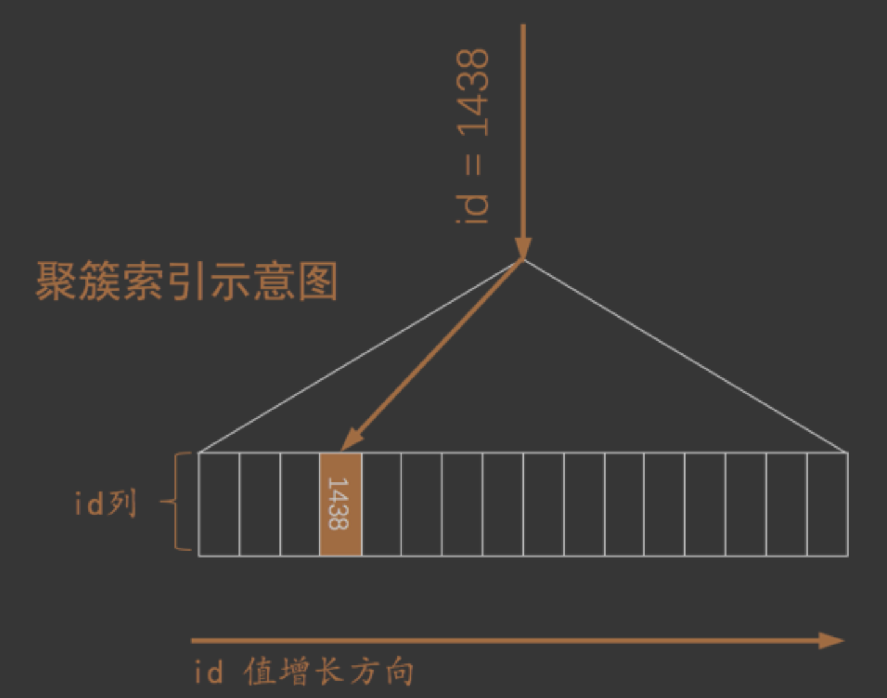
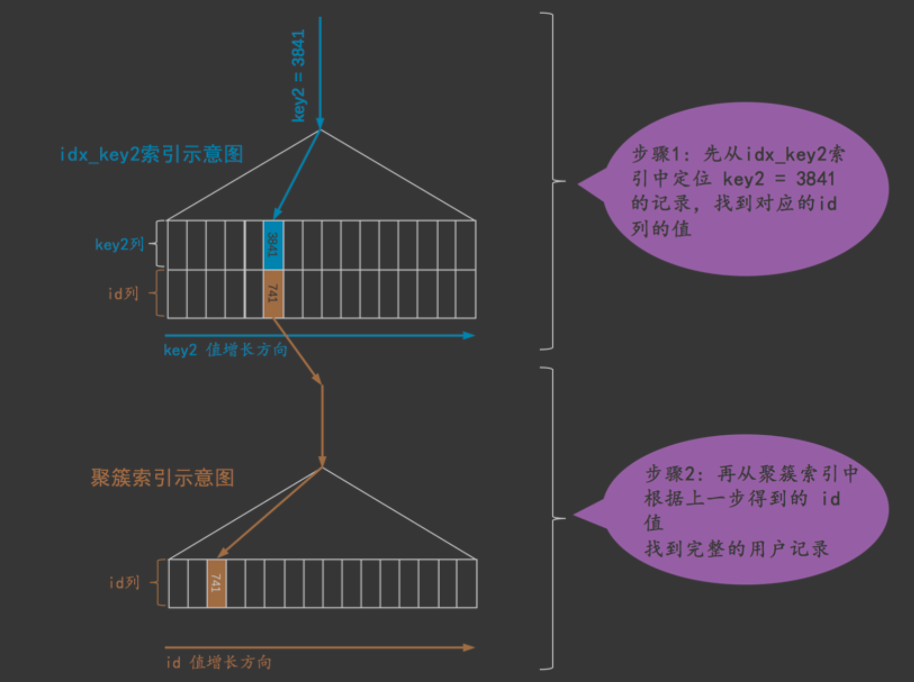
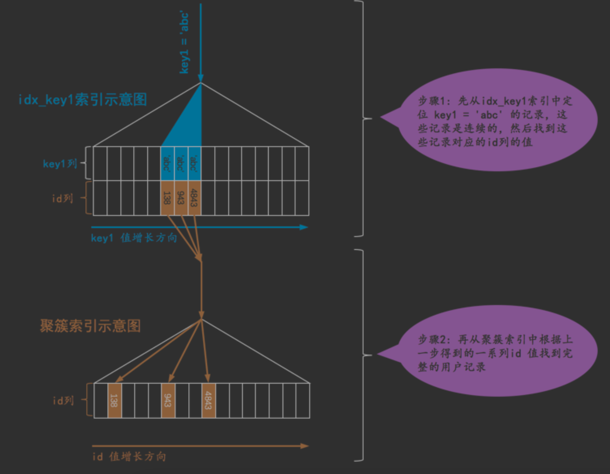
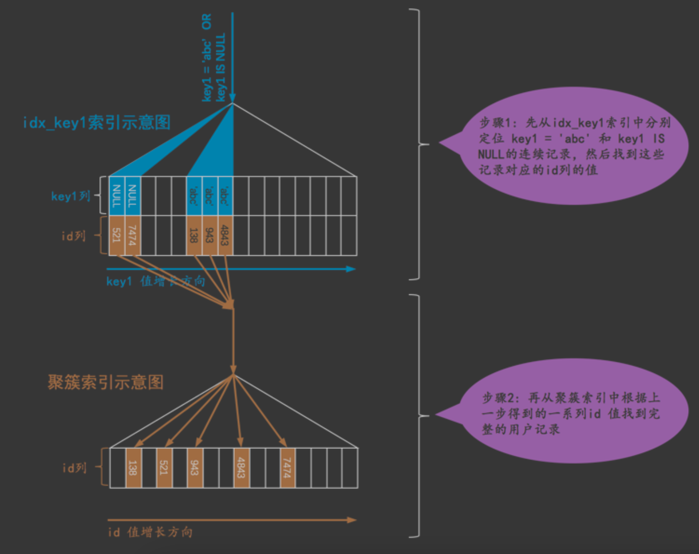
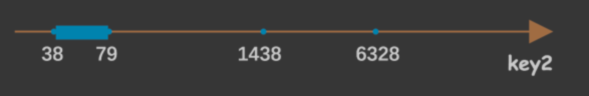

#全表扫描(all)
#索引查询
##主键或唯一二级索引的等值查询(const)
对于聚簇索引来说，它对应的 B+ 树叶子节点中的记录就是按照 id 列排序的

唯一二级索引列来定位一条记录

##唯一二级索引NULL & 普通二级索引的等值查询(ref)
```asp
我们当然可以选择全表扫描来逐一对比搜索条件是否满足要求，我们也可以先使用二级索引找到 对应记录的 id 值，然后再回表到聚簇索引中查找完整的用户记录。
由于普通二级索引并不限制索引列值的唯一 性，所以可能找到多条对应的记录，也就是说使用二级索引来执行查询的代价取决于等值匹配到的二级索引记录
 条数。如果匹配的记录较少，则回表的代价还是比较低的，所以 MySQL 可能选择使用索引而不是全表扫描的方式 来执行查询。
 设计 MySQL 的大叔就把这种搜索条件为二级索引列与常数等值比较，采用二级索引来执行查询的访 问方法称为: ref 
```

```asp
唯一二级索引来说，查询该列为 NULL 值的情况比较特殊，比如这样:
    SELECT * FROM single_table WHERE key2 IS NULL;
因为唯一二级索引列并不限制 NULL 值的数量，所以上述语句可能访问到多条记录，也就是说 上边这个语句不可 以使用 const 访问方法来执行

mysql> EXPLAIN     SELECT * FROM single_table WHERE key2 IS NULL;
+----+-------------+--------------+------------+------+---------------+----------+---------+-------+------+----------+-----------------------+
| id | select_type | table        | partitions | type | possible_keys | key      | key_len | ref   | rows | filtered | Extra                 |
+----+-------------+--------------+------------+------+---------------+----------+---------+-------+------+----------+-----------------------+
|  1 | SIMPLE      | single_table | NULL       | ref  | idx_key2      | idx_key2 | 5       | const |    1 |   100.00 | Using index condition |
+----+-------------+--------------+------------+------+---------------+----------+---------+-------+------+----------+-----------------------+
```
##二级索引列的值等值&列为NULL(ref_or_null)

##索引列的范围查询(range)
```asp
其实对于B+树索引来说，只要索引列和常数使用=、<=>、IN、OR、NOT IN、IS NULL、IS NOT NULL、
> 、 < 、 >= 、 <= 、 BETWEEN 、 != (不等于也可以写成 <> )或者 LIKE 操作符连接起来，就可以产生一个所
谓的 区间

IN操作符的效果和若干个等值匹配操作符`=`之间用`OR`连接起来是一样的，也就是说会产生多个单点 区间，比如下边这两个语句的效果是一样的:
SELECT * FROM single_table WHERE key2 IN (1438, 6328);
SELECT * FROM single_table WHERE key2 = 1438 OR key2 = 6328;

mysql> explain SELECT * FROM single_table WHERE key2 = 1438 OR key2 = 6328;
+----+-------------+--------------+------------+-------+---------------+----------+---------+------+------+----------+-----------------------+
| id | select_type | table        | partitions | type  | possible_keys | key      | key_len | ref  | rows | filtered | Extra                 |
+----+-------------+--------------+------------+-------+---------------+----------+---------+------+------+----------+-----------------------+
|  1 | SIMPLE      | single_table | NULL       | range | idx_key2      | idx_key2 | 5       | NULL |    2 |   100.00 | Using index condition |
+----+-------------+--------------+------------+-------+---------------+----------+---------+------+------+----------+-----------------------+
```

##直接扫描整个索引(index)
##多个单索引选一个(部分搜索条件用索引+回表+条件过滤)
```asp
一般情况下只能利用单个二级索引执行查询，比方说下边的这个查询:

SELECT * FROM single_table WHERE key1 = 'abc' AND key2 > 1000;


优化器一般会根据 single_table 表的统计数据来判断到底使用哪个条件到对应的二级索引中查询扫描的行数会 更少，选择那个扫描行数较少的条件到对应的
二级索引中查询(关于如何比较的细节我们后边的章节中会唠 叨)。然后将从该二级索引中查询到的结果经过回表得到完整的用户记录后再根据其余的 WHERE 条件过滤记录。
 一般来说，等值查找比范围查找需要扫描的行数更少(也就是 ref 的访问方法一般比 range 好，但这也不总是一 定的，也可能采用 ref 访问方法的那个索引列的值为特定值的行数特别多)
 
因为二级索引的节点中的记录只包含索引列和主键，所以在步骤1中使用 idx_key1 索引进行查询时只会用到与 key1 列有关的搜索条件，其余条件，比如 key2 > 1000 这个条件在步骤1
中是用不到的，只有在步骤2完成回表操作后才能继续针对完整的用户记录中继续过滤
```
##索引条件+非索引条件
```asp
SELECT * FROM single_table WHERE key2 > 100 AND common_field = 'abc';

这个查询语句中能利用的索引只有 idx_key2 一个，而 idx_key2 这个二级索引的记录中又不包含 common_field 这个字段，所以在使用二级索引 idx_key2 定位记录的阶段用不到 common_field = 'abc' 这个条
件，这个条件是在回表获取了完整的用户记录后才使用的，而 范围区间 是为了到索引中取记录中提出的概念
在确定 范围区间 的时候不需要考虑 common_field = 'abc' 这个条件，我们在为某个索引确定范围区间的时 候只需要把用不到相关索引的搜索条件替换为 TRUE 就好了
```

##索引合并(多个单索引AND组合)
```asp
1.二级索引列是等值匹配的情况，对于联合索引来说，在联合索引中的每个列都必须等值匹配，不能出现只出现匹配部分列的情况
 SELECT * FROM single_table WHERE key1 = 'a' AND key_part1 = 'a' AND key_part2 = 'b' AND key_part3 = 'c';
 
2.主键列可以是范围匹配
 SELECT * FROM single_table WHERE id > 100 AND key1 = 'a';
 
 上边说的 情况一 和 情况二 只是发生 Intersection 索引合并的必要条件，不是充分条件。也就是说即使 情况一、情况二成立，也不一定发生 Intersection 索引合并，
 这得看优化器的心情。优化器只有在单独根据搜 索条件从某个二级索引中获取的记录数太多，导致回表开销太大，而通过 Intersection 索引合并后需要回表的 记录数大大减少时才会使用 Intersection 索引合并
```
###联合索引替代Intersection索引合并

##Union 索引合并(多个单索引OR组合)
```asp
二级索引列是等值匹配的情况，对于联合索引来说，在联合索引中的每个列都必须等值匹配，不能
出现只出现匹配部分列的情况

SELECT * FROM single_table WHERE key1 = 'a' OR ( key_part1 = 'a' AND key_part2 = 'b'
AND key_part3 = 'c'); 而下边这两个查询就不能进行 Union 索引合并:
SELECT * FROM single_table WHERE key1 > 'a' OR (key_part1 = 'a' AND key_part2 = 'b'
AND key_part3 = 'c');
SELECT * FROM single_table WHERE key1 = 'a' OR key_part1 = 'a';

主键列可以是范围匹配
查询条件符合了这些情况也不一定就会采用 Union 索引合并，也得看优化器的心情
```
#索引失效
[](https://blog.csdn.net/why15732625998/article/details/80409164)
```asp
索引失效的情况：

1、组合索引不遵循最左匹配原则

2、组合索引的前面索引列使用范围查询(<,>,like),会导致后续的索引失效

3、不要在索引上做任何操作（计算，函数，类型转换）

4、is null和is not null无法使用索引

5、尽量少使用or操作符，否则连接时索引会失效

6、字符串不添加引号会导致索引失效

7、两表关联使用的条件字段中字段的长度、编码不一致会导致索引失效

8、like语句中，以%开头的模糊查询

9、如果mysql中使用全表扫描比使用索引快，也会导致索引失效
```
