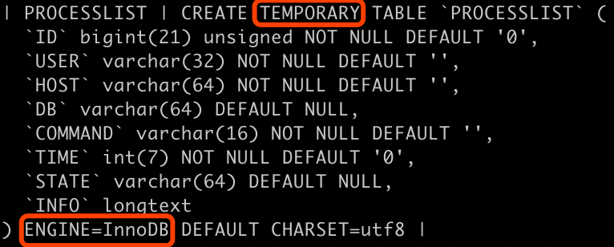

#临界知识
临时表是为了存储中间变量,中间结果不能直接返回给客户端,需要在group by,order by过程中进一步处理
临时表既可能在内存中(memory引擎,innodb引擎),也可能在磁盘中(innodb引擎,内存不够)
#临时表是什么
[](https://zhuanlan.zhihu.com/p/126144198)
[](https://time.geekbang.org/column/article/358649)
[](http://mysql.taobao.org/monthly/2019/04/01/)
临时表只在本会话有效，会话断开后，临时表数据会自动清理,不同会话的临时表可以重名，所有多个会话执行查询时，如果要使用临时表，不会有重名的担忧
#内部临时表
内部临时表看不到表结构定义文件frm
##information_schema()
_内存临时表(内存)__images/91827e11.png)

##Using temporary
会话执行查询时，如果执行计划中包含有“Using temporary”时，会产生临时表  
#外部临时表
外部临时表的表定义文件frm，一般是以#sql{进程id}_{线程id}_序列号组成，因此不同会话可以创建同名的临时表
##临时表空间
#memory临时表 vs innodb临时表
memory引擎表，通过建表语句create table ...engine=memory，数据全部在内存，表结构通过frm管理，同样的内部的memory引擎表，也是看不到frm文件中
information_schema.TABLES是memory临时表,columns,processlist,属于innodb引擎临时表
#子查询物化Materialization
```asp
Materialization speeds up query execution by generating a subquery result as a temporary table, normally in memory. 
The first time MySQL needs the subquery result, it materializes that result into a temporary table
在SQL执行过程中，第一次需要子查询结果时执行子查询并将子查询的结果保存为临时表 ，后续对子查询结果集的访问将直接通过临时表获得
在IN/NOT IN子查询以及 FROM 子查询
```
