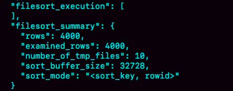

#临界知识
全表扫描(顺序读) vs 索引+回表(随机读,磁盘寻址)
二级索引包含主键id:SELECT pk, key_part1, key_part2 FROM t1 ORDER BY key_part1, key_part2;
select字段避免回表:SELECT * FROM t1 ORDER BY key_part1, key_part2;
排序优化优先使用索引/多级索引方案,避免filesort(额外排序过程)
全字段排序(单记录内存占用大,内存缓存条数少,但无需二次回表) vs rowid回表(单记录内存占用小,内存缓存条数多,需二次回表)
查询数据无序才使用filesort
#索引排序
#file sort
[](https://dev.mysql.com/doc/refman/8.0/en/order-by-optimization.html#order-by-filesort)
```asp
A filesort constitutes an extra sorting phase in query execution.
SELECT ... FROM single_table ... ORDER BY non_index_column [DESC] LIMIT [M,]N;
```
```asp
例子:
CREATE TABLE `s1` (
  `id` int(11) NOT NULL AUTO_INCREMENT,
  `key1` varchar(100) DEFAULT NULL,
  `key2` int(11) DEFAULT NULL,
  `key3` varchar(100) DEFAULT NULL,
  `key_part1` varchar(100) DEFAULT NULL,
  `key_part2` varchar(100) DEFAULT NULL,
  `key_part3` varchar(100) DEFAULT NULL,
  `common_field` varchar(100) DEFAULT NULL,
  PRIMARY KEY (`id`),
  UNIQUE KEY `idx_key2` (`key2`),
  KEY `idx_key1` (`key1`),
  KEY `idx_key3` (`key3`),
  KEY `idx_key_part` (`key_part1`,`key_part2`,`key_part3`)
) ENGINE=InnoDB AUTO_INCREMENT=20001 DEFAULT CHARSET=utf8

mysql> explain  select key_part3  from s1 order by key_part3 limit;
+----+-------------+-------+------------+-------+---------------+--------------+---------+------+-------+----------+-----------------------------+
| id | select_type | table | partitions | type  | possible_keys | key          | key_len | ref  | rows  | filtered | Extra                       |
+----+-------------+-------+------------+-------+---------------+--------------+---------+------+-------+----------+-----------------------------+
|  1 | SIMPLE      | s1    | NULL       | index | NULL          | idx_key_part | 909     | NULL | 18128 |   100.00 | Using index; Using filesort |
+----+-------------+-------+------------+-------+---------------+--------------+---------+------+-------+----------+-----------------------------+

```
##sort buffer
MySQL 会给每个线程分配一块内存用于排序，称为 sort_buffer,大小为sort_buffer_size
##执行过程
```asp

初始化 sort_buffer
从索引找到key_part3,存储sort_buffer
对 sort_buffer 中的数据按照字段 key_part3 做快速排序；
按照排序结果取前 1000 行返回给客户端
```
##全字段排序

如果要排序的数据量小于 sort_buffer_size，排序就在内存中完成。但如果排序数据量太大，内存放不下，则不得不利用磁盘临时文件辅助排序
##rowid排序

rowid 排序多访问了一次表 t 的主键索引
sort_buffer完成后,不需要在服务端再耗费内存存储结果，是直接返回给客户端的

##临时文件
##分页limit减少查询数目,避免临时文件
SELECT col1, ... FROM t1 ... ORDER BY name LIMIT 10;
