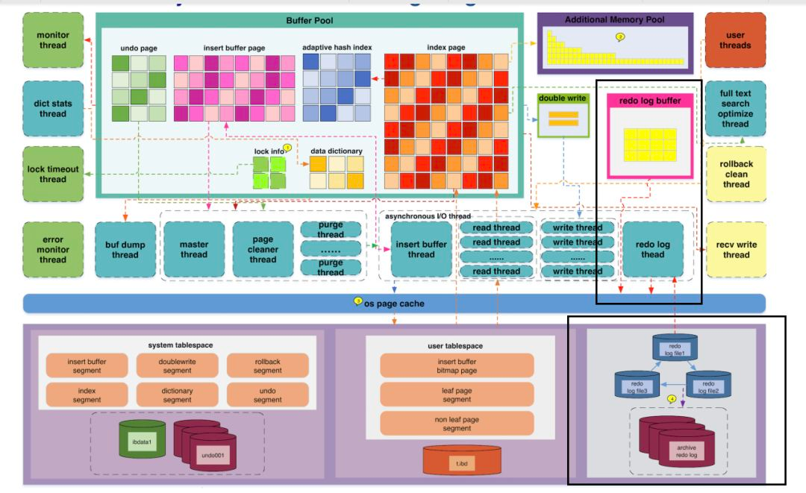
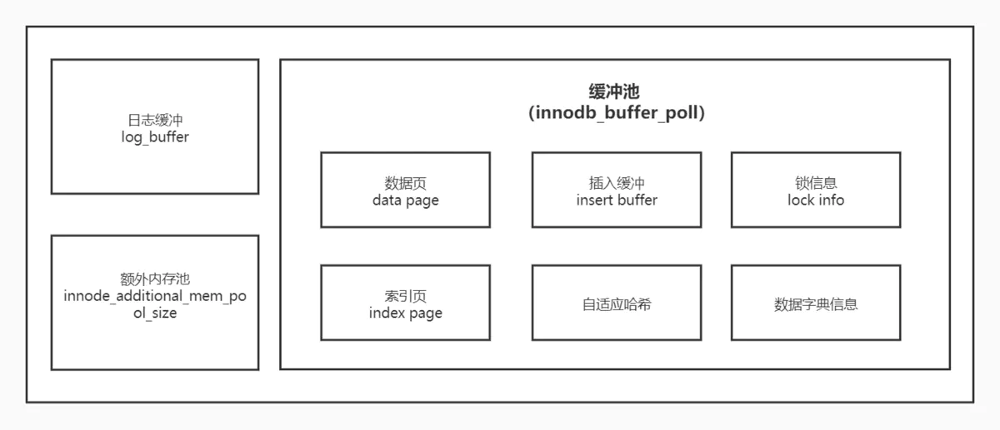
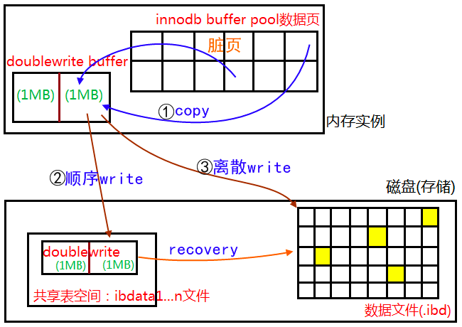
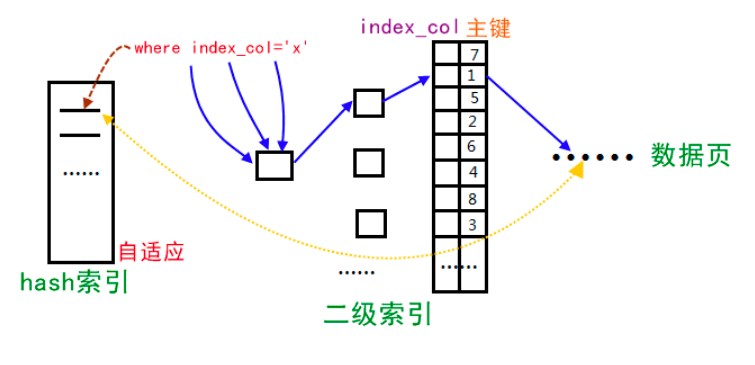

#临界知识
buffer用于缓存中间变量,需要进一步处理,不能直接发送给客户端



#Buffer Pool
[](https://juejin.cn/post/6844903874172551181)
```asp
即使我们 只需要访问一个页的一条记录，那也需要先把整个页的数据加载到内存中。将整个页加载到内存中后就可以进行 读写访问了，
在进行完读写访问之后并不着急把该页对应的内存空间释放掉，而是将其 缓存 起来，
这样将来有 请求再次访问该页面时，就可以省去磁盘 IO 的开销了。
```
#insert buffer/Change buffer

在MySQL5.5之前，叫插入缓冲(insert buffer)，只针对insert做了优化；现在对delete和update也有效，叫做写缓冲(change buffer)

[](https://juejin.cn/post/6844903875271475213)
非聚簇索引,
insert buffer:内存缓存,磁盘缓存
查询时合并change buffer缓存
占整个缓冲池的比例，默认值是25%
#双写Double Write
[](https://cheng-dp.github.io/2019/05/05/innodb-three-feature/)

```asp
在极端情况下，如16KB数据写入4KB后断电，此时造成页数据错误，即Partial Page Write问题。

Redo Log根据Page头信息(如LSN)对页数据进行恢复，然而由于Partial Page Write问题，Page数据已经损坏，无法确定Page头信息，因此无法根据Redo Log恢复
```
```asp
内存中的Double Write Buffer，大小为2MB。
磁盘上的共享表空间(ibdata)中连续128个页，大小也为2MB
```
[](https://cheng-dp.github.io/2019/05/05/innodb-three-feature/#double-write%E6%B5%81%E7%A8%8B)
#自适应哈希索引(Adaptive Hash Index, AHI)

InnoDB通过自使用哈希索引(Adaptive Hash Index)来加速对索引的访问
取部分索引值前缀作为Hash key，value为数据页上的位置
