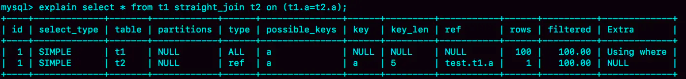
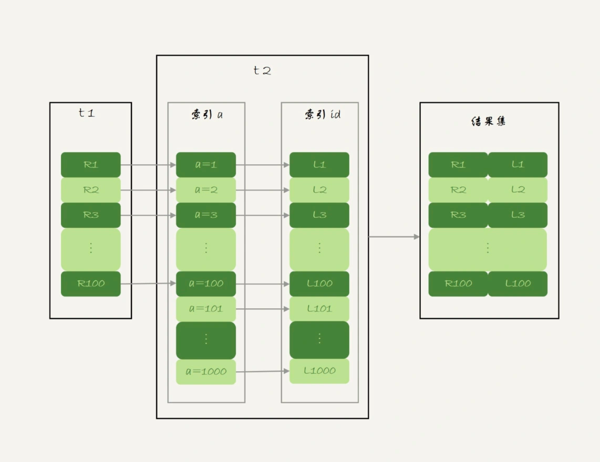
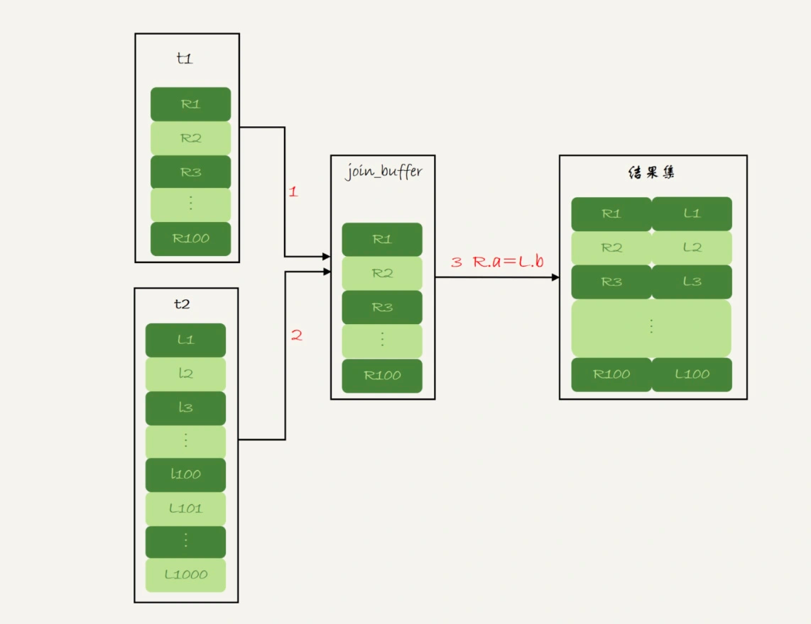
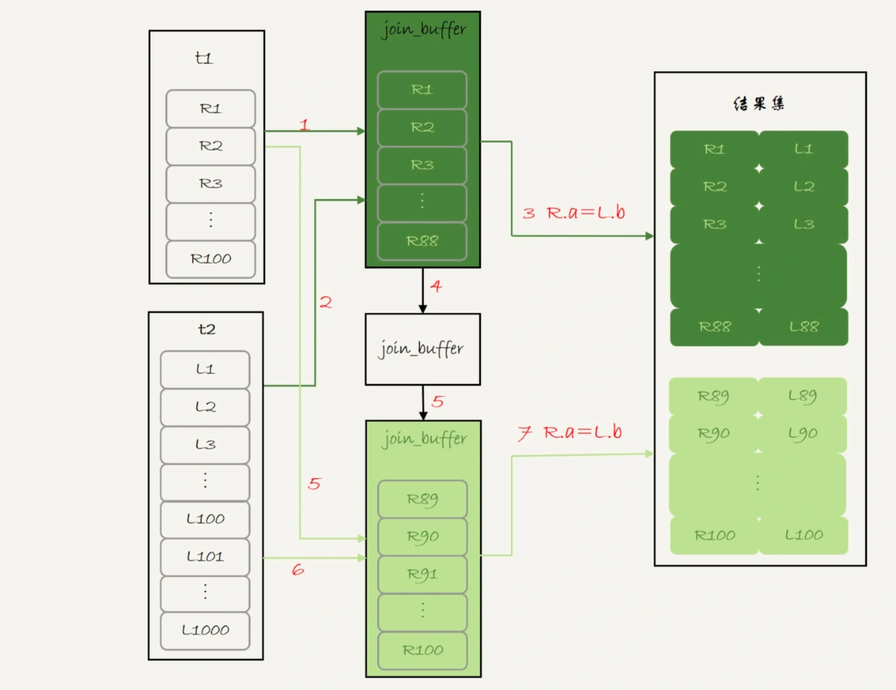
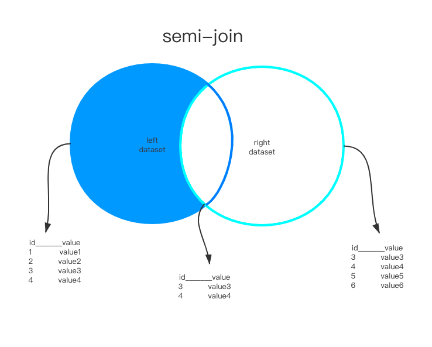

##临界知识
join优化指的是mysql服务端优化而不是客户端批量请求处理
计算向数据移动,提前是数据端抗的住计算(mysql扛不住join的计算)
join驱动表选择,考虑因素:磁盘扫描vs内存扫描,索引查询vs全表扫描
buffer都用于中间结果,不能直接发往客户端
小表概念:参与 join 的各个字段的总数据量小的那个表，就是“小表”,行数更少,记录字段数据量更少
##Index Nested-Loop Join
[](https://time.geekbang.org/column/article/79700)
被驱动表有索引，我们称之为"Index Nested-Loop Join",可能需要回表查询


###磁盘扫描时间复杂度
```asp
N + N*2*logM(驱动表n行,被驱动表非主键索引行数logM,聚集索引行数logM,被驱动表进行次数N)
```
###内存扫描时间复杂度
```asp
M*N
```
##使用join vs 两个单表查询
单表查询,多了内层循环的m次网络请求,导致业务的表连接速度更慢,网络吞吐量更低
但对mysql服务端压力更小
##Simple Nested-Loop Join
join on t1.a=t2.b,如果被驱动表没有索引时,会使用全表扫描:Simple Nested-Loop Join
###磁盘扫描时间复杂度
```asp
N*M(驱动表行数,被驱动表不是索引,需要全表扫描,全表行数为M,需要扫描N次,)
```
###内存扫描时间复杂度
```asp
M*N
```
##Block Nested-Loop Join(join buffer)
```asp
mysql> EXPLAIN SELECT * FROM s1 INNER JOIN s2;
+----+-------------+-------+------------+------+---------------+------+---------+------+-------+----------+---------------------------------------+
| id | select_type | table | partitions | type | possible_keys | key  | key_len | ref  | rows  | filtered | Extra                                 |
+----+-------------+-------+------------+------+---------------+------+---------+------+-------+----------+---------------------------------------+
|  1 | SIMPLE      | s2    | NULL       | ALL  | NULL          | NULL | NULL    | NULL |  9333 |   100.00 | NULL                                  |
|  1 | SIMPLE      | s1    | NULL       | ALL  | NULL          | NULL | NULL    | NULL | 18128 |   100.00 | Using join buffer (Block Nested Loop) |
+----+-------------+-------+------------+------+---------------+------+---------+------+-------+----------+---------------------------------------+
2 rows in set, 1 warning (0.00 sec)
```
被驱动表不是索引,或者是索引但使用全表扫描,则被驱动表使用全表扫描,为了减少磁盘扫描
时间复杂度,将驱动表的多条记录缓存在join_buffer中

把join_buffer_size变小,被驱动表需要全表扫描的次数就会变多

###磁盘扫描时间复杂度
```asp
N+λ*N*M(驱动表扫描N次,被驱动表全表扫描的次数λ*N),join_buffer_size 越大,λ*N越小,全表扫描次数越少
```
##join优化
Extra中出现Block Nested Loop需要警惕
使用小表作为驱动表

##semi-join半连接
[](http://mysql.taobao.org/monthly/2020/07/04/)
```asp
SELECT ... From Outer_tables WHERE expr in (SELECT ... From Inner_tables ...) And ...

SELECT ... From Outer_tables WHERE expr in (SELECT ... From Inner_tables ...) And ...
```

