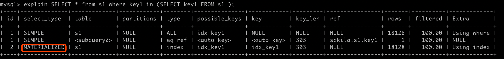

#临界知识
如果 IN 子查询符合转换为 semi-join 的条件，查询优化器会优先把该子查询为 semi-join ，然后再考虑下 边5种执行半连接的策略中哪个成本最低
如果 IN 子查询不符合转换为 semi-join 的条件，那么查询优化器会从下边两种策略中找出一种成本更低的 方式执行子查询:先将子查询物化之后再执行查询 执行 IN to EXISTS 转换。
#子查询规则优化
mySQL 的查询优化器会为我们简化这些表达式
##常量表检测
使用主键等值匹配或者唯一二级索引列等值匹配作为搜索条件来查询某个表
在这个查询中 table1 表相当于 常量表 ，在分析对 table2 表的查询成本之前，就会执行对 table1 表的查询，并把查询中涉及 table1 表的条
件都替换掉
##外连接消除
内连接 的驱动表和被驱动表的位置可以相互转换，而 左(外)连接 和 右(外)连接 的驱动表 和被驱动表是固定的。这就导致 内连接 
可能通过优化表的连接顺序来降低整体的查询成本，而 外连接 却无法优 化表的连接顺序,外连接和内连接的本质区别就是:对于外连接的驱动表的记录来说，
如果无法在被驱动表中找到 匹配ON子句中的过滤条件的记录，那么该记录仍然会被加入到结果集中，对应的被驱动表记录的各个字段使用 NULL值填充;
而内连接的驱动表的记录如果无法在被驱动表中找到匹配ON子句中的过滤条件的记录，那么该记 录会被舍弃
#子查询位置
##select

```asp
mysql> SELECT (SELECT key1 FROM s1 limit 2);
ERROR 1242 (21000): Subquery returns more than 1 row

mysql> SELECT (SELECT key1,key2 FROM s1 limit 1);
ERROR 1241 (21000): Operand should contain 1 column(s)
在 SELECT 子句中的子查询必须是标量子查询
```

##from(派生表)

Derived table实际上是一种特殊的subquery，它位于SQL语句中FROM子句里面，可以看做是一个单独的表
MySQL 在执行带有派生表的时候，优先尝试把派生表和外层查询合并掉，如果不行的话，再把派生表物化掉 执行查询。
##where、on、in
```asp
对于 [NOT] IN/ANY/SOME/ALL 子查询来说，子查询中不允许有 LIMIT 语句
```

###in优化
```asp
ORDER BY 子句 子查询的结果其实就相当于一个集合，集合里的值排不排序一点儿都不重要，比如下边这个语句中的
ORDER BY 子句简直就是画蛇添足:
SELECT * FROM t1 WHERE m1 IN (SELECT m2 FROM t2 ORDER BY m2);
DISTINCT 语句 集合里的值去不去重也没啥意义，比如这样:
SELECT * FROM t1 WHERE m1 IN (SELECT DISTINCT m2 FROM t2); 没有聚集函数以及 HAVING 子句的 GROUP BY 子句。
在没有聚集函数以及 HAVING 子句时， GROUP BY 子句就是个摆设，比如这样:
              SELECT * FROM t1 WHERE m1 IN (SELECT m2 FROM t2 GROUP BY m2);
    对于这些冗余的语句，查询优化器在一开始就把它们给干掉了
```
##ORDER BY 、GROUP BY 

#标量子查询&列子查询
##标量子查询&行子查询
```asp
子查询结果为单值或者单行
使用 = 、 > 、 < 、 >= 、 <= 、 <> 、 != 、 <=> 作为布尔表达式的操作符
操作数 comparison_operator (子查询)
这里的子查询只能是标量子查询或者行子查询，也就是子查询的结果只能返回一个 单一的值或者只能是一条记录
[NOT] EXISTS (子查询)
```

explain SELECT (SELECT key1 FROM s1 LIMIT 1);
+----+-------------+-------+------------+-------+---------------+----------+---------+------+-------+----------+----------------+
| id | select_type | table | partitions | type  | possible_keys | key      | key_len | ref  | rows  | filtered | Extra          |
+----+-------------+-------+------------+-------+---------------+----------+---------+------+-------+----------+----------------+
|  1 | PRIMARY     | NULL  | NULL       | NULL  | NULL          | NULL     | NULL    | NULL |  NULL |     NULL | No tables used |
|  2 | SUBQUERY    | s1    | NULL       | index | NULL          | idx_key1 | 303     | NULL | 18128 |   100.00 | Using index    |
+----+-------------+-------+------------+-------+---------------+----------+---------+------+-------+----------+----------------+

mysql> explain SELECT * from s1 where key1 = (SELECT key1 FROM s1 limit 1);
+----+-------------+-------+------------+-------+---------------+----------+---------+-------+-------+----------+-------------+
| id | select_type | table | partitions | type  | possible_keys | key      | key_len | ref   | rows  | filtered | Extra       |
+----+-------------+-------+------------+-------+---------------+----------+---------+-------+-------+----------+-------------+
|  1 | PRIMARY     | s1    | NULL       | ref   | idx_key1      | idx_key1 | 303     | const |     1 |   100.00 | Using where |
|  2 | SUBQUERY    | s1    | NULL       | index | NULL          | idx_key1 | 303     | NULL  | 18128 |   100.00 | Using index |
+----+-------------+-------+------------+-------+---------------+----------+---------+-------+-------+----------+-------------+

mysql> explain SELECT * from s1 where (key1,key2) = (SELECT key1,key2 FROM s1 limit 1);
+----+-------------+-------+------------+------+---------------+------+---------+------+-------+----------+-------------+
| id | select_type | table | partitions | type | possible_keys | key  | key_len | ref  | rows  | filtered | Extra       |
+----+-------------+-------+------------+------+---------------+------+---------+------+-------+----------+-------------+
|  1 | PRIMARY     | s1    | NULL       | ALL  | NULL          | NULL | NULL    | NULL | 18128 |   100.00 | Using where |
|  2 | SUBQUERY    | s1    | NULL       | ALL  | NULL          | NULL | NULL    | NULL | 18128 |   100.00 | NULL        |
+----+-------------+-------+------------+------+---------------+------+---------+------+-------+----------+-------------+
##列子查询&表子查询
```asp
[NOT] IN/ANY/SOME/ALL子查询
对于列子查询和表子查询来说，它们的结果集中包含很多条记录，这些记录相当于是一个集合，
所以就不能 单纯的和另外一个操作数使用 comparison_operator 来组成布尔表达式了
操作数 [NOT] IN (子查询)
操作数 comparison_operator ANY/SOME(子查询)
操作数 comparison_operator ALL(子查询)
[NOT] EXISTS (子查询)
```

#相关子查询 VS 不相关子查询
不相关子查询:内层子查询不依赖外层查询

相关子查询:内层子查询依赖外层查询
```asp
explain SELECT * from s1 where key1 in (SELECT key1 FROM s2 where s1.key2=s2.key3);
```
##不相关
```asp
SELECT * FROM s1 WHERE key1 = (SELECT common_field FROM s2 WHERE key3 = 'a' LIMIT 1);
先单独执行 (SELECT common_field FROM s2 WHERE key3 = 'a' LIMIT 1) 这个子查询。 
然后在将上一步子查询得到的结果当作外层查询的参数再执行外层查询 SELECT * FROM s1 WHERE key1 = ... 。
对于包含不相关的标量子查询或者行子查询的查询语句来说，MySQL会分别独立的执行外层查询和子 查询，就当作两个单表查询就好了
```
##相关
```asp
SELECT * FROM s1 WHERE key1 in (SELECT common_field FROM s2 WHERE s1.key3 = s2.key3 LIMIT 1);
先从外层查询中获取一条记录，本例中也就是先从 s1 表中获取一条记录。 然后从上一步骤中获取的那条记录中找出子查询中涉及到的值，
本例中就是从 s1 表中获取的那条记录中找 出 s1.key3 列的值，然后执行子查询。
最后根据子查询的查询结果来检测外层查询 WHERE 子句的条件是否成立，如果成立，就把外层查询的那条记 录加入到结果集，否则就丢弃。
再次执行第一步，获取第二条外层查询中的记录，依次类推~
```
#标量不相关&标量相关
对于包含不相关的标量子查询或者行子查询的查询语句来说，MySQL会分别独立的执行外层查询和子 查询，就当作两个单表查询就好了

对于相关的标量子查询或者行子查询来说,
```asp
事情也和年少的我想的一样，它的执行方式就是这样的:
先从外层查询中获取一条记录，本例中也就是先从 s1 表中获取一条记录。 然后从上一步骤中获取的那条记录中找出子查询中涉及到的值，本例中就是从 s1 表中获取的那条记录中找 出 s1.key3 列的值，然后执行子查询。
最后根据子查询的查询结果来检测外层查询 WHERE 子句的条件是否成立，如果成立，就把外层查询的那条记 录加入到结果集，否则就丢弃。
再次执行第一步，获取第二条外层查询中的记录，依次类推~

```
#不相关的 IN 子查询(物化MATERIALIZED&Materialization)
```asp
SELECT * FROM s1
        WHERE key1 IN (SELECT common_field FROM s2 WHERE key3 = 'a');
        
对于不相关的 IN 子查询来说，如果子查询的结果集中的记录条数很少，那么把子查询和外层 查询分别看成两个单独的单表查询效率还是蛮高的，
但是如果单独执行子查询后的结果集太多的话，就会导致这 些问题
结果集太多，可能内存中都放不下
N 子句中的参数特别多,检索太慢
```
```asp
方案:物化子查询,不直接将不相关子查询的结果集当作外层查询的参数，而是将该结果集写入一个临时表里
写入临时表的记录会被去重
```
```asp
mysql> explain SELECT * from s1 where key1 in (SELECT key1 FROM s2);
+----+--------------+-------------+------------+--------+---------------+------------+---------+----------------+-------+----------+-------------+
| id | select_type  | table       | partitions | type   | possible_keys | key        | key_len | ref            | rows  | filtered | Extra       |
+----+--------------+-------------+------------+--------+---------------+------------+---------+----------------+-------+----------+-------------+
|  1 | SIMPLE       | s1          | NULL       | ALL    | idx_key1      | NULL       | NULL    | NULL           | 18128 |   100.00 | Using where |
|  1 | SIMPLE       | <subquery2> | NULL       | eq_ref | <auto_key>    | <auto_key> | 303     | sakila.s1.key1 |     1 |   100.00 | NULL        |
|  2 | MATERIALIZED | s2          | NULL       | index  | idx_key1      | idx_key1   | 303     | NULL           |  9333 |   100.00 | Using index |
+----+--------------+-------------+------------+--------+---------------+------------+---------+----------------+-------+----------+-------------+
```
##子查询物化MATERIALIZED&Materialization

[](http://mysql.taobao.org/monthly/2016/07/08/)
[](https://dev.mysql.com/doc/refman/5.6/en/subquery-materialization.html)
```asp
mysql> EXPLAIN SELECT * FROM s1 WHERE key1 IN (SELECT /*+ SEMIJOIN(Materialize) */  key3 FROM s2) ;
+----+--------------+-------------+------------+--------+---------------+------------+---------+----------------+-------+----------+-------------+
| id | select_type  | table       | partitions | type   | possible_keys | key        | key_len | ref            | rows  | filtered | Extra       |
+----+--------------+-------------+------------+--------+---------------+------------+---------+----------------+-------+----------+-------------+
|  1 | SIMPLE       | s1          | NULL       | ALL    | idx_key1      | NULL       | NULL    | NULL           | 18128 |   100.00 | Using where |
|  1 | SIMPLE       | <subquery2> | NULL       | eq_ref | <auto_key>    | <auto_key> | 303     | sakila.s1.key1 |     1 |   100.00 | NULL        |
|  2 | MATERIALIZED | s2          | NULL       | index  | idx_key3      | idx_key3   | 303     | NULL           |  9333 |   100.00 | Using index |
+----+--------------+-------------+------------+--------+---------------+------------+---------+----------------+-------+----------+-------------+
```
```asp
Materialization speeds up query execution by generating a subquery result as a temporary table, normally in memory. 
The first time MySQL needs the subquery result, it materializes that result into a temporary table
在SQL执行过程中，第一次需要子查询结果时执行子查询并将子查询的结果保存为临时表 ，后续对子查询结果集的访问将直接通过临时表获得
在IN/NOT IN子查询以及 FROM 子查询
Subquery materialization uses an in-memory temporary table when possible, falling back to on-disk storage if the table becomes too larg
物化子查询优化SQL执行的关键点在于对子查询只需要执行一次。 与之相对的执行方式是对外表的每一行都对子查询进行调用，其执行计划中的查询类型为“DEPENDENT SUBQUERY”
```
从表 s1 的角度来看待，整个查询的意思其实是:对于 s1 表中的每条记录来说，如果该记录的 key1 列的值 在子查询对应的物化表中，则该记录会被加入最终的结果集

从子查询物化表的角度来看待，整个查询的意思其实是:对于子查询物化表的每个值来说，如果能在 s1 表 中找到对应的 key1 列的值与该值相等的记录，那么就把这些记录加入到最终的结果集

其实上边的查询就相当于表 s1 和子查询物化表 materialized_table 进行内连接: SELECT s1.* FROM s1 INNER JOIN materialized_table ON key1 = m_val;

#子查询转化为semi-join
[](http://mysql.taobao.org/monthly/2020/07/04/)
Optimizer Hints 可以支持在SQL中hint方式指定semi-join使用的策略
```asp
EXPLAIN SELECT * FROM s1 WHERE key1 IN (SELECT /*+ SEMIJOIN(DUPSWEEDOUT) */  key3 FROM s2) ;
```
```asp
虽然将子查询进行物化之后再执行查询都会有建立临时表的成本，但是不管怎么说，我们见识到了将子查询转换 为连接的强大作用，
设计 MySQL 的大叔继续开脑洞:能不能不进行物化操作直接把子查询转换为连接呢?
SELECT * FROM s1
        WHERE key1 IN (SELECT common_field FROM s2 WHERE key3 = 'a');
等价于
SELECT s1.* FROM s1 INNER JOIN s2
        ON s1.key1 = s2.common_field
        WHERE s2.key3 = 'a';
```
##Table pullout (子查询中的表上拉)

##DuplicateWeedout execution strategy (重复值消除)

```asp
执行计划 start temporary 和 end temporary表示duplicateweedout
mysql> EXPLAIN SELECT * FROM s1 WHERE key1 IN (SELECT /*+ SEMIJOIN(DUPSWEEDOUT) */  key3 FROM s2) ;
+----+-------------+-------+------------+-------+---------------+----------+---------+----------------+------+----------+-------------------------------------------+
| id | select_type | table | partitions | type  | possible_keys | key      | key_len | ref            | rows | filtered | Extra                                     |
+----+-------------+-------+------------+-------+---------------+----------+---------+----------------+------+----------+-------------------------------------------+
|  1 | SIMPLE      | s2    | NULL       | index | idx_key3      | idx_key3 | 303     | NULL           | 9333 |   100.00 | Using where; Using index; Start temporary |
|  1 | SIMPLE      | s1    | NULL       | ref   | idx_key1      | idx_key1 | 303     | sakila.s2.key3 |    1 |   100.00 | End temporary                             |
+----+-------------+-------+------------+-------+---------------+----------+---------+----------------+------+----------+-------------------------------------------+
2 rows in set, 1 warning (0.00 sec)
```

##LooseScan execution strategy (松散索引扫描)

```asp
mysql> EXPLAIN SELECT * FROM s1 WHERE key1 IN (SELECT /*+ SEMIJOIN(LooseScan) */  key3 FROM s2) ;
+----+-------------+-------+------------+-------+---------------+----------+---------+----------------+------+----------+-------------------------------------+
| id | select_type | table | partitions | type  | possible_keys | key      | key_len | ref            | rows | filtered | Extra                               |
+----+-------------+-------+------------+-------+---------------+----------+---------+----------------+------+----------+-------------------------------------+
|  1 | SIMPLE      | s2    | NULL       | index | idx_key3      | idx_key3 | 303     | NULL           | 9333 |   100.00 | Using where; Using index; LooseScan |
|  1 | SIMPLE      | s1    | NULL       | ref   | idx_key1      | idx_key1 | 303     | sakila.s2.key3 |    1 |   100.00 | NULL                                |
+----+-------------+-------+------------+-------+---------------+----------+---------+----------------+------+----------+-------------------------------------+
```
##FirstMatch execution strategy (首次匹配)
```asp
FirstMatch 是一种最原始的半连接执行方式，跟我们年少时认为的相关子查询的执行方式是一样一样的， 就是说先取一条外层查询的中的记录，
然后到子查询的表中寻找符合匹配条件的记录，如果能找到一条，则 将该外层查询的记录放入最终的结果集并且停止查找更多匹配的记录，
如果找不到则把该外层查询的记录丢 弃掉;然后再开始取下一条外层查询中的记录，重复上边这个过程。
```
```asp
mysql> EXPLAIN SELECT * FROM s1 WHERE key1 IN (SELECT /*+ SEMIJOIN(Firstmatch) */  key3 FROM s2) ;
+----+-------------+-------+------------+------+---------------+----------+---------+----------------+-------+----------+-----------------------------+
| id | select_type | table | partitions | type | possible_keys | key      | key_len | ref            | rows  | filtered | Extra                       |
+----+-------------+-------+------------+------+---------------+----------+---------+----------------+-------+----------+-----------------------------+
|  1 | SIMPLE      | s1    | NULL       | ALL  | idx_key1      | NULL     | NULL    | NULL           | 18128 |   100.00 | Using where                 |
|  1 | SIMPLE      | s2    | NULL       | ref  | idx_key3      | idx_key3 | 303     | sakila.s1.key1 |     1 |   100.00 | Using index; FirstMatch(s1) |
+----+-------------+-------+------------+------+---------------+----------+---------+----------------+-------+----------+-----------------------------+
```
##semi-join适用范围(相关&不相关)

```asp
SELECT * FROM s1
        WHERE key1 IN (SELECT common_field FROM s2 WHERE s1.key3 = s2.key3);
        
SELECT s1.* FROM s1 SEMI JOIN s2
        ON s1.key1 = s2.common_field AND s1.key3 = s2.key3;
```
##semi-join不适用范围


#相关in子查询
```asp
A correlated subquery is a subquery that contains a reference to a table that also appears in the outer query
SELECT * FROM t1
  WHERE column1 = ANY (SELECT column1 FROM t2
                       WHERE t2.column2 = t1.column2);
```
[](https://dev.mysql.com/doc/refman/8.0/en/correlated-subqueries.html)
[](https://www.cnblogs.com/zhengyun_ustc/p/slowquery3.html)
##DEPENDENT SUBQUERY(相关子查询)
由于相关子查询并不是一个独立的查询，所以不能转换为物化表来执行查询,可以使用semi-join进行优化


#物化适用范围(不相关)
不相关子查询可以保存到临时表
#EXISTS 子查询(相关/不相关)
```asp
其实对于任意一个IN子查询来说，都可以被转为 EXISTS 子查询，通用的例子如下:
         outer_expr IN (SELECT inner_expr FROM ... WHERE subquery_where)
可以被转换为:
         EXISTS (SELECT inner_expr FROM ... WHERE subquery_where AND outer_expr=inner_expr)
为 EXISTS 子查询时便可以使用到 s2 表的 idx_key3 索引了。
需要注意的是，如果 IN 子查询不满足转换为 semi-join 的条件，又不能转换为物化表或者转换为物化表的
成本太大，那么它就会被转换为 EXISTS 查询。转为 EXISTS 子查询时便可以使用到 s2 表的 idx_key3 索引了
```
