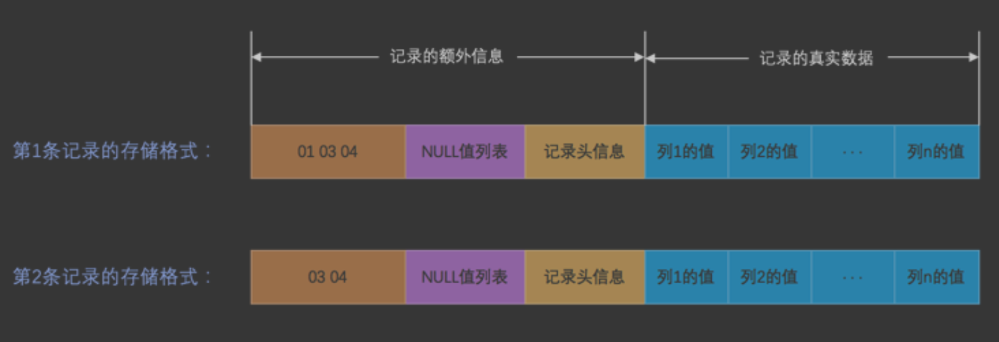
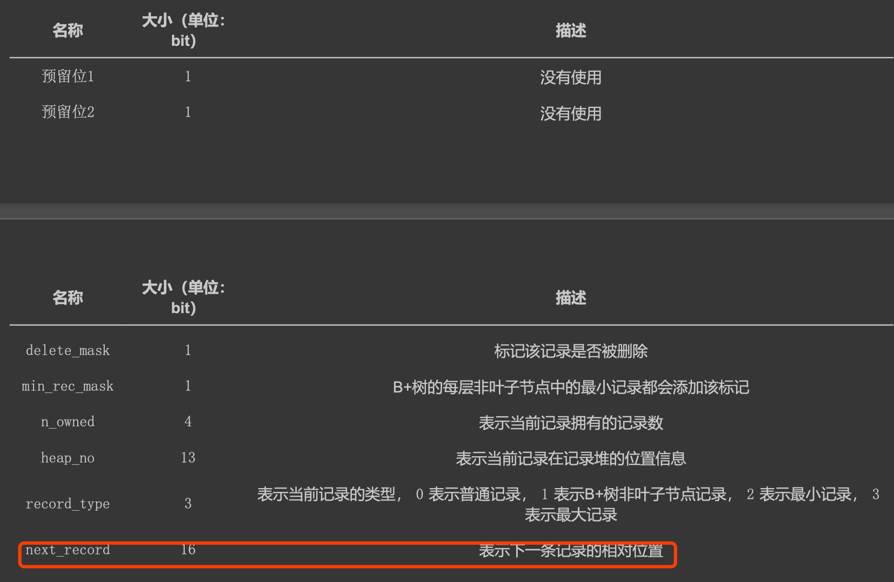
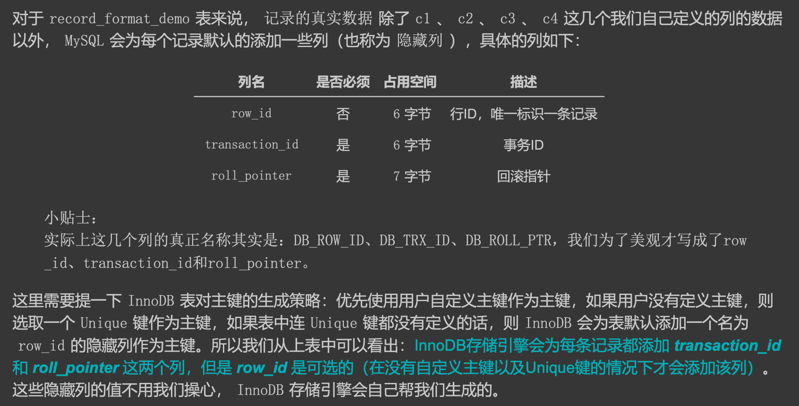
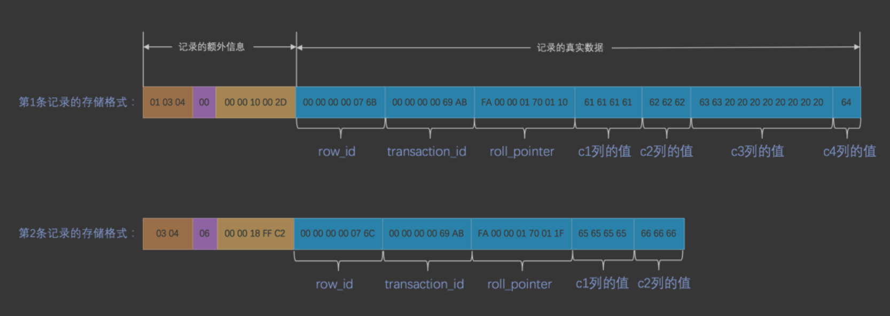
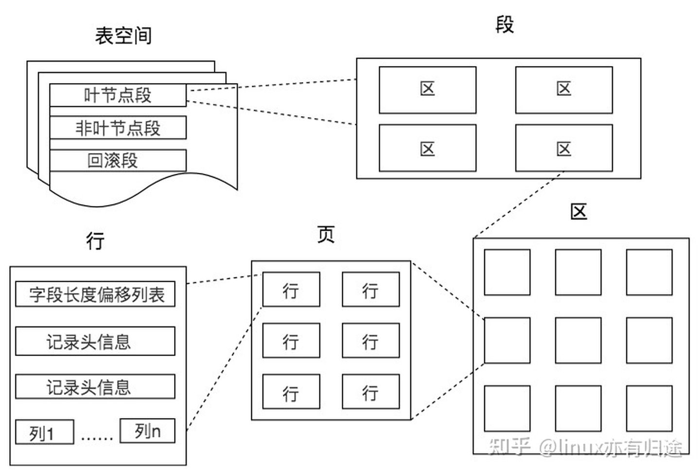

##临界知识
行记录与数据类型,记录删除策略,事务,回滚
##参考
[mysql是怎么运行的]()
##行格式
###compact


####表列度长段字长变(逆序)

把所有变长字段的真实数据占用的字节长度都存放在记录的开头部位，从而形成一个变长 字段长度列表，
各变长字段数据占用的字节数按照列的顺序逆序存放，逆序存放
```$xslt
1. 假设某个字符集中表示一个字符最多需要使用的字节数为 W ，也就是使用 SHOW CHARSET 语句的结果中的 Maxlen 列，比方说 utf8 字符集中的 W 就是 3 ， gbk 字符集中的 W 就是 2 ， ascii 字符集中的 W 就是 1。
2. 对于变长类型 VARCHAR(M) 来说，这种类型表示能存储最多 M 个字符(注意是字符不是字节)，所以这个类 型能表示的字符串最多占用的字节数就是 M×W 。
3. 假设它实际存储的字符串占用的字节数是 L 。
```

```$xslt
长度具体用1个还是2个字节来 表示真实数据占用的字节数,2个字节最大值65535
```
####null(逆序)
####记录头


####隐藏列



###行溢出
###Dynamic

##数据物理存储格式


[](https://zhuanlan.zhihu.com/p/345414925)
##零拷贝
[](https://spongecaptain.cool/post/mysql/zerocopyofmysql/)
[](https://zhuanlan.zhihu.com/p/330515575)
[](https://www.cnblogs.com/zhoujinyi/p/4270745.html)
