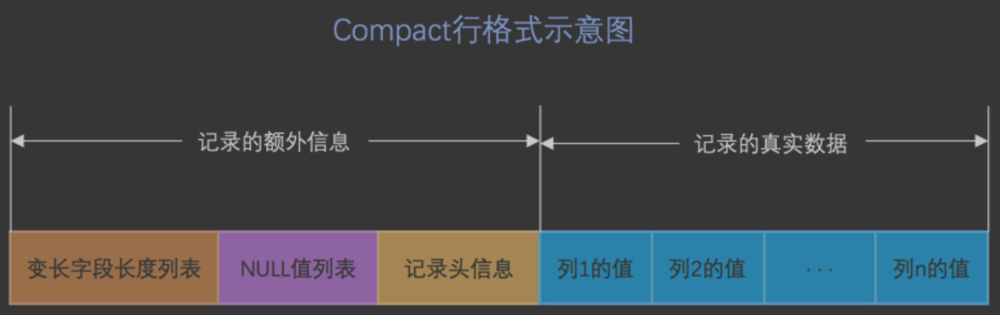
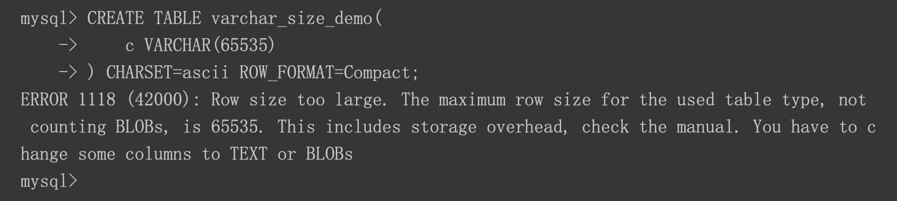
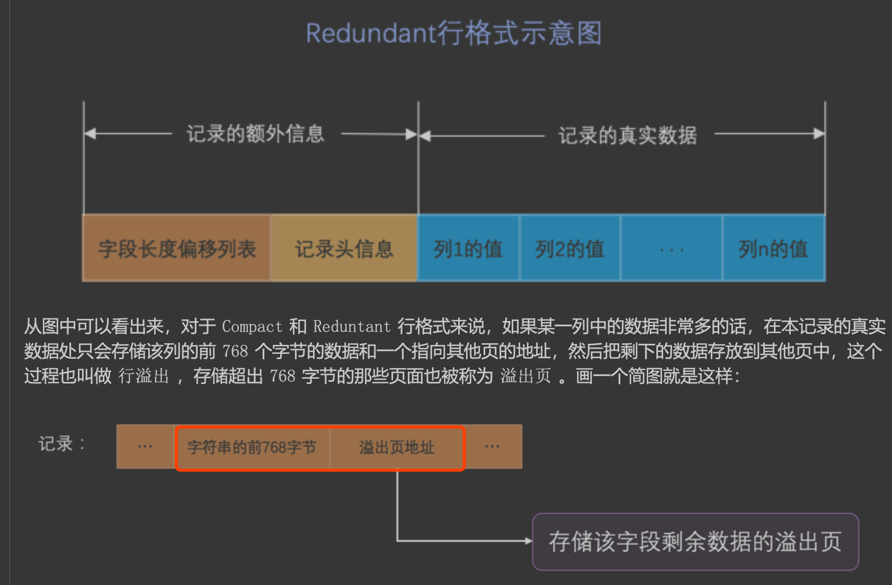

##临界知识
行记录与数据类型,记录删除策略
行记录与事务
行记录与回滚
行记录与下一条记录的位置,当前记录拥有的记录数(B+树)
Mysql的上限受到连接数,磁盘io寻址,磁盘吞吐量影响
##参考
[mysql是怎么运行的]()
##行格式
###compact


####表列度长段字长变(逆序)
把所有变长字段的真实数据占用的字节长度都存放在记录的开头部位，从而形成一个变长 字段长度列表，
各变长字段数据占用的字节数按照列的顺序逆序存放，逆序存放
```$xslt
1. 假设某个字符集中表示一个字符最多需要使用的字节数为 W ，也就是使用 SHOW CHARSET 语句的结果中的 Maxlen 列，比方说 utf8 字符集中的 W 就是 3 ， gbk 字符集中的 W 就是 2 ， ascii 字符集中的 W 就是 1。
2. 对于变长类型 VARCHAR(M) 来说，这种类型表示能存储最多 M 个字符(注意是字符不是字节)，所以这个类 型能表示的字符串最多占用的字节数就是 M×W 。
3. 假设它实际存储的字符串占用的字节数是 L 。
```

```$xslt
长度具体用1个还是2个字节来 表示真实数据占用的字节数,2个字节最大值65535
```

####CHAR(M)列的存储格式

对于 CHAR(M) 类型的列来说，当列采用的是定长字符集时，该列占用的字节数不会被加到变长字 段长度列表，而如果采用变长字符集时，该列占用的字节数也会被加到变长字段长度列表
####null(逆序)
```asp
变长字段长度列表中只存储值为 NULL 的列内容占用的长度，值为 NULL 的列的长度 是不储存的 。也就是说对于第二条记录来说，因为 c4 列的值为 NULL ，
所以第二条记录的 变长字段长度列表 只 需要存储 c1 和 c2 列的长度即可。其中 c1 列存储的值为 'eeee' ，占用的字节数为 4 ， c2 列存储的值
为 'fff' ，占用的字节数为 3 。数字 4 可以用1个字节表示， 3 也可以用1个字节表示，所以整个 变长字段长度 列表 共需2个字节。

如果表中没有允许存储 NULL 的列，则 NULL 也不存在了
否则将每个允许存储 NULL 的列对应一个
二进制位，二进制位按照列的顺序逆序排列，二进制位表示的意义如下：
二进制位的值为 1 时，代表该列的值为 NULL 
二进制位的值为 0 时，代表该列的值不为 NULL 

MySQL 规定 NULL值列表 必须用整数个字节的位表示，如果使用的二进制位个数不是整数个字节，则在字节 的高位补 0 
```

####记录头


####隐藏列


###行溢出

其他所有的列(不包括隐藏列和记录头信息)占用的字节长度加起来不能超过 65535 个字节
```asp
一个页的大小一般是 16KB ，也就是 16384 字节，而一个 VARCHAR(M) 类 型的列就最多可以存储 65532 个字节，这样就可能造成一个页存放不了一条记录的尴尬情况。
在 Compact 和 Reduntant 行格式中，对于占用存储空间非常大的列，在 记录的真实数据 处只会存储该列的一部 分数据，把剩余的数据分散存储在几个其他的页中，
然后 记录的真实数据 处用20个字节存储指向这些页的地址 (当然这20个字节中还包括这些分散在其他页面中的数据的占用的字节数)，从而可以找到剩余数据所在的页， 如图所示:
```


###Dynamic

###compressed
Compressed 行格式和 Dynamic 不同的一点是， Compressed 行格式会采用压缩算法对页面进行压缩，以节省空 间。
##数据物理存储格式


[](https://zhuanlan.zhihu.com/p/345414925)
##零拷贝
[](https://spongecaptain.cool/post/mysql/zerocopyofmysql/)
[](https://zhuanlan.zhihu.com/p/330515575)
[](https://www.cnblogs.com/zhoujinyi/p/4270745.html)
